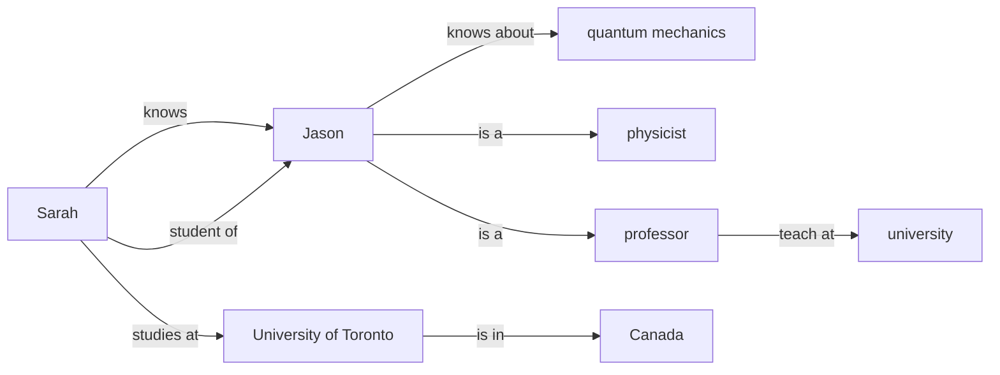

# Building a knowledge graph, one chunk at a time

*A knowledge graph built chunk by chunk with pydantic models, then queried.*

<!-- generated by docs/build.py from examples/graph_rag/README.md (the notebook): edit that one -->


Text arrives in chunks; we want one knowledge graph out of all of them.
An AI function reads a chunk together with the graph so far and returns
only what is new; plain Python merges it in. Pydantic models are the
contract on both sides.

Every output below is a real reply. This page is a notebook: open it in
Chattering and run it, or run it all with `python tools/docs.py run examples/graph_rag/README.md`.

```python
import functai
functai.configure(lm="gpt-4.1-mini", temperature=0)

from functai import ai
```

## The graph

```python
from pydantic import BaseModel

class Node(BaseModel, frozen=True):
    id: int
    label: str

class Edge(BaseModel, frozen=True):
    source: int   # a node id
    target: int   # a node id
    label: str    # the relation, as a short verb phrase

class KnowledgeGraph(BaseModel):
    nodes: list[Node] = []
    edges: list[Edge] = []

    def merge(self, other: "KnowledgeGraph") -> "KnowledgeGraph":
        """This graph plus the other's new nodes and edges."""
        nodes = list(dict.fromkeys(self.nodes + other.nodes))
        edges = list(dict.fromkeys(self.edges + other.edges))
        return KnowledgeGraph(nodes=nodes, edges=edges)
```

## The AI function

The graph so far is an input like any other: it is shown to the model as
JSON, and the reply is read back as a `KnowledgeGraph`.

```python
@ai
def new_facts(text: str, graph: KnowledgeGraph) -> KnowledgeGraph:
    """Extract the entities and relations in the text that are not in the
    graph yet. Reuse the ids of nodes the graph already has; give new nodes
    ids that are not taken."""
```

## Building it

```python
chunks = [
    "Jason knows a lot about quantum mechanics. He is a physicist and a professor.",
    "Professors teach at universities.",
    "Sarah knows Jason and is a student of his.",
    "Sarah studies at the University of Toronto, which is in Canada.",
]

graph = KnowledgeGraph()
for chunk in chunks:
    graph = graph.merge(new_facts(chunk, graph))

len(graph.nodes), len(graph.edges)
```

```output
(8, 8)
```

## Looking at it

A [Mermaid](https://mermaid.js.org) diagram renders directly on GitHub:

```python
def mermaid(g: KnowledgeGraph) -> str:
    lines = ["graph LR"]
    lines += [f'  n{n.id}["{n.label}"]' for n in g.nodes]
    lines += [f'  n{e.source} -- "{e.label}" --> n{e.target}' for e in g.edges]
    return "\n".join(lines)
```

```python
print("```mermaid\n" + mermaid(graph) + "\n```")
```



## Asking it questions

The graph is data now. Another AI function can answer from it, with no
access to the original text:

```python
@ai
def ask(graph: KnowledgeGraph, question: str) -> str:
    """Answer from the graph only. Say so when the graph doesn't tell."""

ask(graph, "In which country does Jason's student study?")
```

```output
"Jason's student, Sarah, studies at the University of Toronto, which is in Canada."
```

```python
ask(graph, "How old is Sarah?")
```

```output
"The graph doesn't tell how old Sarah is."
```
