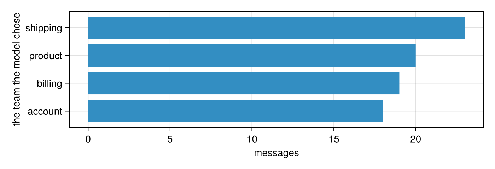

# 1. Your first AI function

*Eighty customer messages, four teams, and a function whose body is a language model. By the end you will have sorted every message, counted how many it got right, made it better, and know what it cost to the cent.*

A small homeware shop gets messages all day: a parcel that never came, a card charged twice, a kettle that won't boil, a password that won't work. Someone reads each one and forwards it to the team that can help: **shipping**, **billing**, **product** or **account**. Reading eighty messages is a morning. Reading eighty thousand is a job nobody wants.

You are going to write the function that does the reading, and use it like any other Julia function. This is where we are going:

```{.julia .no-run}
@enum Team shipping billing product account

@ai function team(message::String)::Team
    "Which team should answer this customer message?"
end

tickets.team = team.(tickets.message)
```

A column of text goes in; a column of `Team`s comes out, one model call per row. Everything else in this tutorial is about trusting that column.

**You will:**

- write an AI function with `@ai`, and call it on one message and on a whole column;
- see exactly what the model reads, before paying for anything;
- measure how often it is right, and make it better by writing down what you know;
- read the call log to count what it cost.

## What you need

- Julia 1.10 or later. FunctAI, and the two packages it uses to talk to models (lmcc and lm15), install from GitHub; add them in this order, since none is in the General registry yet:

```{.julia .no-run}
using Pkg
Pkg.add(url = "https://github.com/MaximeRivest/lmcc", subdir = "julia")
Pkg.add(url = "https://github.com/lm15-dev/LM15.jl")
Pkg.add(url = "https://github.com/MaximeRivest/functai", subdir = "julia")
Pkg.add(["DataFrames", "CairoMakie"])
```

- A key for a model provider. This series mostly uses OpenAI's. Set it in the shell that starts Julia (`export OPENAI_API_KEY=sk-...`), or in `~/.julia/config/startup.jl` (a file that is never shared or committed):

```{.julia .no-run}
ENV["OPENAI_API_KEY"] = "sk-..."
```

- Less than a cent of model calls. You will see the exact bill at the end.

This tutorial assumes you know a little DataFrames.jl (making a column, `groupby` and `combine`). Nothing else.

## Setting up

```julia
using FunctAI, DataFrames, CairoMakie, Statistics

log_folder = mktempdir()
FunctAI.configure!(lm = "gpt-6-luna", log_calls = log_folder);
```

`FunctAI.configure!` sets choices for the whole session (the `!` says it changes something, as always in Julia):

- `lm` is the language model that will do the work. `gpt-6-luna` is OpenAI's smallest current model (September 2026): fast, and cheap enough that a thousand messages cost a few cents.
- `log_calls` keeps a record of every call in a folder. We will read it at the end to count what we spent. (`mktempdir()` makes a fresh, empty folder, so this tutorial only counts its own calls.)

## The messages

FunctAI comes with the shop's messages as a dataset, `FunctAI.tickets()`, a table any Julia table package can read. A person has already decided which team should answer each one: that's the `category` column. We won't show it to the model; it's the answer key.

```julia
tickets = DataFrame(FunctAI.tickets())
```

```output
80×5 DataFrame
 Row │ id     message                            channel  category  order_id
     │ Int64  String                             String   String    String?
─────┼───────────────────────────────────────────────────────────────────────
   1 │     1  Hi, my order A-1042 still hasn't…  email    shipping  A-1042
   2 │     2  The mug arrived in pieces.         chat     shipping  missing
   3 │     3  I was charged twice for order B-…  email    billing   B-2210
   4 │     4  How do I change the email on my …  chat     account   missing
   5 │     5  The kettle lid doesn't close pro…  email    product   missing
   6 │     6  I'd like my money back for the t…  email    billing   missing
   7 │     7  Tracking for C-3319 hasn't moved…  chat     shipping  C-3319
   8 │     8  I forgot my password and the res…  chat     account   missing
  ⋮  │   ⋮                    ⋮                     ⋮        ⋮         ⋮
  74 │    74  Return the headphones and give m…  chat     billing   missing
  75 │    75  Can the dutch oven go on an indu…  chat     product   missing
  76 │    76  I changed my email and now I can…  email    account   missing
  77 │    77  The ceramic bowls came smashed, …  email    shipping  C-3555
  78 │    78  I want to cancel my subscription…  email    billing   missing
  79 │    79  The knife rusted after I left it…  chat     product   missing
  80 │    80  Please send the password reset t…  chat     account   missing
                                                              65 rows omitted
```

```julia
combine(groupby(tickets, :category), nrow => :n)
```

```output
4×2 DataFrame
 Row │ category  n
     │ String    Int64
─────┼─────────────────
   1 │ shipping     22
   2 │ billing      22
   3 │ account      18
   4 │ product      18
```

## A function with no body

First the answers: four teams, as an `@enum`, Julia's type for "one of these names":

```julia
@enum Team shipping billing product account
```

Then the function:

```julia
@ai function team(message::String)::Team
    "Which team should answer this customer message?"
end
```

```output
AI function team(message::String) -> Team
  model:        gpt-6-luna
  instruction:  Which team should answer this customer message?
  version:      sha256:99ae724adb8e…
  see:          FunctAI.prompt(team, …) for the exact request
```

Read it as any Julia function:

- `team(message::String)` takes one argument, a `String`.
- `::Team` says what comes back: one of the four teams. The model may only answer one of them, and you get a `Team`, not text.
- The string in the body says what it does, the way you'd explain the job to a new colleague.

There is no code in the body for you to write. `@ai` makes a function whose body a language model writes, every time it is called. Printing it shows what you declared and which model will do the work. It really is a function:

```julia
team isa Function
```

```output
true
```

## What the model reads

A language model reads text and writes text. So what text does `team` send? `FunctAI.prompt` shows the exact request, as a conversation, without sending it (and without paying for it):

```julia
FunctAI.prompt(team, "My card was charged twice for order B-2210.")
```

```output
model: gpt-6-luna
system
Function: team

Which team should answer this customer message?

Reply in exactly this form:
<result>
one of: shipping, billing, product, account
</result>

user
<message>
My card was charged twice for order B-2210.
</message>
```

The **system** message is the instruction, written from your function: its name, your sentence, and the form the reply must take. The **user** message is the input. When the reply comes back, FunctAI reads the text between `<result>` and `</result>`, checks it is one of the four teams, and hands you a `Team`. A reply that doesn't fit is asked again once; if it still doesn't fit, you get an error (or, over a column, a `missing`), never a made-up value.

## One call

```julia
team("My card was charged twice for order B-2210.")
```

```output
billing::Team = 1
```

That took a second or two: the question went to OpenAI's servers, the model thought about it, and the answer came back as a `Team` (the REPL shows an `@enum` value with its number, `= 1`; it is the value `billing`). The very first call of a session also waits while Julia compiles; the calls after it don't.

## A whole column

A dot calls any Julia function on every element (`uppercase.(names)`), and so it does `team`: eighty messages in, eighty answers back, in order.

```julia
tickets.guess = team.(tickets.message)
select(tickets, :category, :guess, :message)
```

```output
80×3 DataFrame
 Row │ category  guess     message
     │ String    Team      String
─────┼───────────────────────────────────────────────────────
   1 │ shipping  shipping  Hi, my order A-1042 still hasn't…
   2 │ shipping  shipping  The mug arrived in pieces.
   3 │ billing   billing   I was charged twice for order B-…
   4 │ account   account   How do I change the email on my …
   5 │ product   product   The kettle lid doesn't close pro…
   6 │ billing   billing   I'd like my money back for the t…
   7 │ shipping  shipping  Tracking for C-3319 hasn't moved…
   8 │ account   account   I forgot my password and the res…
  ⋮  │    ⋮         ⋮                      ⋮
  74 │ billing   billing   Return the headphones and give m…
  75 │ product   product   Can the dutch oven go on an indu…
  76 │ account   account   I changed my email and now I can…
  77 │ shipping  shipping  The ceramic bowls came smashed, …
  78 │ billing   billing   I want to cancel my subscription…
  79 │ product   product   The knife rusted after I left it…
  80 │ account   account   Please send the password reset t…
                                              65 rows omitted
```

That was eighty model calls. FunctAI sends up to eight at a time (the `concurrency` setting), so it took seconds, not minutes. The same thing in DataFrames' own words is `transform(tickets, :message => ByRow(team) => :guess)`, and it is just as concurrent. `guess` is an ordinary column of `Team`s, so everything you know works on it:

```julia
counts = sort(combine(groupby(tickets, :guess), nrow => :n), :n)
fig = Figure(size = (700, 240))
ax = Axis(fig[1, 1], xlabel = "messages", ylabel = "the team the model chose",
          yticks = (1:nrow(counts), string.(counts.guess)))
barplot!(ax, counts.n; direction = :x)
fig
```



## Was it right?

We have a person's answer (`category`, text) next to the model's (`guess`, a `Team`), so "how often is it right?" is a proportion:

```julia
right = string.(tickets.guess) .== tickets.category
(right = count(right), n = length(right), accuracy = mean(right))
```

```output
(right = 77, n = 80, accuracy = 0.9625)
```

A good score for a function you wrote in three lines. But the interesting rows are the wrong ones:

```julia
tickets[.!right, [:category, :guess, :message]]
```

```output
3×3 DataFrame
 Row │ category  guess     message
     │ String    Team      String
─────┼───────────────────────────────────────────────────────
   1 │ billing   shipping  Why was I charged for shipping w…
   2 │ billing   product   Money back please, the knife set…
   3 │ billing   product   The duvet shrank in the wash, I'…
```

Read them next to the shop's house rules (they're in `?FunctAI.tickets`). Two rules trip up anyone who hasn't read them:

- anything that **arrived broken** is *shipping*, because the carrier pays;
- **every request for money back** is *billing*, whatever the reason.

A new colleague would make the same sensible guesses the model made, and they wouldn't be the shop's. The model doesn't know the rules either.

## Tell it what you know

The sentence in the body is the function's code. The most direct fix is to write the rules into it:

```julia
@ai function team_rules(message::String)::Team
    """
    Which team should answer this customer message?
    House rules:
    - Anything wrong with the delivery itself (late, lost, wrong address, wrong item,
      something missing, or broken when it arrived) is shipping: the carrier pays.
    - Anything about money (charges, invoices, coupons, cards, and every request for
      money back, whatever the reason) is billing.
    - Problems that appear while using a product, and questions about products, are product.
    - Signing in, passwords, profile details, personal data and emails from the shop are account.
    """
end

tickets.guess_rules = team_rules.(tickets.message)
(without_rules = mean(string.(tickets.guess) .== tickets.category),
 with_rules = mean(string.(tickets.guess_rules) .== tickets.category))
```

```output
(without_rules = 0.9625, with_rules = 1.0)
```

The rules came from the shop's policy, not from peeking at the wrong answers. One honest caveat: we measured both versions on the same eighty messages we've been staring at. That flatters any change you make. Tutorial 4 shows how to test a change fairly, and tutorial 3 how sure you can be of a score from eighty rows.

## The same function, another model

Nothing in `team_rules` is specific to OpenAI. `configure` (no `!`: it changes nothing) makes a copy with other settings, such as another provider's model. Here is a message that sits exactly where two rules meet, asked of both:

```julia
vase = "The vase came in pieces, can I get my money back?"
team_claude = configure(team_rules; lm = "claude-haiku-4-5")

(gpt_6_luna = team_rules(vase), claude_haiku = team_claude(vase))
```

```output
(gpt_6_luna = billing, claude_haiku = shipping)
```

(The second call needs an `ANTHROPIC_API_KEY`. Skip it if you don't have one: nothing below depends on it.)

Broken on arrival says *shipping*; a request for money back says *billing*. The shop's answer is billing, because the money rule says "whatever the reason". Two models reading the same rules can land on different sides, because the description never says which rule wins when both apply. That's the most useful thing to learn here: where two rules meet is exactly where a model hesitates. The fix is more words ("if a message asks for money back, it is billing, even when the item arrived broken"), then checking again, on messages you didn't write the rule from.

## What it cost

Every call went into the log folder. `calls` reads it back, one row per call, as a table:

```julia
log = DataFrame(calls(folder = log_folder))
select(log, :name, :model, :seconds, :input_tokens, :output_tokens, :total_tokens)
```

```output
163×6 DataFrame
 Row │ name        model             seconds    input_tokens  output_tokens  total_tokens
     │ String      String            Float64    Int64         Int64          Int64
─────┼────────────────────────────────────────────────────────────────────────────────────
   1 │ team        gpt-6-luna        17.8548              63             26            89
   2 │ team        gpt-6-luna         1.28176             68             25            93
   3 │ team        gpt-6-luna         1.30768             57             30            87
   4 │ team        gpt-6-luna         1.28972             66             26            92
   5 │ team        gpt-6-luna         1.73444             61             25            86
   6 │ team        gpt-6-luna         1.49509             64             27            91
   7 │ team        gpt-6-luna         1.33645             64             42           106
   8 │ team        gpt-6-luna         1.51314             62             27            89
  ⋮  │     ⋮              ⋮              ⋮           ⋮              ⋮             ⋮
 157 │ team_rules  gpt-6-luna         0.79266            168             25           193
 158 │ team_rules  gpt-6-luna         1.15319            171             27           198
 159 │ team_rules  gpt-6-luna         0.952375           167             40           207
 160 │ team_rules  gpt-6-luna         1.19611            166             41           207
 161 │ team_rules  gpt-6-luna         1.01361            170             29           199
 162 │ team_rules  gpt-6-luna         1.33275            168             65           233
 163 │ team_rules  claude-haiku-4-5   1.57499            184              9           193
                                                                          148 rows omitted
```

Providers charge by the **token**, a piece of a word (about three quarters of an English word on average), with one price for what you send and a higher one for what the model writes. What it writes includes its hidden reasoning: recent models think before they answer, and you pay for the thinking. That's why we count `total_tokens - input_tokens` as the output.

Prices change, so write them down with the date you read them:

```julia
prices = DataFrame(model  = ["gpt-6-luna", "claude-haiku-4-5"],   # dollars per million tokens, 2026-09-27
                   input  = [0.10, 1.00],
                   output = [0.50, 5.00])

bill = leftjoin(log, prices, on = :model)
(calls = nrow(bill),
 dollars = sum(bill.input_tokens .* bill.input .+ (bill.total_tokens .- bill.input_tokens) .* bill.output) / 1e6)
```

```output
(calls = 163, dollars = 0.004932199999999999)
```

Keep that in mind when someone says language models are expensive. For sorting short messages, the small ones cost about as much as the electricity to read this page.

## Your turn

1. Write `urgent`, a function that answers `true` or `false` (`::Bool`): does this message need an answer today? Run it on `tickets.message` and count the `true`s by `category` with `groupby` and `combine`. Which team gets the most urgent messages?
2. Look at `FunctAI.prompt(team_rules, "hi")`. Where did your house rules go?
3. Give `team_rules` a message you write yourself that sits between two rules. What does it answer? Would a new colleague agree?

## What you learned

- `@ai function name(input::Type)::Answer "what it does" end` writes a function whose body is a language model. It is a Julia `Function`: call it, broadcast it with a dot, pass it to `ByRow`.
- The answer comes back as the type you declared. An `@enum` means the model can only give one of your answers.
- `FunctAI.prompt` shows exactly what the model will read.
- "Is it right?" is a proportion when you have the right answers in a column.
- The description is your function's code. Writing down what you know (the house rules) is the most direct way to make it better.
- `calls` reads the log: calls, time and tokens, and so dollars.

**Next:** [2. Answers you can compute with](02-types.md) turns free-text field notes into a table of numbers, categories and records you can plot.
