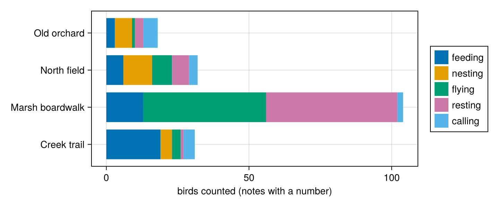

# 2. Answers you can compute with

*Sixty bird-survey notes, written however each volunteer liked. By the end you will have turned them into a table of species, counts and behaviours you can sum, plot and check, and you will know what to do when a note doesn't say.*

**Can you skip this one?** If you can answer these, jump to [tutorial 3](03-is-it-right.md). The answers are at the bottom.

1. A note says "a few mallards". What should a `count` column hold, and what type do you give the answer so the model is allowed to say it?
2. How do you get three answers from one call, as three columns of a `DataFrame`?
3. What happens to a row whose call fails, and how do you find it?

**You will:** give answers Julia types (`Int`, `Union{Int,Missing}`, an `@enum`, a struct, a `Vector`), get several answers from one call, and see what a type promises when the model has nothing to say.

## Setting up

```julia
using FunctAI, DataFrames, CairoMakie, Statistics

log_folder = mktempdir()
FunctAI.configure!(lm = "gpt-6-luna", log_calls = log_folder);
```

## The notes

Volunteers walk four sites and write down what they see, in their own words. `FunctAI.field_notes()` holds sixty of their notes, and what the survey's coordinator recorded from each:

```julia
field_notes = DataFrame(FunctAI.field_notes())
select(field_notes, :id, :site, :note)
```

```output
60×3 DataFrame
 Row │ id     site             note
     │ Int64  String           String
─────┼───────────────────────────────────────────────────────────
   1 │     1  Marsh boardwalk  Great blue heron standing in the…
   2 │     2  North field      A pair of robins pulling worms o…
   3 │     3  Creek trail      Heard a chickadee calling 'chick…
   4 │     4  Old orchard      Downy woodpecker drumming on a d…
   5 │     5  Marsh boardwalk  About 40 Canada geese flying ove…
   6 │     6  North field      Red-tailed hawk perched on the f…
   7 │     7  Creek trail      3 blue jays squabbling at the fe…
   8 │     8  Old orchard      Male cardinal singing from the t…
  ⋮  │   ⋮           ⋮                         ⋮
  54 │    54  North field      Chickadees, a few, flying from t…
  55 │    55  Creek trail      Robin feeding worms to 3 chicks …
  56 │    56  Old orchard      Downy woodpecker at the suet fee…
  57 │    57  Marsh boardwalk  Goose family: 2 adults, 5 goslin…
  58 │    58  North field      Blue jays (4) eating acorns unde…
  59 │    59  Creek trail      One great blue heron flying down…
  60 │    60  Old orchard      Song sparrow and its mate singin…
                                                  45 rows omitted
```

The coordinator follows a protocol (it's in `?FunctAI.field_notes`):

- **Species** is a name from the checklist of twelve; nicknames count ("robin", "red-tail", "downy"), and a bird not on the list is `other`.
- **Count** is every bird seen or heard. One bird named on its own ("a blue jay") is 1, "a pair" is 2, "about 40" is 40, but a note with no number ("a few", "a flock") has **no count: never guess**.
- **Behaviour** is one of five: *feeding*, *nesting*, *flying*, *resting* or *calling* (singing and drumming are calling; sitting on a nest is nesting).

Put the coordinator's answers aside as the key, and keep only what the volunteers wrote:

```julia
key = select(field_notes, :id, :species, :count, :behaviour)
notes = select(field_notes, :id, :site, :date, :note);
```

## A number

Start with the count. The obvious function answers an integer:

```julia
@ai function how_many(note::String)::Int
    "How many birds does the note report?"
end

how_many("About 40 Canada geese flying over in a V, heading north.")
```

```output
40
```

`::Int` is a promise: whatever the model writes, you get an `Int` back, or an error. Not the string `"about 40"`, not `"40 geese"`. You can add it, average it, plot it.

Now the whole column, next to the key:

```julia
counted = transform(notes, :note => ByRow(how_many) => :count)
counted = leftjoin(counted, select(key, :id, :count => :true_count), on = :id, order = :left)

filter(:true_count => ismissing, counted)[:, [:note, :true_count, :count]]
```

```output
7×3 DataFrame
 Row │ note                               true_count  count
     │ String                             Int64?      Int64
─────┼──────────────────────────────────────────────────────
   1 │ Mallards, a few of them, dabblin…     missing      3
   2 │ Crows, a whole noisy flock, goin…     missing      0
   3 │ Red-winged blackbirds everywhere…     missing      0
   4 │ Several song sparrows hopping in…     missing      3
   5 │ Lots of crows mobbing a hawk and…     missing      0
   6 │ Several Canada geese flying low …     missing      3
   7 │ Chickadees, a few, flying from t…     missing      3
```

Here is the trap. The protocol says a note with no number has no count. But we asked for an `Int`, and an `Int` is what we got: the model had to invent one. "A few" became a number. Every one of those numbers will end up in a sum, looking exactly like a real count.

The type made the model answer. It should have let it *not* answer. In Julia, a value that may be absent from data is `missing`, so the answer's type is `Union{Int,Missing}`: an integer, or nothing to report. And the counting rule belongs next to the answer, as words the model reads about it: name the output, and describe it with `ai"…"`:

```julia
@ai function how_many(note::String)
    "How many birds does the note report?"
    count::Union{Int,Missing} = ai"every bird seen or heard, young included; one bird named on its own ('a blue jay') is 1; 'a pair' is 2; an approximate number ('about 40', 'maybe 6') is that number; no number in the note ('a few', 'several', 'a flock') means no count: never guess"
end

counted.count = how_many.(counted.note)
filter(:true_count => ismissing, counted)[:, [:note, :true_count, :count]]
```

```output
7×3 DataFrame
 Row │ note                               true_count  count
     │ String                             Int64?      Int64
─────┼──────────────────────────────────────────────────────
   1 │ Mallards, a few of them, dabblin…     missing      0
   2 │ Crows, a whole noisy flock, goin…     missing      0
   3 │ Red-winged blackbirds everywhere…     missing      0
   4 │ Several song sparrows hopping in…     missing      0
   5 │ Lots of crows mobbing a hawk and…     missing      0
   6 │ Several Canada geese flying low …     missing      0
   7 │ Chickadees, a few, flying from t…     missing      0
```

Look at the counts: the notes without a number still got one (mostly a zero, where the model had to write *something*). The words say "never guess", so why? Do what you did in tutorial 1, and read what the model reads:

```julia
FunctAI.prompt(how_many, "Mallards, a few of them.")
```

```output
model: gpt-6-luna
system
Function: how_many

How many birds does the note report?

Output guidance:
- count: every bird seen or heard, young included; one bird named on its own ('a blue jay') is 1; 'a pair' is 2; an approximate number ('about 40', 'maybe 6') is that number; no number in the note ('a few', 'several', 'a flock') means no count: never guess

Reply in exactly this form:
<count>
(integer)
</count>

user
<note>
Mallards, a few of them.
</note>
```

Your rule is there, under "Output guidance". But the form the model must fill in says `(integer)`, and nothing on the page says how to write "nothing". Faced with a form that wants a number, the model wrote one.

How the model is asked, and how its reply is read, is the function's **layout**. The default one, which you've been reading, writes the question as plain text and works with any model. The `:json` layout also sends the answer's exact type as a JSON schema (here: "an integer, or null"), and OpenAI, Anthropic and Gemini hold the model to that schema. For pulling typed fields out of text, especially fields that may be missing, it is the safer choice:

```julia
how_many_json = configure(how_many; adapter = :json)

counted.count = how_many_json.(counted.note)
filter(:true_count => ismissing, counted)[:, [:note, :true_count, :count]]
```

```output
7×3 DataFrame
 Row │ note                               true_count  count
     │ String                             Int64?      Int64?
─────┼────────────────────────────────────────────────────────
   1 │ Mallards, a few of them, dabblin…     missing  missing
   2 │ Crows, a whole noisy flock, goin…     missing  missing
   3 │ Red-winged blackbirds everywhere…     missing  missing
   4 │ Several song sparrows hopping in…     missing  missing
   5 │ Lots of crows mobbing a hawk and…     missing  missing
   6 │ Several Canada geese flying low …     missing  missing
   7 │ Chickadees, a few, flying from t…     missing  missing
```

A missing count is `missing`, and `missing` is contagious: `sum(counted.count)` is `missing` until you say `sum(skipmissing(counted.count))`, so a note with no number can't quietly become a zero in a total.

How close are the counts overall? `isequal` treats two `missing`s as equal, which is exactly the comparison we want here:

```julia
mean(isequal.(counted.count, counted.true_count))
```

```output
1.0
```

## A choice

Behaviour is one of five words, so its type is an `@enum`:

```julia
@enum Behaviour feeding nesting flying resting calling

@ai function doing(note::String)::Behaviour
    "What is the bird doing, by the survey's protocol?"
end

doing.(["Robin singing at dawn from the roof antenna.",
        "Canada goose sitting on eggs on the island, mate standing guard."])
```

```output
2-element Vector{Behaviour}:
 calling::Behaviour = 4
 nesting::Behaviour = 1
```

Singing is *calling*, sitting on eggs is *nesting*: the protocol's words, which the model can only choose among. A reply outside the five is not accepted: FunctAI asks again, and never hands you a sixth value.

## Three answers from one call

You could write one function per column and call the model three times per note. It's cheaper to ask once, for all three. Declare each answer in the body, with its type and its words; the last one declared is the main answer, and calling returns them all:

```julia
species_list = ["American robin", "black-capped chickadee", "blue jay", "northern cardinal",
                "mallard", "Canada goose", "great blue heron", "red-tailed hawk",
                "downy woodpecker", "song sparrow", "American crow", "barn swallow", "other"]

@ai adapter = :json function survey(note::String)
    "Record the note as the bird survey's protocol says."
    species::OneOf(species_list) = ai"the checklist name; nicknames count; a bird not on the checklist is 'other'"
    count::Union{Int,Missing} = ai"every bird seen or heard, young included; one bird named on its own ('a blue jay') is 1; 'a pair' is 2; an approximate number ('about 40', 'maybe 6') is that number; no number in the note ('a few', 'several', 'a flock') means no count: never guess"
    behaviour::Behaviour = ai"singing, calling and drumming are calling; building, sitting on a nest or feeding young are nesting; perched, swimming, roosting or standing still are resting"
end

survey("Pair of downies (male + female) excavating a hole in the old pear tree.")
```

```output
(species = "downy woodpecker", count = 2, behaviour = nesting)
```

A few things are new here:

- `OneOf(species_list)` is a choice among values you have in a variable, without declaring an `@enum` (whose names can't have spaces). The answer is one of the `String`s in the list.
- `adapter = :json` before `function` is a setting of this function alone; any setting goes there (`lm`, `temperature`, …).
- The answer is a `NamedTuple`: destructure it, `(; species, count) = survey(note)`, or turn it into columns.

DataFrames turns a `NamedTuple` per row into columns with `AsTable`:

```julia
recorded = transform(notes, :note => ByRow(survey) => AsTable)
select(recorded, :note, :species, :count, :behaviour)
```

```output
60×4 DataFrame
 Row │ note                               species                 count    behaviour
     │ String                             String                  Int64?   Behaviour
─────┼───────────────────────────────────────────────────────────────────────────────
   1 │ Great blue heron standing in the…  great blue heron              1  feeding
   2 │ A pair of robins pulling worms o…  American robin                2  feeding
   3 │ Heard a chickadee calling 'chick…  black-capped chickadee        1  calling
   4 │ Downy woodpecker drumming on a d…  downy woodpecker              1  calling
   5 │ About 40 Canada geese flying ove…  Canada goose                 40  flying
   6 │ Red-tailed hawk perched on the f…  red-tailed hawk               1  resting
   7 │ 3 blue jays squabbling at the fe…  blue jay                      3  feeding
   8 │ Male cardinal singing from the t…  northern cardinal             1  calling
  ⋮  │                 ⋮                            ⋮                ⋮         ⋮
  54 │ Chickadees, a few, flying from t…  black-capped chickadee  missing  flying
  55 │ Robin feeding worms to 3 chicks …  American robin                4  nesting
  56 │ Downy woodpecker at the suet fee…  downy woodpecker              1  feeding
  57 │ Goose family: 2 adults, 5 goslin…  Canada goose                  7  resting
  58 │ Blue jays (4) eating acorns unde…  blue jay                      4  feeding
  59 │ One great blue heron flying down…  great blue heron              1  flying
  60 │ Song sparrow and its mate singin…  song sparrow                  2  calling
                                                                      45 rows omitted
```

Sixty calls, three typed columns. Now it's data, so check it against the key, one column at a time:

```julia
checked = leftjoin(recorded, key, on = :id, renamecols = "" => "_key", order = :left)

(species   = mean(checked.species .== checked.species_key),
 count     = mean(isequal.(checked.count, checked.count_key)),
 behaviour = mean(string.(checked.behaviour) .== checked.behaviour_key))
```

```output
(species = 1.0, count = 0.9666666666666667, behaviour = 0.9666666666666667)
```

And look at what it got wrong, because that's where you learn whether to trust it:

```julia
wrong(col) = checked[.!isequal.(string.(checked[!, col]), string.(checked[!, "$(col)_key"])),
                     ["$(col)_key", col, "note"]]
wrong("species")
```

```output
0×3 DataFrame
 Row │ species_key  species  note
     │ String?      String   String
─────┴──────────────────────────────
```

```julia
wrong("behaviour")
```

```output
2×3 DataFrame
 Row │ behaviour_key  behaviour  note
     │ String?        Behaviour  String
─────┼─────────────────────────────────────────────────────────────
   1 │ feeding        flying     Osprey hovering then diving into…
   2 │ nesting        feeding    Song sparrow carrying a caterpil…
```

```julia
wrong("count")
```

```output
2×3 DataFrame
 Row │ count_key  count    note
     │ Int64?     Int64?   String
─────┼───────────────────────────────────────────────────────
   1 │         1  missing  Chickadee pecking at birch catki…
   2 │         1  missing  Heron stalking frogs at the edge…
```

Read them before deciding anything. Some misses are arguable, the kind of disagreement two volunteers might have. Others are a rule applied less carefully when the model was asked for three things at once than when `how_many` only had to count. That's the trade-off to know about: one call instead of three is cheaper, and often just as good, but not always. Measure each column, and when one slips, give it back its own function or sharpen its words.

## Now it's just data

The point of all this is what comes next, which is ordinary Julia:

```julia
birds = combine(groupby(dropmissing(recorded, :count), [:site, :behaviour]), :count => sum => :birds)
sites = sort(unique(birds.site))
kinds = instances(Behaviour)
colors = Makie.wong_colors()[1:length(kinds)]

fig = Figure(size = (720, 300))
ax = Axis(fig[1, 1], xlabel = "birds counted (notes with a number)", yticks = (1:length(sites), sites))
barplot!(ax, [findfirst(==(s), sites) for s in birds.site], birds.birds;
         stack = Int.(birds.behaviour) .+ 1, color = colors[Int.(birds.behaviour) .+ 1], direction = :x)
Legend(fig[1, 2], [PolyElement(color = c) for c in colors], collect(string.(kinds)))
fig
```



## Records and lists

An answer can be a whole record. Declare it as a struct, the way you'd declare any data in Julia; each field is typed, and may be missing:

```julia
struct Ages
    adults::Union{Int,Missing}
    young::Union{Int,Missing}
end

@ai function ages(note::String)::Ages
    "Does the note report young birds, and how many of each age?"
end

young_notes = filter(:id => in((25, 42, 55, 57)), notes)
young_notes.ages = ages.(young_notes.note)
select(young_notes, :note, :ages => ByRow(a -> (; a.adults, a.young)) => AsTable)
```

```output
4×3 DataFrame
 Row │ note                               adults   young
     │ String                             Int64?   Int64
─────┼───────────────────────────────────────────────────
   1 │ Mallard hen with 9 ducklings swi…        1      9
   2 │ Robins, three adults and two spe…        3      2
   3 │ Robin feeding worms to 3 chicks …  missing      3
   4 │ Goose family: 2 adults, 5 goslin…        2      5
```

Each answer is an `Ages`, a value of your own type: `ages(note).young` works, and so does anything you've written for `Ages`. The last line spreads its fields into two columns.

An answer can also be a list. A `Vector{String}` is a list of quotes, each a string:

```julia
@ai function evidence(note::String)::Vector{String}
    "Quote the words in the note that show what the bird is doing."
end

evidence("Robin carrying mud and grass into the hedge. Nest in progress!")
```

```output
1-element Vector{String}:
 "carrying mud and grass into the hedge"
```

Types compose the way they do everywhere in Julia: a `Vector` of structs, a struct with a `Vector` field, a `Dict{String,Int}` of counts by species. Each becomes the JSON schema the model is held to, and comes back as the type you wrote.

## When a note is missing, or a call fails

A missing input is not sent to the model at all. It's `missing`, for free:

```julia
doing.(["Blue jay flew over, one.", missing])
```

```output
2-element Vector{Union{Missing, Behaviour}}:
 flying::Behaviour = 2
 missing
```

And calls do fail: a provider has a bad minute, a reply can't be read even after asking again. FunctAI doesn't stop a whole column for one bad row: that row is `missing`, one warning says how many failed, and `FunctAI.problems()` lists them, with their errors, so you can fix the cause and run just those rows again. When *every* call of a column fails, nothing was answered, so there is nothing to keep: it throws the first error instead, which is almost always a setting to fix (a missing key, a model name). To see it, here's a function that can't succeed: it allows the model 16 tokens, far too few for it to think and answer.

```julia
starved = configure(survey; max_tokens = 16, retries = 0)
try
    starved.(notes.note[1:3])
catch err
    showerror(stdout, err)
end
```

```output
[parse-truncated] the provider cut the reply at its length limit; reader 'json_object' cannot tell which outputs ended before it (json_object: reply contains no JSON object (not a JSON object)); raise max_tokens or ask for less (the model spent 16 of its tokens thinking first; raise max_tokens)
```

The error says why: the provider cut the reply off at its length limit. Remove the limit, and the same rows answer.

## What it cost

```julia
prices = DataFrame(model = ["gpt-6-luna"], input = [0.10], output = [0.50])   # dollars per million tokens, 2026-09-27

bill = leftjoin(DataFrame(calls(folder = log_folder)), prices, on = :model)
(calls = nrow(bill), failed = count(!ismissing, bill.error),
 dollars = sum(skipmissing(bill.input_tokens .* bill.input .+ (bill.total_tokens .- bill.input_tokens) .* bill.output)) / 1e6)
```

```output
(calls = 253, failed = 3, dollars = 0.0094867)
```

## Your turn

1. Write `site_kind`, a function whose answer is an `@enum` of `wetland`, `field`, `woodland`, from the note alone. Compare it with the `site` column: can the notes tell you where they were written?
2. Give `survey` a note you write yourself with no number and a nickname ("Some cardinals in the hedge"). Is `count` `missing`? Is the species right?
3. Add a fourth answer to `survey`, `certain::Bool = ai"whether the volunteer sounds sure of the identification"`, and count how many notes the model thinks are uncertain.

## What you learned

- The answer's type is a promise the answer keeps: an `Int` is an `Int`, an `@enum` or `OneOf(...)` is one of your values, a struct is your struct, a `Vector{String}` is a list of strings.
- A type that can't say "nothing" forces an answer. `Union{Int,Missing}` lets the model leave it empty, as `missing`, and the `:json` layout holds the model to the exact type.
- `name::Type = ai"words"` declares an answer with words about it; several make one call return a `NamedTuple`, and `ByRow(f) => AsTable` makes them columns.
- `missing` in, `missing` out, with no call. A failed row is `missing`, with a warning and `FunctAI.problems()`; a column where every row fails throws.

**Answers to the check at the top.** (1) `missing`: the protocol says never guess; `Union{Int,Missing}` lets the model leave it empty, and `adapter = :json` holds it to that type. (2) Declare each answer in the body (`species::OneOf(list) = ai"…"`, …); calling returns a `NamedTuple`, and `transform(df, :note => ByRow(f) => AsTable)` makes the columns. (3) It becomes `missing`, with one warning for all the failed rows; `FunctAI.problems()` lists them with their errors.

**Next:** [3. Is it right?](03-is-it-right.md) turns "it looks good" into a number, an interval and a fair comparison.
