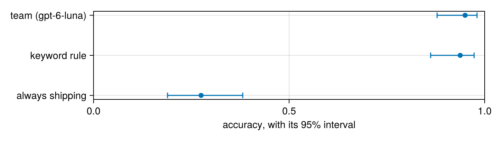

# 3. Is it right?

*A function that looks right on five messages can be wrong on one in five. By the end you will measure `team` on eighty messages with a number you can defend: how often it's right, how sure you can be, compared with what, and where it goes wrong.*

**Can you skip this one?** If you can answer these, jump to [tutorial 4](04-making-it-better.md). The answers are at the bottom.

1. A function is right on 72 of 80 rows. Between which two numbers is its true accuracy, probably?
2. Why is 90% accuracy not impressive when 90% of your rows are one class?
3. You run the same evaluation twice and get two different scores. Is something broken?

**You will:** `evaluate` a function with a 95% interval, see how the interval shrinks with rows, measure baselines (plain Julia functions), read a confusion table, and measure run-to-run variation.

## Setting up

```julia
using FunctAI, DataFrames, CairoMakie, Statistics

log_folder = mktempdir()
FunctAI.configure!(lm = "gpt-6-luna", log_calls = log_folder)

tickets = DataFrame(FunctAI.tickets())

@enum Team shipping billing product account

@ai function team(message::String)::Team
    "Which team should answer this customer message?"
end;
```

This is tutorial 1's `team`, without the house rules, so it has something left to get wrong.

## A score and its interval

`evaluate` runs a function on every row, compares each answer with the right one, and summarises:

```julia
ev = evaluate(team, tickets; expected = :category)
```

```output
Evaluation of team on 80 rows
  exact_match  0.95  (95% range 0.88 to 0.98)
  every row: DataFrame(e)
```

`expected = :category` says which column holds the right answers. (Without it, `evaluate` looks for a column named like the function's answer, `result`; the answer key here is called `category`.) The inputs are found the same way: the column `message` goes to the input `message`. A `Team` answer is compared with the text in `category` by its name, ignoring case and extra spaces, so `billing` matches `"billing"`.

The first number is the share it got right. The two after it are a **95% interval**: if you drew many more messages like these, the function's true accuracy would very likely lie between them. Read the interval before the score. It's the honest summary of what eighty rows can tell you.

There's nothing mysterious about it. Being right or wrong is a yes/no outcome, so the score is a proportion, and this is Wilson's interval for a proportion, the one HypothesisTests.jl gives:

```julia
using HypothesisTests

right = round(Int, ev.score * length(ev))
confint(BinomialTest(right, length(ev)); method = :wilson)
```

```output
(0.8783772379535697, 0.9803864454644557)
```

The numbers are the ones `evaluate` printed. `ev.score`, `ev.low` and `ev.high` hold them, and an evaluation is a table (a Tables.jl source), one row per row you gave it: its columns, the answer (`pred_result`), its score, and the id of its call:

```julia
rows = DataFrame(ev)
select(rows, :category, :pred_result, :exact_match, :call)
```

```output
80×4 DataFrame
 Row │ category  pred_result  exact_match  call
     │ String    Team         Float64      String
─────┼───────────────────────────────────────────────────────────────────────
   1 │ shipping  shipping             1.0  01a0e4db-e831-7eaa-a57c-e637e129…
   2 │ shipping  shipping             1.0  01a0e4dc-3167-7c98-b2d2-3014351b…
   3 │ billing   billing              1.0  01a0e4dc-3168-79fe-b845-4d47cc36…
   4 │ account   account              1.0  01a0e4dc-3168-7693-b6e3-840540c8…
   5 │ product   product              1.0  01a0e4dc-3169-79b3-9d8b-7720bf06…
   6 │ billing   billing              1.0  01a0e4dc-3169-7cc2-8bf1-2209fc51…
   7 │ shipping  shipping             1.0  01a0e4dc-3169-7015-be01-3ec0318f…
   8 │ account   account              1.0  01a0e4dc-316a-756a-91ff-908444b1…
  ⋮  │    ⋮           ⋮            ⋮                       ⋮
  74 │ billing   billing              1.0  01a0e4dc-6616-74d1-aff7-3b9f82b4…
  75 │ product   product              1.0  01a0e4dc-6636-7d31-947c-1e3321d2…
  76 │ account   account              1.0  01a0e4dc-675a-70fa-9a74-a590bd7b…
  77 │ shipping  shipping             1.0  01a0e4dc-688a-717f-96c6-47ef6af4…
  78 │ billing   billing              1.0  01a0e4dc-68a9-7de5-b520-33aae74b…
  79 │ product   product              1.0  01a0e4dc-6945-74a6-91e7-8cdafe79…
  80 │ account   account              1.0  01a0e4dc-69e8-726f-92de-15687e1a…
                                                              65 rows omitted
```

## How many rows do you need?

The interval narrows as you add rows, by the square root of their number. You don't need a model to see it: `score_interval` computes it for any scores. For a function that is right 85% of the time:

```julia
widths = map([20, 50, 80, 200, 500, 2000]) do n
    k = round(Int, 0.85n)
    (; rows = n, score_interval(vcat(ones(k), zeros(n - k)))...)
end
DataFrame(widths)
```

```output
6×4 DataFrame
 Row │ rows   mean     low       high
     │ Int64  Float64  Float64   Float64
─────┼────────────────────────────────────
   1 │    20     0.85  0.639581  0.947631
   2 │    50     0.84  0.714858  0.916626
   3 │    80     0.85  0.755868  0.91206
   4 │   200     0.85  0.793944  0.892864
   5 │   500     0.85  0.816039  0.878624
   6 │  2000     0.85  0.833681  0.864977
```

With twenty rows, "85%" means anything from about 64% to 95%. With two hundred, you can tell 85% from 80%. Fifty to two hundred carefully labelled rows is usually the sweet spot: an afternoon of work that tells you whether to trust the next hundred thousand.

## Compared with what?

A score means nothing on its own. Is 90% good? It depends on how well something much simpler would do. Always measure a **baseline**.

The simplest is the "null model": always answer the most common team.

```julia
sort(combine(groupby(tickets, :category), nrow => :n), :n, rev = true)
```

```output
4×2 DataFrame
 Row │ category  n
     │ String    Int64
─────┼─────────────────
   1 │ shipping     22
   2 │ billing      22
   3 │ account      18
   4 │ product      18
```

Then something a person might write in ten minutes: a keyword rule. It's an ordinary Julia function, and it returns a `Team` too:

```julia
function keyword_rule(message::AbstractString)::Team
    m = lowercase(message)
    occursin(r"charge|refund|invoice|coupon|card|pay|money", m)     && return billing
    occursin(r"password|sign in|log in|login|account|email|data", m) && return account
    occursin(r"arriv|deliver|track|parcel|package|box|order", m)     && return shipping
    return product
end

keyword_rule("Where is my parcel?")
```

```output
shipping::Team = 0
```

`evaluate` takes any function, not only AI functions: a plain one is called with each row, as a `NamedTuple`. So the baselines are measured exactly like `team`:

```julia
always_shipping(row) = shipping
keywords(row) = keyword_rule(row.message)

scores = DataFrame(model = ["always shipping", "keyword rule", "team (gpt-6-luna)"],
                   ev = [evaluate(always_shipping, tickets; expected = :category),
                         evaluate(keywords, tickets; expected = :category),
                         ev])
scores = select(scores, :model, :ev => ByRow(e -> (accuracy = e.score, low = e.low, high = e.high)) => AsTable)
```

```output
3×4 DataFrame
 Row │ model              accuracy  low       high
     │ String             Float64   Float64   Float64
─────┼─────────────────────────────────────────────────
   1 │ always shipping      0.275   0.189178  0.381441
   2 │ keyword rule         0.9375  0.861899  0.973011
   3 │ team (gpt-6-luna)    0.95    0.878377  0.980386
```

```julia
fig = Figure(size = (700, 200))
ax = Axis(fig[1, 1], xlabel = "accuracy, with its 95% interval", yticks = (1:3, scores.model), limits = ((0, 1), nothing))
rangebars!(ax, 1:3, scores.low, scores.high; direction = :x, whiskerwidth = 8)
scatter!(ax, scores.accuracy, 1:3; markersize = 10)
fig
```



The null model gets about one in four, by construction: four teams of roughly equal size. The keyword rule is the humbling one. Its interval overlaps the language model's, so on these eighty messages you may not be able to tell them apart.

Two things keep that in proportion. First, the rule was written by someone who had read these very messages, so it has been fitted to them: next month's messages will use words it has never seen. Second, the language model got there with one sentence and no knowledge of the shop. But the lesson stands, and it's the reason to always measure a baseline: sometimes the simple thing is nearly as good, and much cheaper.

## Where does it go wrong?

A single accuracy hides *which* mistakes it makes. A **confusion table** shows them: one row per true team, one column per answer.

```julia
pairs = combine(groupby(rows, [:category, :pred_result]), nrow => :n)
unstack(transform(pairs, :pred_result => ByRow(string) => :answer), :category, :answer, :n, fill = 0)
```

```output
4×5 DataFrame
 Row │ category  shipping  billing  account  product
     │ String    Int64     Int64    Int64    Int64
─────┼───────────────────────────────────────────────
   1 │ shipping        22        0        0        0
   2 │ billing          1       18        0        3
   3 │ account          0        0       18        0
   4 │ product          0        0        0       18
```

The cells where the row and the column name the same team are where it was right. Everything else is a kind of mistake, and in most jobs they're far from spread evenly. Two questions, per team, make it precise:

- **Recall**: of the messages that really were billing, what share did it send to billing?
- **Precision**: of the messages it sent to billing, what share really were billing?

```julia
recall = combine(groupby(rows, :category), :exact_match => mean => :recall)
precision = combine(groupby(transform(rows, :pred_result => ByRow(string) => :category), :category),
                    :exact_match => mean => :precision)
leftjoin(recall, precision, on = :category)
```

```output
4×3 DataFrame
 Row │ category  recall    precision
     │ String    Float64   Float64?
─────┼───────────────────────────────
   1 │ shipping  1.0        0.956522
   2 │ billing   0.818182   1.0
   3 │ account   1.0        1.0
   4 │ product   1.0        0.857143
```

Which one matters depends on what a mistake costs. If billing messages sent elsewhere are lost for days, you care about billing's recall. If the billing team is small and drowning, you care about its precision. That question, what each mistake costs, is the whole of [tutorial 6](06-decisions.md).

## Same question, another answer

Run the same evaluation again:

```julia
ev2 = evaluate(team, tickets; expected = :category)
```

```output
Evaluation of team on 80 rows
  exact_match  0.97  (95% range 0.91 to 0.99)
  every row: DataFrame(e)
```

The score may move, and some rows may flip. That's not a bug. A language model picks each word from a distribution, and recent models like `gpt-6-luna` also think before answering, differently each time. How often do the two runs agree, row by row?

```julia
runs = DataFrame(category = tickets.category, first_run = DataFrame(ev).pred_result,
                 second_run = DataFrame(ev2).pred_result, message = tickets.message)
mean(runs.first_run .== runs.second_run)
```

```output
0.975
```

```julia
filter(r -> r.first_run != r.second_run, runs)
```

```output
2×4 DataFrame
 Row │ category  first_run  second_run  message
     │ String    Team       Team        String
─────┼────────────────────────────────────────────────────────────────────
   1 │ billing   product    billing     Money back please, the knife set…
   2 │ billing   product    billing     Refund please: the towels are mu…
```

On a run like this one the two may agree on every row, or differ on a few: run it a few times and you'll see both. The rows that do flip are the ones the model finds hard, usually the same ones a person would hesitate over. Older models let you turn randomness down with `temperature = 0`. Current reasoning models don't take it:

```julia
configure(team; temperature = 0)("Where is my parcel?")
```

```output
[ Warning: openai:gpt-6-luna does not take temperature; left out of its requests
shipping::Team = 0
```

FunctAI leaves the setting out and tells you once, rather than failing every row. So the honest way to handle the variation is the one you already have: report intervals, and don't read much into a point or two.

## What it cost

```julia
prices = DataFrame(model = ["gpt-6-luna"], input = [0.10], output = [0.50])   # dollars per million tokens, 2026-09-27

bill = leftjoin(DataFrame(calls(folder = log_folder)), prices, on = :model)
(calls = nrow(bill),
 dollars = sum(bill.input_tokens .* bill.input .+ (bill.total_tokens .- bill.input_tokens) .* bill.output) / 1e6)
```

```output
(calls = 161, dollars = 0.003968699999999999)
```

## Your turn

1. Evaluate tutorial 1's `team_rules` (with the house rules) on `tickets`. Does its interval overlap `team`'s? What does that tell you, and what doesn't it? (Tutorial 4 has a sharper test for two functions run on the same rows.)
2. The keyword rule has no model at all. Improve it by one line (the confusion table is a good guide) and measure it again. Can a rule of ten lines reach the language model's interval?
3. Which team has the lowest recall? Read three of its missed messages. Is the model wrong, or is the label arguable?

## What you learned

- `evaluate(f, data; expected = :column)` scores a function on rows with known answers: a proportion with a 95% interval (Wilson's, as HypothesisTests.jl computes it). The evaluation is a table: `DataFrame(ev)`.
- Read the interval first. Its width depends on the number of rows: fifty to two hundred rows is usually enough to decide.
- Always compare with a baseline, the most common answer and a simple rule, measured by the same `evaluate`: it takes any Julia function.
- A confusion table shows which mistakes; recall and precision per class say which ones matter.
- The same function can answer differently twice. Measure how often, and let intervals absorb it.

**Answers to the check at the top.** (1) About 81% to 95%: `score_interval(vcat(ones(72), zeros(8)))`. (2) Because always answering that class scores 90%; compare with the null model. (3) No: language models vary from run to run, reasoning models more so; compare runs row by row and report intervals.

**Next:** [4. Making it better without fooling yourself](04-making-it-better.md) tries rules, examples and a teacher, and tests each change fairly.
