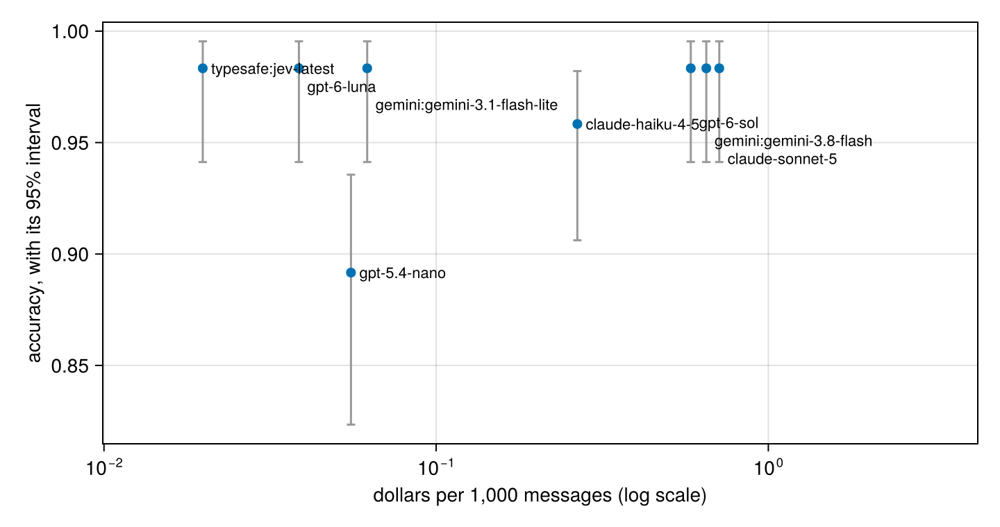

# 5. Choosing a model

*Eight current models, one job, 120 rows each. By the end you will have a chart of accuracy against cost with honest intervals, a paired test between the front-runners, and a rule for picking the cheapest model that is good enough.*

**Can you skip this one?** If you can answer these, jump to [tutorial 6](06-decisions.md). The answers are at the bottom.

1. Is the biggest, most expensive model the most accurate one?
2. Two models score 97% and 89% on the same 120 rows. How do you know the difference is real?
3. What does "the model is 20 times more expensive" mean for a job of a million short messages?

**You will:** run one function on eight models (`configure(f; lm = …)`), measure accuracy, cost and speed from the call log, compare the front-runners in pairs, choose with a rule written first, and turn a reasoning model's thinking off.

## The job

The refund desk from tutorial 4 decides better when it knows what state the item is in: still sealed, opened but unused, used, damaged on arrival, the wrong item, or faulty. The customer never says it in those words. Reading it from their message is a job worth doing well, and a good one for comparing models: each message has one right answer, and some are subtle.

```julia
using FunctAI, DataFrames, CairoMakie, Statistics, HypothesisTests
import LM15

log_folder = mktempdir()
FunctAI.configure!(log_calls = log_folder)

refunds = DataFrame(FunctAI.refunds())

@enum ItemState unopened opened_unused used damaged wrong_item faulty

@ai function item_state(message::String)
    "What state is the item in, from the customer's message?"
    state::ItemState = ai"unopened: still sealed, never opened; opened_unused: unpacked and looked at, never used; used: used for a while, works fine, no longer wanted; damaged: broken or damaged when it arrived; wrong_item: not what was ordered, or part of the order missing; faulty: worked at first, then failed in normal use"
end

sort(combine(groupby(refunds, :state), nrow => :n), :n, rev = true)
```

```output
6×2 DataFrame
 Row │ state          n
     │ String         Int64
─────┼──────────────────────
   1 │ faulty            34
   2 │ used              22
   3 │ damaged           20
   4 │ opened_unused     16
   5 │ wrong_item        14
   6 │ unopened          14
```

The words after `ai` say what each answer means, and the model reads them: a choice is only as clear as its answers. The answer is named `state`, so `evaluate` will compare with the `state` column, which holds the right answers.

## The candidates

Eight models from five families, as of September 2026, with their list prices (dollars per million tokens, input and output; output includes the model's hidden reasoning):

```julia
candidates = DataFrame([
    (model = "gpt-6-luna",                   key = "OPENAI_API_KEY",    input = 0.10,  output = 0.50),
    (model = "gpt-6-sol",                    key = "OPENAI_API_KEY",    input = 2.00,  output = 10.00),
    (model = "gpt-5.4-nano",                 key = "OPENAI_API_KEY",    input = 0.20,  output = 1.25),
    (model = "claude-haiku-4-5",             key = "ANTHROPIC_API_KEY", input = 1.00,  output = 5.00),
    (model = "claude-sonnet-5",              key = "ANTHROPIC_API_KEY", input = 2.00,  output = 10.00),
    (model = "gemini:gemini-3.8-flash",      key = "GEMINI_API_KEY",    input = 0.75,  output = 3.75),
    (model = "gemini:gemini-3.1-flash-lite", key = "GEMINI_API_KEY",    input = 0.25,  output = 1.50),
    (model = "typesafe:jev-latest",          key = "TYPESAFE_API_KEY",  input = 0.042, output = 0.0)])

filter!(row -> !isempty(get(ENV, row.key, "")), candidates)   # only the providers you have a key for
candidates.model
```

```output
8-element Vector{String}:
 "gpt-6-luna"
 "gpt-6-sol"
 "gpt-5.4-nano"
 "claude-haiku-4-5"
 "claude-sonnet-5"
 "gemini:gemini-3.8-flash"
 "gemini:gemini-3.1-flash-lite"
 "typesafe:jev-latest"
```

Note what `gpt-5.4-nano` is: the small model of six months ago. It's here to show how fast this moves. And `typesafe:jev-latest` is a different kind of model: TypeSafe's Jev writes no text, it only answers typed questions (one of these options, yes or no, a score), with a probability for each answer, and charges only for what it reads. Reading an item's state is exactly such a question, so it's in the race; tutorial 6 shows what its probabilities are for.

## Running them all

The same function, one model at a time, on all 120 messages. `configure` swaps the model and nothing else, so each model reads exactly the same request:

```julia
evaluations = Dict(m => evaluate(configure(item_state; lm = m), refunds) for m in candidates.model)

accuracy = DataFrame([(model = m, accuracy = e.score, low = e.low, high = e.high, failed = e.failed)
                      for (m, e) in evaluations])
sort(accuracy, :accuracy, rev = true)
```

```output
8×5 DataFrame
 Row │ model                         accuracy  low       high      failed
     │ String                        Float64   Float64   Float64   Int64
─────┼────────────────────────────────────────────────────────────────────
   1 │ typesafe:jev-latest           0.983333  0.941264  0.995417       0
   2 │ gemini:gemini-3.1-flash-lite  0.983333  0.941264  0.995417       0
   3 │ gpt-6-sol                     0.983333  0.941264  0.995417       0
   4 │ gpt-6-luna                    0.983333  0.941264  0.995417       0
   5 │ claude-sonnet-5               0.983333  0.941264  0.995417       0
   6 │ gemini:gemini-3.8-flash       0.983333  0.941264  0.995417       0
   7 │ claude-haiku-4-5              0.958333  0.906159  0.982073       0
   8 │ gpt-5.4-nano                  0.891667  0.823446  0.935589       0
```

That was up to 960 calls. Now the other two things you care about, from the call log: what each model cost, and how long a single answer took.

```julia
log = DataFrame(calls(folder = log_folder))
log.output_tokens = log.total_tokens .- log.input_tokens

usage = combine(groupby(log, :model), :seconds => median => :seconds,
                :input_tokens => mean => :input_tokens, :output_tokens => mean => :output_tokens)

board = innerjoin(accuracy, usage, candidates, on = :model)
board.per_1000 = 1000 .* (board.input_tokens .* board.input .+ board.output_tokens .* board.output) ./ 1e6
sort(select(board, :model, :accuracy, :per_1000, :seconds, :output_tokens), :accuracy, rev = true)
```

```output
8×5 DataFrame
 Row │ model                         accuracy  per_1000   seconds   output_tokens
     │ String                        Float64   Float64    Float64   Float64
─────┼────────────────────────────────────────────────────────────────────────────
   1 │ gpt-6-luna                    0.983333  0.03862    1.01623        37.2
   2 │ gpt-6-sol                     0.983333  0.58415    1.1662         18.9083
   3 │ claude-sonnet-5               0.983333  0.711817   1.24785        14.8417
   4 │ gemini:gemini-3.8-flash       0.983333  0.650537   1.12897       132.167
   5 │ gemini:gemini-3.1-flash-lite  0.983333  0.062      0.495614        6.90833
   6 │ typesafe:jev-latest           0.983333  0.0198331  0.147126       67.2333
   7 │ claude-haiku-4-5              0.958333  0.266092   0.511538        9.95
   8 │ gpt-5.4-nano                  0.891667  0.0554025  0.794148       12.7167
```

`per_1000` is dollars per thousand messages, `seconds` the median time for one answer, `output_tokens` how much each model wrote per answer, thinking included. Look at that last column: some models think at length before a one-word answer, and you pay for every word of it.

## Accuracy against cost

```julia
fig = Figure(size = (720, 380))
ax = Axis(fig[1, 1], xscale = log10, xlabel = "dollars per 1,000 messages (log scale)",
          ylabel = "accuracy, with its 95% interval")
rangebars!(ax, board.per_1000, board.low, board.high; whiskerwidth = 6, color = :gray60)
scatter!(ax, board.per_1000, board.accuracy; markersize = 10)
tied(i) = count(j -> board.accuracy[j] == board.accuracy[i] && board.per_1000[j] < board.per_1000[i], eachindex(board.model))
text!(ax, board.per_1000, board.accuracy; text = board.model, fontsize = 11, align = (:left, :center),
      offset = [(6, -13 * tied(i)) for i in eachindex(board.model)])     # labels of tied models, stacked
xlims!(ax, minimum(board.per_1000) / 2, maximum(board.per_1000) * 6)
fig
```



The best models are up and to the left: more accurate for less. Read where the expensive models sit: do they buy anything here? Reading the state of an item from a short message is a narrow job, and a recent small model may do it about as well as anything. Big models earn their price on long, hard problems; for a column of short texts, measure before you assume.

## Is the gap real?

The intervals overlap for the front-runners. As in tutorial 4, the sharper question uses the fact that every model answered the *same* rows: count the disagreements.

```julia
right(m) = FunctAI.scores(evaluations[m]) .== 1

function paired(a, b)
    a_only, b_only = count(right(a) .& .!right(b)), count(.!right(a) .& right(b))
    (model = b, a_only = a_only, b_only = b_only,
     p_value = a_only + b_only == 0 ? 1.0 : pvalue(BinomialTest(a_only, a_only + b_only)))
end

best = board.model[argmax(board.accuracy)]
gaps = DataFrame([paired(best, m) for m in board.model if m != best])
```

```output
7×4 DataFrame
 Row │ model                         a_only  b_only  p_value
     │ String                        Int64   Int64   Float64
─────┼───────────────────────────────────────────────────────────
   1 │ gpt-6-sol                          0       0  1.0
   2 │ gpt-5.4-nano                      11       0  0.000976562
   3 │ claude-haiku-4-5                   3       0  0.25
   4 │ claude-sonnet-5                    0       0  1.0
   5 │ gemini:gemini-3.8-flash            0       0  1.0
   6 │ gemini:gemini-3.1-flash-lite       1       1  1.0
   7 │ typesafe:jev-latest                1       1  1.0
```

`a_only` is how many messages the best model got right and the other got wrong; `b_only` the reverse. A model that loses 10 to 1 is really worse. One that splits 2 to 1 isn't distinguishable on 120 rows.

## A rule for choosing

Write the rule down before you look at the chart, so the chart can't talk you into anything:

> Among the models whose accuracy is **not clearly worse** than the best (paired p-value above 0.05, and at most 3 points behind), pick the **cheapest**. If speed matters more than money, pick the fastest of those instead.

In Julia, the rule is a filter:

```julia
push!(gaps, (model = best, a_only = 0, b_only = 0, p_value = 1.0))
good_enough = filter(r -> r.p_value > 0.05 && r.accuracy >= maximum(board.accuracy) - 0.03,
                     innerjoin(board, gaps, on = :model))
sort(select(good_enough, :model, :accuracy, :per_1000, :seconds), :per_1000)
```

```output
7×4 DataFrame
 Row │ model                         accuracy  per_1000   seconds
     │ String                        Float64   Float64    Float64
─────┼─────────────────────────────────────────────────────────────
   1 │ typesafe:jev-latest           0.983333  0.0198331  0.147126
   2 │ gpt-6-luna                    0.983333  0.03862    1.01623
   3 │ gemini:gemini-3.1-flash-lite  0.983333  0.062      0.495614
   4 │ claude-haiku-4-5              0.958333  0.266092   0.511538
   5 │ gpt-6-sol                     0.983333  0.58415    1.1662
   6 │ gemini:gemini-3.8-flash       0.983333  0.650537   1.12897
   7 │ claude-sonnet-5               0.983333  0.711817   1.24785
```

The first row is the choice. The trade-off it absorbs is stated in the rule: "not clearly worse on 120 rows" is not "equal". If a point of accuracy is worth a lot to you, label more rows and run the comparison again, rather than paying for the biggest model on faith.

## Thinking less

Reasoning models let you choose how hard they think. `gpt-6-luna` thinks at "medium" effort unless told otherwise; at "off" it answers straight away, the way models did two years ago, and writes far fewer tokens. Is the thinking worth paying for on this job? The setting passes straight through to the provider with `config`, as lm15's own `Reasoning`:

```julia
luna_off = configure(item_state; lm = "gpt-6-luna", config = (reasoning = LM15.Reasoning(effort = "off"),))
ev_off = evaluate(luna_off, refunds)
```

```output
Evaluation of item_state on 120 rows
  exact_match  0.98  (95% range 0.94 to 1.00)
  every row: DataFrame(e)
```

Every call an evaluation makes is logged with the evaluation's id (the `caller` column), so the log can tell the two efforts apart. Their tokens and time, then their answers on the same rows:

```julia
luna = filter(:model => ==("gpt-6-luna"), DataFrame(calls(folder = log_folder)))
luna.effort = [get(c, "evaluation", "") == ev_off.run ? "off" : "medium" for c in luna.caller]
combine(groupby(luna, :effort), nrow => :calls, :seconds => median => :seconds,
        [:total_tokens, :input_tokens] => ((t, i) -> mean(t .- i)) => :output_tokens)
```

```output
2×4 DataFrame
 Row │ effort  calls  seconds   output_tokens
     │ String  Int64  Float64   Float64
─────┼────────────────────────────────────────
   1 │ medium    120  1.01623         37.2
   2 │ off       120  0.823828        12.9333
```

```julia
select(DataFrame(compare(evaluations["gpt-6-luna"], ev_off)), :before, :after, :better, :worse, :same)
```

```output
1×5 DataFrame
 Row │ before    after     better  worse  same
     │ Float64   Float64   Int64   Int64  Int64
─────┼──────────────────────────────────────────
   1 │ 0.983333  0.983333       1      1    118
```

Switched off, it writes a fraction of the tokens. If it is as accurate on this job, within a row or two either way, the thinking isn't worth paying for here. On a job that combines several rules with arithmetic (tutorial 4's decision), check again: that's where thinking earns its tokens.

## What it cost

```julia
bill = innerjoin(DataFrame(calls(folder = log_folder)), candidates, on = :model)
bill.dollars = (bill.input_tokens .* bill.input .+ (bill.total_tokens .- bill.input_tokens) .* bill.output) ./ 1e6
sort(combine(groupby(bill, :model), nrow => :calls, :dollars => sum => :dollars), :dollars, rev = true)
```

```output
8×3 DataFrame
 Row │ model                         calls  dollars
     │ String                        Int64  Float64
─────┼─────────────────────────────────────────────────
   1 │ claude-sonnet-5                 120  0.085418
   2 │ gemini:gemini-3.8-flash         120  0.0780645
   3 │ gpt-6-sol                       120  0.070098
   4 │ claude-haiku-4-5                120  0.031931
   5 │ gpt-6-luna                      240  0.0078342
   6 │ gemini:gemini-3.1-flash-lite    120  0.00744
   7 │ gpt-5.4-nano                    120  0.0066483
   8 │ typesafe:jev-latest             120  0.00237997
```

```julia
sum(bill.dollars)
```

```output
0.28981397200000003
```

## Your turn

1. Run `item_state` with `adapter = :json` on the two cheapest models. Does holding them to a schema change their accuracy?
2. Add a model you have access to (any provider lm15 reaches, even a local `ollama:` one at zero cost) to `candidates` and run it again.
3. Change the rule's "3 points" to 1. Which model does it choose? What would it cost you, per million messages, to be that strict?

## What you learned

- Compare models on your job, your rows: `configure(f; lm = …)` changes only the model.
- Cost is tokens times price, and output tokens include hidden reasoning: measure it from the log, don't guess it from the price list.
- Bigger is not better by default. For narrow jobs on short text, a recent small model is often the best and the cheapest.
- Compare front-runners in pairs, by their disagreements on the same rows.
- Write the choosing rule down first, as code. Then the chart informs the choice instead of making it.
- Reasoning effort is a dial (`config = (reasoning = LM15.Reasoning(effort = "off"),)`): less thinking is cheaper; check it stays accurate.

**Answers to the check at the top.** (1) Not necessarily: measure it; on narrow jobs the expensive models often buy little. (2) Count the rows where they disagree, each way, and test the split (a binomial test on the disagreements, McNemar's). (3) Twenty times the bill, a million times over: a few dollars becomes a hundred or more, for an accuracy you should measure before paying for it.

**Next:** [6. Decision models](06-decisions.md): approve, deny, or ask a person, with the cost of each mistake.
