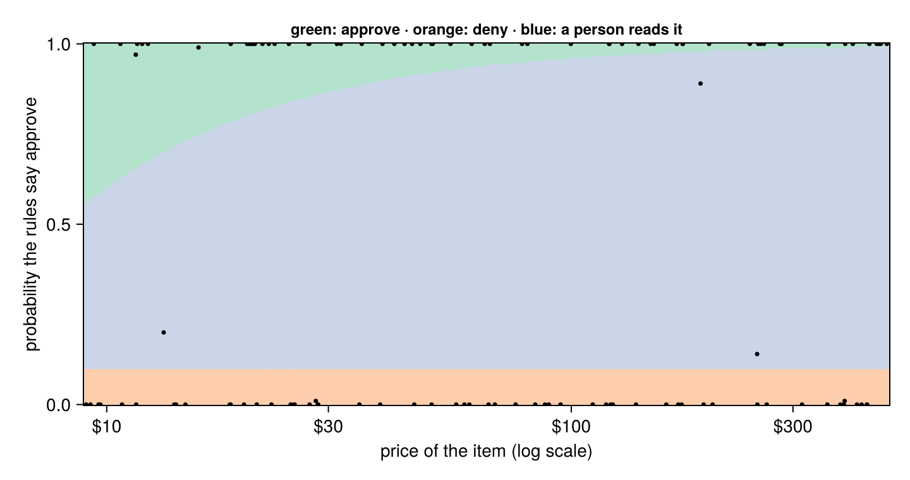

# 6. Decision models

*Approve, deny, or ask a person. Paying a refund the rules forbid costs the price of the item; refusing one the rules allow costs a customer; a person's review costs a few dollars of their time. By the end you will have a decision model that reads the facts, applies the rules exactly, knows when it isn't sure, and chooses the action with the lowest expected cost, all measured in dollars.*

**Can you skip this one?** If you can answer these, jump to [tutorial 7](07-mlj-and-formulas.md). The answers are at the bottom.

1. A model is right 97% of the time. Why might it still be the wrong one for the job?
2. The probability that the rules say "approve" is 0.8. For a $400 espresso machine and a $12 mug, what should the desk do?
3. What do you gain by letting the model read the facts and Julia apply the rules?
4. You ask a language model how sure it is, and it says 95%. Why isn't that a probability you can use?

**You will:** price each kind of mistake, let the model read and a Julia function decide, test the rules like any code (`@test`), check a model's self-rated confidence against the truth, use Jev's measured probabilities to choose the action with the lowest expected cost, escalate the unsure cases with a `@program`, and learn rules from past decisions with a decision tree.

## What you need

A `TYPESAFE_API_KEY` from [console.typesafe.ai](https://console.typesafe.ai/keys) for TypeSafe's Jev, a model built for decisions, and DecisionTree.jl for the last section (`Pkg.add("DecisionTree")`). It costs about ten cents.

```julia
using FunctAI, DataFrames, CairoMakie, Statistics, Test

log_folder = mktempdir()
FunctAI.configure!(lm = "gpt-6-luna", log_calls = log_folder)

refunds = DataFrame(FunctAI.refunds())
select(refunds, :item, :price, :days_since_delivery, :final_sale, :state, :decision)
```

```output
120×6 DataFrame
 Row │ item                 price    days_since_delivery  final_sale  state          decis ⋯
     │ String               Float64  Int64                Bool        String         Strin ⋯
─────┼──────────────────────────────────────────────────────────────────────────────────────
   1 │ wall clock             28.51                   66       false  wrong_item     deny  ⋯
   2 │ floor rug              39.22                   28       false  wrong_item     appro
   3 │ stand mixer             9.38                    9       false  faulty         appro
   4 │ ceramic planter       139.47                   57       false  faulty         appro
   5 │ bath towels            75.9                   368       false  used           deny  ⋯
   6 │ desk chair            388.71                   17       false  faulty         appro
   7 │ cast-iron casserole   458.27                   26       false  opened_unused  appro
   8 │ teapot                 11.63                   28        true  wrong_item     appro
  ⋮  │          ⋮              ⋮              ⋮               ⋮             ⋮           ⋮  ⋱
 114 │ pillow pair            22.99                   24       false  damaged        appro ⋯
 115 │ shoe rack              20.84                   24       false  damaged        appro
 116 │ reading lamp           31.9                    12       false  faulty         appro
 117 │ table lamp             24.66                   22       false  damaged        appro
 118 │ kettle                 45.43                   23       false  faulty         appro ⋯
 119 │ bedside table          20.44                   33       false  damaged        appro
 120 │ ceramic planter        24.89                   62       false  wrong_item     deny
                                                               1 column and 105 rows omitted
```

The refund desk of tutorials 4 and 5 again: 120 requests, each with the decision the shop's rules give (`?FunctAI.refunds`).

## A decision is a choice with costs

Accuracy treats every mistake the same. The desk doesn't. There are two ways to be wrong and one way to be careful:

- **approving** a refund the rules forbid: the shop loses the price of the item;
- **denying** a refund the rules allow: the customer complains, disputes the charge, and likely never comes back: call it $40;
- sending it to a **person**, who reads it and gets it right: five minutes of their time, $4.

Those numbers are the shop's to set, and they are the most important part of the model. Write them down as code:

```julia
review_cost = 4.0      # a person reads it
lost_customer = 40.0   # a wrong "no"

"What one action costs, against the decision the rules give."
cost(action, decision, price) =
    action == :review ? review_cost :
    string(action) == decision ? 0.0 :
    action == :approve ? price :            # paid what the rules don't allow
    lost_customer                           # refused what they do

"What a column of actions would have cost."
outcome(actions, strategy) =
    (strategy = strategy,
     reviews = count(==(:review), actions),
     wrong_approvals = count((actions .== :approve) .& (refunds.decision .== "deny")),
     wrong_denials = count((actions .== :deny) .& (refunds.decision .== "approve")),
     dollars = sum(cost.(actions, refunds.decision, refunds.price)))
```

```output
outcome
```

Actions are `Symbol`s (`:approve`, `:deny`, `:review`), Julia's cheap names for a small set of choices. Before any model, three strategies anyone could follow:

```julia
everyone(action) = fill(action, nrow(refunds))
baselines = [outcome(everyone(:approve), "approve everything"),
             outcome(everyone(:deny), "deny everything"),
             outcome(everyone(:review), "a person reads everything")]
DataFrame(baselines)
```

```output
3×5 DataFrame
 Row │ strategy                   reviews  wrong_approvals  wrong_denials  dollars
     │ String                     Int64    Int64            Int64          Float64
─────┼─────────────────────────────────────────────────────────────────────────────
   1 │ approve everything               0               58              0  7113.74
   2 │ deny everything                  0                0             62  2480.0
   3 │ a person reads everything      120                0              0   480.0
```

A person reading everything is the benchmark to beat: never wrong, and $480 for 120 requests. A model has to be cheaper than that *including the cost of its mistakes*.

## The model decides

Tutorial 4's function, with the rules in its description. Its answer is `:approve` or `:deny`:

```julia
@ai function refund_rules(message::String, price::Float64, days_since_delivery::Int, final_sale::Bool)::OneOf(:approve, :deny)
    """
    Should the shop refund this request? Follow the refund rules exactly:
    - Damaged on arrival, or the wrong item (or part of the order missing): refund within 60 days
      of delivery, final sale or not.
    - Faulty (it failed in normal use): refund within 365 days, final sale or not.
    - Unopened, or opened but not used, and no longer wanted: refund within 30 days, never for a
      final-sale item.
    - Used and no longer wanted: no refund.
    """
end

direct = refund_rules.(refunds.message, refunds.price, refunds.days_since_delivery, refunds.final_sale)
outcome(direct, "the model decides")
```

```output
(strategy = "the model decides", reviews = 0, wrong_approvals = 1, wrong_denials = 1, dollars = 53.26)
```

A dot over four columns calls the function once per row, with that row's four values. Compare the dollars with the person reading everything. And ask the question a manager would ask about each decision: *why?* The function answered "approve" or "deny". It can't show its work in a form you could audit, and if the policy changes next month, you'd change a paragraph of prose and hope.

## The model reads, Julia decides

Split the job in two. The part that needs reading (what state is the item in?) goes to the model, which is good at it: tutorial 5 measured it. The part that is arithmetic on facts (how many days, final sale or not) goes to Julia, which is never wrong about whether 31 is more than 30.

The reading, from tutorial 5:

```julia
@enum ItemState unopened opened_unused used damaged wrong_item faulty

@ai function item_state(message::String)
    "What state is the item in, from the customer's message?"
    state::ItemState = ai"unopened: still sealed, never opened; opened_unused: unpacked and looked at, never used; used: used for a while, works fine, no longer wanted; damaged: broken or damaged when it arrived; wrong_item: not what was ordered, or part of the order missing; faulty: worked at first, then failed in normal use"
end;
```

The rules, as a plain Julia function:

```julia
function policy(state::ItemState, days::Integer, final_sale::Bool)
    ok = state in (damaged, wrong_item)       ? days <= 60 :
         state == faulty                      ? days <= 365 :
         state in (unopened, opened_unused)   ? days <= 30 && !final_sale :
         false                                # used, no longer wanted
    ok ? :approve : :deny
end
```

```output
policy (generic function with 1 method)
```

Test it like any Julia function: given the true states, it must reproduce every decision, because it *is* the rules. The data's states are text, so look each one up by name first:

```julia
by_name = Dict(string(s) => s for s in instances(ItemState))
refunds.true_state = [by_name[s] for s in refunds.state]

@test string.(policy.(refunds.true_state, refunds.days_since_delivery, refunds.final_sale)) == refunds.decision
```

```output
Test Passed
```

Now the model reads, and the policy decides:

```julia
refunds.state_read = item_state.(refunds.message)
two_step = policy.(refunds.state_read, refunds.days_since_delivery, refunds.final_sale)
outcome(two_step, "the model reads, Julia decides")
```

```output
(strategy = "the model reads, Julia decides", reviews = 0, wrong_approvals = 1, wrong_denials = 0, dollars = 13.26)
```

And every decision comes with its reason, in words a manager can check:

```julia
because(state, days, final_sale) = "$state, $days days" * (final_sale ? ", final sale" : "")

first(DataFrame(item = refunds.item, action = two_step,
                reason = because.(refunds.state_read, refunds.days_since_delivery, refunds.final_sale)), 8)
```

```output
8×3 DataFrame
 Row │ item                 action   reason
     │ String               Symbol   String
─────┼───────────────────────────────────────────────────────────────
   1 │ wall clock           deny     wrong_item, 66 days
   2 │ floor rug            approve  wrong_item, 28 days
   3 │ stand mixer          approve  faulty, 9 days
   4 │ ceramic planter      approve  faulty, 57 days
   5 │ bath towels          deny     used, 368 days
   6 │ desk chair           approve  faulty, 17 days
   7 │ cast-iron casserole  approve  opened_unused, 26 days
   8 │ teapot               approve  wrong_item, 28 days, final sale
```

When the policy changes, you change `policy`, run the `@test` again, and the model doesn't need to know.

## Knowing when it isn't sure

To choose between approving, denying and asking a person, you need to know how likely each decision is to be right. The tempting shortcut is to ask the model how sure it is:

```julia
@ai adapter = :json function read_and_rate(message::String)
    "What state is the item in, from the customer's message, and how sure are you?"
    state::ItemState = ai"the item's state"
    confidence::Float64 = ai"how sure you are of the state, from 0 to 1"
end

rated = DataFrame(read_and_rate.(refunds.message))
rated.truth = refunds.true_state
first(rated, 6)
```

```output
6×3 DataFrame
 Row │ state       confidence  truth
     │ ItemState   Float64     ItemState
─────┼────────────────────────────────────
   1 │ wrong_item        0.99  wrong_item
   2 │ wrong_item        0.99  wrong_item
   3 │ faulty            0.99  faulty
   4 │ faulty            0.99  faulty
   5 │ used              0.99  used
   6 │ faulty            0.99  faulty
```

That number is text the model wrote, not a measurement. Language models are trained to sound helpful, and "95% sure" is what a helpful answer sounds like. Check it the only way that counts, against the right answers: group the answers by the confidence the model gave them, and see how often each group was right.

```julia
band(c) = c >= 0.99 ? "0.99 or more" : c >= 0.9 ? "0.90-0.99" : c >= 0.7 ? "0.70-0.90" : "under 0.70"

combine(groupby(transform(rated, :confidence => ByRow(band) => :said), :said),
        nrow => :answers, [:state, :truth] => ((a, b) -> mean(a .== b)) => :right)
```

```output
4×3 DataFrame
 Row │ said          answers  right
     │ String        Int64    Float64
─────┼─────────────────────────────────
   1 │ 0.99 or more       92  1.0
   2 │ 0.90-0.99          23  0.956522
   3 │ under 0.70          2  0.5
   4 │ 0.70-0.90           3  0.666667
```

It may look better than you'd fear: current models are often roughly right about their own doubt on easy jobs. But look for mistakes it made while saying 0.99, and remember what this number is: words the model chose, not something it was trained to get right. Nothing keeps it **calibrated** (right 90% of the time when it says 0.9) when the model version changes or the messages get harder, so you would have to repeat this check forever before building a cost rule on it.

## A model built for decisions: Jev

TypeSafe's **Jev** is built the other way round from a language model. It writes no text at all. It answers typed questions (pick one of these options, yes or no, a score on a scale) with a probability for every possible answer, and it is trained so those probabilities are **calibrated**: of all the answers it gives at 80%, about 80% should be right. It costs almost nothing ($0.042 per million tokens read, and nothing for its answers) and answers in a fraction of a second.

In FunctAI it's just another model, because `item_state` is already a typed question with a set of answers. `predict` returns everything a call produced, the probabilities included, keyed by your own type:

```julia
jev_state = configure(item_state; lm = "typesafe:jev-latest")

p = predict(jev_state, "Opened the box and the lid was cracked right across.")
p.value
```

```output
damaged::ItemState = 3
```

```julia
p.probabilities.state
```

```output
OrderedCollections.OrderedDict{ItemState, Float64} with 6 entries:
  unopened      => 0.0
  opened_unused => 0.01
  used          => 0.0
  damaged       => 0.99
  wrong_item    => 0.0
  faulty        => 0.0
```

On all 120 requests, concurrently, keeping every prediction (`predict.` over a column is concurrent, like calling the function):

```julia
jev_preds = predict.(jev_state, refunds.message)

jev = DataFrame(item = refunds.item, price = refunds.price, days = refunds.days_since_delivery,
                final_sale = refunds.final_sale, decision = refunds.decision, truth = refunds.true_state,
                state_read = [p.value for p in jev_preds], probs = [p.probabilities.state for p in jev_preds])
jev.sure = [probs[s] for (probs, s) in zip(jev.probs, jev.state_read)]
mean(jev.state_read .== jev.truth)
```

```output
0.9833333333333333
```

Now the check that self-rated confidence failed: group Jev's answers by the probability it gave them, and see how often each group was right.

```julia
combine(groupby(transform(jev, :sure => ByRow(band) => :said), :said),
        nrow => :answers, [:state_read, :truth] => ((a, b) -> mean(a .== b)) => :right)
```

```output
4×3 DataFrame
 Row │ said          answers  right
     │ String        Int64    Float64
─────┼─────────────────────────────────
   1 │ 0.99 or more       99  1.0
   2 │ 0.70-0.90           6  0.833333
   3 │ 0.90-0.99          12  1.0
   4 │ under 0.70          3  0.666667
```

The answers it was very sure of should be right, and its mistakes, if any, should sit among the answers it was less sure of: its doubt is where the errors are. With 120 rows the lower groups hold a handful of answers each, so read this as a sanity check, not a measurement; checking calibration properly takes a few hundred labelled rows.

## The action with the lowest expected cost

Jev gives a probability for each *state*. Push those through the policy and you get the probability that the rules say **approve**: add up the probabilities of every state that leads to approve, for this request's days and final-sale flag.

```julia
p_approve(probs, days, final_sale) = sum(p for (state, p) in probs if policy(state, days, final_sale) == :approve; init = 0.0)

jev.p = p_approve.(jev.probs, jev.days, jev.final_sale)
first(sort(select(jev, :item, :price, :truth, :state_read, :p), :p), 5)
```

```output
5×5 DataFrame
 Row │ item              price    truth       state_read  p
     │ String            Float64  ItemState   ItemState   Float64
─────┼────────────────────────────────────────────────────────────
   1 │ wall clock          28.51  wrong_item  wrong_item      0.0
   2 │ bath towels         75.9   used        used            0.0
   3 │ ceramic planter     50.05  unopened    unopened        0.0
   4 │ salad bowl          87.79  used        used            0.0
   5 │ set of four mugs   263.48  damaged     damaged         0.0
```

For each request, each action has an **expected cost**: what it costs in each case, weighted by how likely each case is.

- approve: wrong with probability `1 - p`, and then it costs the price;
- deny: wrong with probability `p`, and then it costs $40;
- review: always $4.

Choose the cheapest. `argmin` of a `NamedTuple` gives the name of its smallest value:

```julia
choose(p, price) = argmin((approve = (1 - p) * price, deny = p * lost_customer, review = review_cost))

jev.action = choose.(jev.p, jev.price)
outcome(jev.action, "expected cost, Jev")
```

```output
(strategy = "expected cost, Jev", reviews = 3, wrong_approvals = 0, wrong_denials = 0, dollars = 12.0)
```

```julia
filter(:action => ==(:review), jev)[:, [:item, :price, :p, :truth, :state_read]]
```

```output
3×5 DataFrame
 Row │ item             price    p        truth       state_read
     │ String           Float64  Float64  ItemState   ItemState
─────┼───────────────────────────────────────────────────────────
   1 │ wool throw         13.26     0.2   used        used
   2 │ coffee grinder    251.17     0.14  used        used
   3 │ ceramic planter   189.77     0.89  wrong_item  wrong_item
```

The rule depends on the price, which is the point. A 90% sure "approve" for a $12 mug is worth taking (expected loss $1.20, less than a review). The same 90% for a $400 espresso machine risks $40 on average: a person should look. Here is the whole rule as a map, with every request on it:

```julia
prices = exp.(range(log(9), log(480), 200))
ps = range(0, 1, 200)
code = Dict(:approve => 1, :deny => 2, :review => 3)
grid = [code[choose(p, price)] for price in prices, p in ps]

fig = Figure(size = (720, 380))
ax = Axis(fig[1, 1], xscale = log10, xlabel = "price of the item (log scale)",
          ylabel = "probability the rules say approve", xticks = ([10, 30, 100, 300], ["\$10", "\$30", "\$100", "\$300"]),
          title = "green: approve · orange: deny · blue: a person reads it", titlesize = 12)
heatmap!(ax, prices, ps, grid; colormap = [colorant"#b3e2cd", colorant"#fdcdac", colorant"#cbd5e8"], colorrange = (1, 3))
scatter!(ax, jev.price, jev.p; color = :black, markersize = 5)
fig
```



Most requests sit at the top or bottom edge: Jev was sure. The few in between are the ones it was honestly unsure about, and there the map acts, sending the dear ones to a person.

## A second opinion, as a program

A person isn't the only second opinion. Ask Jev first, and only when it is less sure than a threshold, ask a bigger model instead. That's four lines of Julia; `@program` makes them one call in the log, with the model calls it made as its children, so you can see what the second opinion cost and bought:

```julia
sol_state = configure(item_state; lm = "gpt-6-sol")

@program function careful_state(message::String)
    p = predict(jev_state, message)
    p.probabilities.state[p.value] >= 0.9 ? p.value : sol_state(message)
end

careful = careful_state.(refunds.message)
(right = mean(careful .== refunds.true_state), asked_sol = count(c -> c.model === "gpt-6-sol", calls(item_state; folder = log_folder)))
```

```output
(right = 0.9833333333333333, asked_sol = 9)
```

```julia
outcome(policy.(careful, refunds.days_since_delivery, refunds.final_sale), "Jev, gpt-6-sol when unsure")
```

```output
(strategy = "Jev, gpt-6-sol when unsure", reviews = 0, wrong_approvals = 1, wrong_denials = 0, dollars = 13.26)
```

TypeSafe's advice for Jev is the design of this whole tutorial: ask it narrow questions a knowledgeable person could answer in a few seconds (what state is this item in?), and combine the answers with logic in your code (`policy`, `choose`). Jev can't write a reply to the customer or explain itself in prose; for that you'd still call a language model. For the decision itself, a model that measures its doubt is the right tool.

## Every strategy, in dollars

```julia
strategies = [baselines...,
              outcome(direct, "the model decides"),
              outcome(two_step, "the model reads, Julia decides"),
              outcome(jev.action, "expected cost, Jev"),
              outcome(policy.(careful, refunds.days_since_delivery, refunds.final_sale), "Jev, gpt-6-sol when unsure")]
sort(DataFrame(strategies), :dollars)
```

```output
7×5 DataFrame
 Row │ strategy                        reviews  wrong_approvals  wrong_denials  dollars
     │ String                          Int64    Int64            Int64          Float64
─────┼──────────────────────────────────────────────────────────────────────────────────
   1 │ expected cost, Jev                    3                0              0    12.0
   2 │ the model reads, Julia decides        0                1              0    13.26
   3 │ Jev, gpt-6-sol when unsure            0                1              0    13.26
   4 │ the model decides                     0                1              1    53.26
   5 │ a person reads everything           120                0              0   480.0
   6 │ deny everything                       0                0             62  2480.0
   7 │ approve everything                    0               58              0  7113.74
```

Remember what isn't in those dollars: the model calls themselves. They are in the log, and they are small:

```julia
per_million = DataFrame(model  = ["gpt-6-luna", "gpt-6-sol", "typesafe:jev-latest"],   # dollars per million tokens, 2026-09-27
                        input  = [0.10, 2.00, 0.042],
                        output = [0.50, 10.00, 0.0])          # Jev charges only for what it reads

log = dropmissing(DataFrame(calls(folder = log_folder)), :model)   # a program's own line calls no model
bill = innerjoin(log, per_million, on = :model)
bill.dollars = (bill.input_tokens .* bill.input .+ (bill.total_tokens .- bill.input_tokens) .* bill.output) ./ 1e6
combine(groupby(bill, :model), nrow => :calls, :dollars => sum => :dollars)
```

```output
3×3 DataFrame
 Row │ model                calls  dollars
     │ String               Int64  Float64
─────┼────────────────────────────────────────
   1 │ gpt-6-luna             360  0.0150066
   2 │ typesafe:jev-latest    241  0.00477763
   3 │ gpt-6-sol                9  0.006908
```

## When nobody wrote the rules down

Sometimes there's no written policy, only past decisions: staff decided case by case, and you want to know what rule they were following. That's a job for a classic decision model: a **decision tree**, which learns yes/no questions from past cases. Jev reads the state; the tree learns the rules from the history:

```julia
import DecisionTree as DT
using Random

order = shuffle(Xoshiro(2026), 1:nrow(jev))
history, incoming = jev[order[1:60], :], jev[order[61:end], :]   # past decisions to learn from; new requests to decide

features(df) = hcat(df.days, df.final_sale, df.price, [df.state_read .== s for s in instances(ItemState)]...)
names = ["days_since_delivery", "final_sale", "price", ["state=$s" for s in instances(ItemState)]...]

tree = DT.DecisionTreeClassifier(max_depth = 4, min_samples_leaf = 5, rng = 0)
DT.fit!(tree, Float64.(features(history)), history.decision)
DT.print_tree(tree; feature_names = names)
```

```output
Feature 1: "days_since_delivery" < 30.0 ?
├─ Feature 1: "days_since_delivery" < 6.5 ?
    ├─ approve : 3/5
    └─ approve : 21/21
└─ Feature 9: "state=faulty" < 0.5 ?
    ├─ Feature 1: "days_since_delivery" < 54.5 ?
        ├─ deny : 7/9
        └─ deny : 19/19
    └─ approve : 5/6
```

Read it from the top: each line is a question, the branch under `├─` is what happens when the answer is yes and the one under `└─` when it is no, down to a decision (with how many past cases agreed with it). Put its questions next to the rules in `?FunctAI.refunds`. Which did it find? Which did it miss, or invent from the accidents of sixty past cases? And how well does it decide the other sixty, next to the written rules?

```julia
(tree = mean(DT.predict(tree, Float64.(features(incoming))) .== incoming.decision),
 written_rules = mean(string.(policy.(incoming.state_read, incoming.days, incoming.final_sale)) .== incoming.decision))
```

```output
(tree = 0.8666666666666667, written_rules = 1.0)
```

Sixty cases are not enough to learn four rules with three different time limits. The tree is still useful: it's a readable summary of what people *actually* did, and where it disagrees with what you think the policy is, you've found something to talk about. But when the rules can be written, write them.

## Your turn

1. Change `lost_customer` to $10 and then $200. How does the map change? Which strategy wins at each value?
2. Change the program's threshold to 0.99 and 0.7. How many requests go to `gpt-6-sol`, and what does each setting cost and buy?
3. Ask Jev atomic yes/no questions instead of one choice: several `Bool` answers (`opened::Bool = ai"…"`, `used::Bool = ai"…"`, `broken_on_arrival::Bool = ai"…"`) combined by a Julia function. Is it as accurate? Is it easier to explain?
4. Fit the tree on all 120 rows. Does it find the final-sale rule? Why might it not?

## What you learned

- A decision model is a choice with costs. Write the costs down; they decide more than the model does.
- Let the model read and Julia rule: `policy` is exact, testable with `@test`, and gives a reason for every decision.
- A language model's self-rated confidence is text, not a measurement: check it against labelled rows before trusting it, and expect to keep checking.
- A model built for decisions, like TypeSafe's Jev (`lm = "typesafe:jev-latest"`), gives calibrated probabilities per answer (`predict(f, x).probabilities`), which turn into the action with the lowest expected cost.
- The same doubt means "approve" for a mug and "ask a person" for an espresso machine.
- A `@program` is a second opinion in plain Julia: ask the cheap model, and the dear one only when unsure; the log shows both.
- A decision tree learns rules from past decisions; it needs far more cases than a written rule needs lines.

**Answers to the check at the top.** (1) Because its 3% of mistakes may be the expensive ones (a wrong approval on a $450 machine costs more than a hundred reviews of mugs); judge it in dollars. (2) For the $400 machine, approving risks 0.2 × $400 = $80, more than a $4 review, so a person looks; for the $12 mug, approving risks $2.40, less than a review, so approve. (3) Exact arithmetic on the facts, a reason for every decision, a policy you can test and change without the model, and a probability you can reason with. (4) It's text the model wrote to sound helpful, not a measurement: it can be high when the answer is wrong, and nothing keeps it honest when the model or the data change. A model trained to be calibrated, like Jev, gives a probability per answer that you can check against labelled rows, and use.

**Next:** [7. AI functions in MLJ and formulas](07-mlj-and-formulas.md): fit, resample and tune a language model like any MLJ model, and use one inside a GLM formula.
