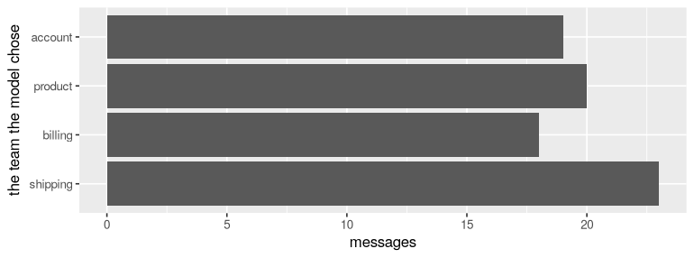

# 1. Your first AI function

*Eighty customer messages, four teams, and a function whose body is a language model. By the end you will have sorted every message, counted how many it got right, made it better, and know what it cost to the cent.*

A small homeware shop gets messages all day: a parcel that never came, a card charged twice, a kettle that won't boil, a password that won't work. Someone reads each one and forwards it to the team that can help: **shipping**, **billing**, **product** or **account**. Reading eighty messages is a morning. Reading eighty thousand is a job nobody wants.

You are going to write the function that does the reading, and use it like any other R function. This is where we are going:

```{.r .no-run}
tickets |>
  mutate(team = team(message)) |>
  count(team)
```

A column of text goes in; a column of teams comes out, as a factor, one model call per row. Everything else in this tutorial is about trusting that column.

## What you need

- R 4.1 or later, and the packages below. functai, and the two packages it uses to talk to models (lmcc and lm15), install from GitHub:

```{.r .no-run}
install.packages(c("remotes", "dplyr", "ggplot2"))
remotes::install_github("MaximeRivest/lmcc", subdir = "r")
remotes::install_github("lm15-dev/lm15-r")
remotes::install_github("MaximeRivest/functai", subdir = "r")
```

- A key for a model provider. This series mostly uses OpenAI's. Put it in your `~/.Renviron` file (`usethis::edit_r_environ()` opens it), then restart R:

```{.r .no-run}
OPENAI_API_KEY=sk-...
```

- Less than a cent of model calls. You will see the exact bill at the end.

## Setting up

```r
library(functai)
library(dplyr)
library(ggplot2)

log_folder <- tempfile("functai-calls-")
ai_config(lm = "gpt-6-luna", log_calls = log_folder)
```

```output
rat: rat: failed to start r kernel: R not found (tried: Rscript, R)
```

`ai_config()` sets choices for the whole session:

- `lm` is the language model that will do the work. `gpt-6-luna` is OpenAI's smallest current model (September 2026): fast, and cheap enough that a thousand messages cost a few cents.
- `log_calls` keeps a record of every call in a folder. We will read it at the end to count what we spent. (`tempfile()` makes a fresh, empty folder name, so this tutorial only counts its own calls.)

## The messages

functai comes with the shop's messages as a dataset, `tickets`. A person has already decided which team should answer each one: that's the `category` column. We won't show it to the model; it's the answer key.

```r
tickets
```

```output
# A tibble: 80 × 5
      id message                                       channel category order_id
   <int> <chr>                                         <chr>   <chr>    <chr>   
 1     1 Hi, my order A-1042 still hasn't arrived and… email   shipping A-1042  
 2     2 The mug arrived in pieces.                    chat    shipping <NA>    
 3     3 I was charged twice for order B-2210, please… email   billing  B-2210  
 4     4 How do I change the email on my account?      chat    account  <NA>    
 5     5 The kettle lid doesn't close properly anymor… email   product  <NA>    
 6     6 I'd like my money back for the toaster, it b… email   billing  <NA>    
 7     7 Tracking for C-3319 hasn't moved since Monda… chat    shipping C-3319  
 8     8 I forgot my password and the reset email nev… chat    account  <NA>    
 9     9 Box was crushed and the lamp inside is crack… email   shipping D-4001  
10    10 My coupon code SPRING10 didn't apply at chec… chat    billing  <NA>    
# ℹ 70 more rows
```

```r
count(tickets, category)
```

```output
# A tibble: 4 × 2
  category     n
  <chr>    <int>
1 account     18
2 billing     22
3 product     18
4 shipping    22
```

## A function with no body

Here is the function:

```r
team <- ai("team", "Which team should answer this customer message?",
  message = character(),
  .returns = factor(levels = c("shipping", "billing", "product", "account")))
```

Read it like any function definition:

- `"team"` is its name.
- The sentence says what it does, the way you'd explain the job to a new colleague.
- `message = character()` is its one input: some text. (`character()` is an empty character vector: functai reads the *type* from it.)
- `.returns` is what comes back: a factor with exactly these four levels. The model may only answer one of them.

There is no body for you to write. Printing the function shows what you declared, and which model will do the work:

```r
team
```

```output
<ai function> team(message) -> result: factor [shipping, billing, product, account]
  Function: team
  
  Which team should answer this customer message?
model: gpt-6-luna
```

Every R function has three parts: its arguments, its body and its environment. `team` is no exception:

```r
formals(team)
body(team)
```

```output
$message

call_ai(.core, mget(.inputs, envir = environment()))
```

The body is one line: hand the inputs to a model. That's the whole idea. You write the arguments, the type of the answer and a sentence; a language model does the rest, every time the function is called.

## What the model reads

A language model reads text and writes text. So what text does `team` send? `ai_render()` shows the exact request, without sending it (and without paying for it):

```r
request <- ai_render(team, message = "My card was charged twice for order B-2210.")
cat(request$system)
cat(request$messages[[1]]$parts[[1]]$text)
```

```output
Function: team

Which team should answer this customer message?

Reply in exactly this form:
<result>
one of: shipping, billing, product, account
</result>
<message>
My card was charged twice for order B-2210.
</message>
```

The first part is the instruction, written from your function: its name, your sentence, and the form the reply must take. The second part is the message itself. When the reply comes back, functai reads the text between `<result>` and `</result>`, checks it is one of the four levels, and hands you a factor. A reply that doesn't fit is asked again once; if it still doesn't fit, you get an error or an `NA`, never a made-up value.

## One call

```r
team("My card was charged twice for order B-2210.")
```

```output
[1] billing
Levels: shipping billing product account
```

That took a second or two: the question went to OpenAI's servers, the model thought about it, and the answer came back as a factor with your levels.

## A whole column

`team` is vectorised, like `toupper()` or `nchar()`: give it a vector of eighty messages and you get eighty answers back, in order. So it goes straight into `mutate()`:

```r
answered <- tickets |>
  mutate(guess = team(message))

answered |>
  select(category, guess, message)
```

```output
# A tibble: 80 × 3
   category guess    message                                                    
   <chr>    <fct>    <chr>                                                      
 1 shipping shipping Hi, my order A-1042 still hasn't arrived and it's been thr…
 2 shipping shipping The mug arrived in pieces.                                 
 3 billing  billing  I was charged twice for order B-2210, please fix this.     
 4 account  account  How do I change the email on my account?                   
 5 product  product  The kettle lid doesn't close properly anymore after a mont…
 6 billing  billing  I'd like my money back for the toaster, it burns everythin…
 7 shipping shipping Tracking for C-3319 hasn't moved since Monday.             
 8 account  account  I forgot my password and the reset email never comes.      
 9 shipping shipping Box was crushed and the lamp inside is cracked. Order D-40…
10 billing  billing  My coupon code SPRING10 didn't apply at checkout.          
# ℹ 70 more rows
```

That was eighty model calls. functai sends up to eight at a time, so it took seconds, not minutes. The result is an ordinary tibble, and `guess` is an ordinary factor, so everything you know from dplyr and ggplot2 works on it:

```r
#| fig-height: 2.6
answered |>
  count(guess) |>
  ggplot(aes(n, guess)) +
  geom_col() +
  labs(x = "messages", y = "the team the model chose")
```



## Was it right?

We have a person's answer (`category`) next to the model's (`guess`), so "how often is it right?" is a proportion, one line of dplyr:

```r
answered |>
  summarise(right = sum(guess == category), n = n(), accuracy = mean(guess == category))
```

```output
# A tibble: 1 × 3
  right     n accuracy
  <int> <int>    <dbl>
1    76    80     0.95
```

A good score for a function you wrote in three lines. But the interesting rows are the wrong ones:

```r
answered |>
  filter(guess != category) |>
  select(category, guess, message)
```

```output
# A tibble: 4 × 3
  category guess    message                                                     
  <chr>    <fct>    <chr>                                                       
1 billing  product  I want a refund for the chair, it wobbles no matter what I …
2 billing  shipping Why was I charged for shipping when my order was over $50?  
3 billing  product  The duvet shrank in the wash, I'd like my money back.       
4 billing  account  How do I stop my saved card from being used for future orde…
```

Read them next to the shop's house rules (they're in `?tickets`). Two rules trip up anyone who hasn't read them:

- anything that **arrived broken** is *shipping*, because the carrier pays;
- **every request for money back** is *billing*, whatever the reason.

Here, every miss is about money: a refund asked for because a product is poor looks like a *product* problem, a shipping charge sounds like *shipping*, a saved card sounds like an *account* setting. A new colleague would make the same sensible guesses, and they wouldn't be the shop's. The model doesn't know the rules either.

## Tell it what you know

The sentence you give `ai()` is the function's code. The most direct fix is to write the rules into it:

```r
team_rules <- ai("team",
  "Which team should answer this customer message?
  House rules:
  - Anything wrong with the delivery itself (late, lost, wrong address, wrong item,
    something missing, or broken when it arrived) is shipping: the carrier pays.
  - Anything about money (charges, invoices, coupons, cards, and every request for
    money back, whatever the reason) is billing.
  - Problems that appear while using a product, and questions about products, are product.
  - Signing in, passwords, profile details, personal data and emails from the shop are account.",
  message = character(),
  .returns = factor(levels = c("shipping", "billing", "product", "account")))

answered <- answered |>
  mutate(guess_rules = team_rules(message))

answered |>
  summarise(without_rules = mean(guess == category), with_rules = mean(guess_rules == category))
```

```output
# A tibble: 1 × 2
  without_rules with_rules
          <dbl>      <dbl>
1          0.95          1
```

The rules came from the shop's policy, not from peeking at the wrong answers, and they helped. One honest caveat: we measured both versions on the same eighty messages we've been staring at. That flatters any change you make. Tutorial 4 shows how to test a change fairly, and tutorial 3 how sure you can be of a score from eighty rows.

## The same function, another model

Nothing in `team_rules` is specific to OpenAI. `update()` makes a copy with other settings, such as another provider's model. Here is a message that sits exactly where two rules meet, asked of both:

```r
vase <- "The vase came in pieces, can I get my money back?"
team_claude <- update(team_rules, lm = "claude-haiku-4-5")

c(gpt_6_luna = team_rules(vase), claude_haiku = team_claude(vase))
```

```output
  gpt_6_luna claude_haiku 
     billing     shipping 
Levels: shipping billing product account
```

(The second call needs an `ANTHROPIC_API_KEY`. Skip it if you don't have one: nothing below depends on it.)

Broken on arrival says *shipping*; a request for money back says *billing*. The shop's answer is billing, because the money rule says "whatever the reason". Two models reading the same rules can land on different sides, because the description never says which rule wins when both apply. That's the most useful thing to learn here: where two rules meet is exactly where a model hesitates. The fix is more words ("if a message asks for money back, it is billing, even when the item arrived broken"), then checking again, on messages you didn't write the rule from.

## What it cost

Every call went into the log folder. `calls()` reads it back as a tibble, one row per call:

```r
log <- calls(folder = log_folder)
log |> select(name, model, seconds, input_tokens, output_tokens, total_tokens)
```

```output
# A tibble: 163 × 6
   name  model      seconds input_tokens output_tokens total_tokens
   <chr> <chr>        <dbl>        <dbl>         <dbl>        <dbl>
 1 team  gpt-6-luna    1.27           63            25           88
 2 team  gpt-6-luna    1.17           68            26           94
 3 team  gpt-6-luna    1.55           57            47          104
 4 team  gpt-6-luna    1.36           66            26           92
 5 team  gpt-6-luna    1.33           61            25           86
 6 team  gpt-6-luna    1.17           64            30           94
 7 team  gpt-6-luna    1.98           64           111          175
 8 team  gpt-6-luna    1.10           62            25           87
 9 team  gpt-6-luna    1.07           62            26           88
10 team  gpt-6-luna    1.34           67            38          105
# ℹ 153 more rows
```

Providers charge by the **token**, a piece of a word (about three quarters of an English word on average), with one price for what you send and a higher one for what the model writes. What it writes includes its hidden reasoning: recent models think before they answer, and you pay for the thinking. That's why we count `total_tokens - input_tokens` as the output.

Prices change, so write them down with the date you read them:

```r
prices <- tribble(
  ~model,             ~input, ~output,   # dollars per million tokens, 2026-09-27
  "gpt-6-luna",         0.10,    0.50,
  "claude-haiku-4-5",   1.00,    5.00
)

log |>
  left_join(prices, by = "model") |>
  summarise(calls = n(),
            dollars = sum(input_tokens * input + (total_tokens - input_tokens) * output) / 1e6)
```

```output
# A tibble: 1 × 2
  calls dollars
  <int>   <dbl>
1   163 0.00495
```

Keep that in mind when someone says language models are expensive. For sorting short messages, the small ones cost about as much as the electricity to read this page.

## Your turn

1. Write `urgent`, a function that answers `TRUE` or `FALSE`: does this message need an answer today? (`.returns = logical()`.) Run it on `tickets` and `count()` the answers by `category`. Which team gets the most urgent messages?
2. Look at `ai_render(team_rules, message = "hi")`. Where did your house rules go?
3. Give `team_rules` a message you write yourself that sits between two rules. What does it answer? Would a new colleague agree?

## What you learned

- `ai(name, description, inputs..., .returns = type)` writes a function whose body is a language model. It is vectorised, so it works in `mutate()` like any other function.
- The answer comes back as the type you declared. A factor means the model can only give one of your levels.
- `ai_render()` shows exactly what the model will read.
- "Is it right?" is a proportion when you have the right answers in a column.
- The description is your function's code. Writing down what you know (the house rules) is the most direct way to make it better.
- `calls()` reads the log: calls, time and tokens, and so dollars.

**Next:** [2. Answers you can compute with](02-types.md) turns free-text field notes into a table of numbers, categories and records you can plot.
