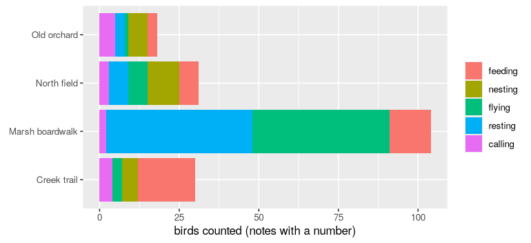

# 2. Answers you can compute with

*Sixty bird-survey notes, written however each volunteer liked. By the end you will have turned them into a table of species, counts and behaviours you can sum, plot and check, and you will know what to do when a note doesn't say.*

**Can you skip this one?** If you can answer these, jump to [tutorial 3](03-is-it-right.md). The answers are at the bottom.

1. A note says "a few mallards". What should a `count` column hold, and what do you write in `ai()` so the model is allowed to say it?
2. How do you get three answers from one call, as three columns?
3. What happens to a row whose call fails, and how do you find it?

## The notes

A bird survey sends volunteers along four trails in spring. They write what they see, as they see it:

```r
library(functai)
library(dplyr)
library(ggplot2)

log_folder <- tempfile("functai-calls-")
ai_config(lm = "gpt-6-luna", log_calls = log_folder)

field_notes |> select(id, site, note)
```

```output
# A tibble: 60 × 3
      id site            note                                                   
   <int> <chr>           <chr>                                                  
 1     1 Marsh boardwalk Great blue heron standing in the shallows, stabbing at…
 2     2 North field     A pair of robins pulling worms on the lawn.            
 3     3 Creek trail     Heard a chickadee calling 'chick-a-dee-dee' from the p…
 4     4 Old orchard     Downy woodpecker drumming on a dead branch.            
 5     5 Marsh boardwalk About 40 Canada geese flying over in a V, heading nort…
 6     6 North field     Red-tailed hawk perched on the fence post, just sittin…
 7     7 Creek trail     3 blue jays squabbling at the feeder over peanuts.     
 8     8 Old orchard     Male cardinal singing from the top of the apple tree.  
 9     9 Marsh boardwalk Mallards, a few of them, dabbling near the reeds.      
10    10 North field     Barn swallows swooping low over the grass, maybe 6.    
# ℹ 50 more rows
```

The survey needs a table, not prose: which species, how many, doing what. Someone has already filled it in for these sixty notes, following the survey's protocol (it's in `?field_notes`):

- **Species** is a name from the checklist of twelve; nicknames count ("robin", "red-tail", "downy"), and a bird not on the list is `other`.
- **Count** is every bird seen or heard. One bird named on its own ("a blue jay") is 1, "a pair" is 2, "about 40" is 40, but a note with no number ("a few", "a flock") has **no count: never guess**.
- **Behaviour** is one of five: *feeding*, *nesting*, *flying*, *resting* or *calling* (singing and drumming are calling; sitting on a nest is nesting).

We'll keep that answer key to one side, and hand the model only what a volunteer wrote:

```r
key <- field_notes |> select(id, species, count, behaviour)
notes <- field_notes |> select(id, site, date, note)
```

## A number

Start with the count. The obvious function asks for an integer:

```r
how_many <- ai("how_many", "How many birds does the note report?",
  note = character(),
  .returns = integer())

how_many("About 40 Canada geese flying over in a V, heading north.")
```

```output
[1] 40
```

`integer()` is a promise: whatever the model writes, you get an R integer back, or an error. Not the string `"about 40"`, not `"40 geese"`. You can add it, average it, plot it.

Now the whole column, next to the key:

```r
counted <- notes |>
  mutate(count = how_many(note)) |>
  left_join(key |> select(id, true_count = count), by = "id")

counted |> filter(is.na(true_count)) |> select(note, true_count, count)
```

```output
# A tibble: 7 × 3
  note                                                          true_count count
  <chr>                                                              <int> <int>
1 Mallards, a few of them, dabbling near the reeds.                     NA     3
2 Crows, a whole noisy flock, going to roost in the oaks.               NA     0
3 Red-winged blackbirds everywhere on the cattails, singing.            NA     0
4 Several song sparrows hopping in the brush pile, picking at …         NA     3
5 Lots of crows mobbing a hawk and cawing like crazy.                   NA     1
6 Several Canada geese flying low over the field, honking.              NA     3
7 Chickadees, a few, flying from the hedge into the woods.              NA     3
```

Here is the trap. The protocol says a note with no number has no count. But we asked for an integer, and an integer is what we got: the model had to invent one. "A few" became 3, "a whole flock" became something. Every one of those numbers will end up in a sum, looking exactly like a real count.

The type made the model answer. It should have let it *not* answer. `optional()` does that: the answer may be missing, and missing comes back as `NA`. And `described()` adds words the model reads about the field: here, the protocol's counting rule, kept in a variable because we'll use it again.

```r
count_rule <- "every bird seen or heard, young included; one bird named on its own ('a blue jay') is 1;
  'a pair' is 2; an approximate number ('about 40', 'maybe 6') is that number;
  no number in the note ('a few', 'several', 'a flock') means no count: never guess"

how_many <- ai("how_many", "How many birds does the note report?",
  note = character(),
  .returns = optional(described(integer(), count_rule)))

counted <- counted |> mutate(count = how_many(note))

counted |> filter(is.na(true_count)) |> select(note, true_count, count)
```

```output
# A tibble: 7 × 3
  note                                                          true_count count
  <chr>                                                              <int> <int>
1 Mallards, a few of them, dabbling near the reeds.                     NA     0
2 Crows, a whole noisy flock, going to roost in the oaks.               NA     0
3 Red-winged blackbirds everywhere on the cattails, singing.            NA     0
4 Several song sparrows hopping in the brush pile, picking at …         NA     0
5 Lots of crows mobbing a hawk and cawing like crazy.                   NA     1
6 Several Canada geese flying low over the field, honking.              NA     0
7 Chickadees, a few, flying from the hedge into the woods.              NA     0
```

Look at the counts: the notes without a number still got one (mostly a zero, where the model had to write *something*). The words say "never guess", so why? Do what you did in tutorial 1, and read what the model reads:

```r
cat(ai_render(how_many, note = "Mallards, a few of them.")$system)
```

```output
Function: how_many

How many birds does the note report?

Output guidance:
- result: every bird seen or heard, young included; one bird named on its own ('a blue jay') is 1;
  'a pair' is 2; an approximate number ('about 40', 'maybe 6') is that number;
  no number in the note ('a few', 'several', 'a flock') means no count: never guess

Reply in exactly this form:
<result>
(integer)
</result>
```

Your rule is there, under "Output guidance". But the form the model must fill in says `(integer)`, and nothing on the page says the answer may be empty, or how to write "nothing". Faced with a form that wants a number, the model wrote one.

functai can ask in another **layout**. The default one, which you've been reading, writes the question as plain text and works with any model. The `json` layout also sends the answer's exact type as a JSON schema (here: "an integer, or null"), and OpenAI, Anthropic and Gemini hold the model to that schema. For pulling typed fields out of text, especially fields that may be missing, it's the better choice:

```r
how_many <- update(how_many, adapter = "json")

counted <- counted |> mutate(count = how_many(note))

counted |> filter(is.na(true_count)) |> select(note, true_count, count)
```

```output
# A tibble: 7 × 3
  note                                                          true_count count
  <chr>                                                              <int> <int>
1 Mallards, a few of them, dabbling near the reeds.                     NA    NA
2 Crows, a whole noisy flock, going to roost in the oaks.               NA    NA
3 Red-winged blackbirds everywhere on the cattails, singing.            NA    NA
4 Several song sparrows hopping in the brush pile, picking at …         NA    NA
5 Lots of crows mobbing a hawk and cawing like crazy.                   NA    NA
6 Several Canada geese flying low over the field, honking.              NA    NA
7 Chickadees, a few, flying from the hedge into the woods.              NA    NA
```

Now "no number" is `NA`. That matters more than it looks: R's `sum()` and `mean()` refuse to ignore an `NA` unless you tell them to, so a missing count stays visible instead of quietly becoming a zero in a total.

How close are the counts overall? Two missing values agree; a missing value and a number don't:

```r
counted |>
  summarise(right = mean(coalesce(count == true_count, is.na(count) & is.na(true_count))))
```

```output
# A tibble: 1 × 1
  right
  <dbl>
1 0.983
```

## A choice

Behaviour is one of five words, so it's a factor, like `team` in tutorial 1:

```r
doing <- ai("doing", "What is the bird doing, by the survey's protocol?",
  note = character(),
  .returns = factor(levels = c("feeding", "nesting", "flying", "resting", "calling")))

doing(c("Robin singing at dawn from the roof antenna.",
        "Canada goose sitting on eggs on the island, mate standing guard."))
```

```output
[1] calling nesting
Levels: feeding nesting flying resting calling
```

Notice the factor's levels are yours, in your order, even when the model only used two of them. `count()` and ggplot2 will show all five.

## Three answers from one call

You could write one function per column and call the model three times per note. It's cheaper to ask once, for all three. `.outputs` takes a named list of types, one per answer:

```r
species_list <- c("American robin", "black-capped chickadee", "blue jay", "northern cardinal",
                  "mallard", "Canada goose", "great blue heron", "red-tailed hawk",
                  "downy woodpecker", "song sparrow", "American crow", "barn swallow", "other")

survey <- ai("survey", "Record the note as the bird survey's protocol says.",
  note = character(),
  .outputs = list(
    species = described(factor(levels = species_list),
      "the checklist name; nicknames count; a bird not on the checklist is 'other'"),
    count = optional(described(integer(), count_rule)),
    behaviour = described(factor(levels = c("feeding", "nesting", "flying", "resting", "calling")),
      "singing, calling and drumming are calling; building, sitting on a nest or feeding young are nesting;
       perched, swimming, roosting or standing still are resting")),
  .adapter = "json")

survey("Pair of downies (male + female) excavating a hole in the old pear tree.")
```

```output
# A tibble: 1 × 3
  species          count behaviour
  <fct>            <int> <fct>    
1 downy woodpecker     2 nesting  
```

With several outputs, the function returns a tibble, one column per answer. Inside `mutate()`, an unnamed tibble is spliced in as columns:

```r
recorded <- notes |>
  mutate(survey(note))

recorded |> select(note, species, count, behaviour)
```

```output
# A tibble: 60 × 4
   note                                                  species count behaviour
   <chr>                                                 <fct>   <int> <fct>    
 1 Great blue heron standing in the shallows, stabbing … great …     1 feeding  
 2 A pair of robins pulling worms on the lawn.           Americ…     2 feeding  
 3 Heard a chickadee calling 'chick-a-dee-dee' from the… black-…     1 calling  
 4 Downy woodpecker drumming on a dead branch.           downy …     1 calling  
 5 About 40 Canada geese flying over in a V, heading no… Canada…    40 flying   
 6 Red-tailed hawk perched on the fence post, just sitt… red-ta…     1 resting  
 7 3 blue jays squabbling at the feeder over peanuts.    blue j…     3 feeding  
 8 Male cardinal singing from the top of the apple tree. northe…     1 calling  
 9 Mallards, a few of them, dabbling near the reeds.     mallard    NA feeding  
10 Barn swallows swooping low over the grass, maybe 6.   barn s…     6 flying   
# ℹ 50 more rows
```

Sixty calls, three typed columns. Now it's data, so check it against the key, one column at a time:

```r
checked <- recorded |>
  left_join(key, by = "id", suffix = c("", "_key"))

checked |>
  summarise(species = mean(species == species_key),
            count = mean(coalesce(count == count_key, is.na(count) & is.na(count_key))),
            behaviour = mean(behaviour == behaviour_key))
```

```output
# A tibble: 1 × 3
  species count behaviour
    <dbl> <dbl>     <dbl>
1       1 0.933     0.983
```

And look at what it got wrong, because that's where you learn whether to trust it:

```r
checked |> filter(species != species_key) |> select(species_key, species, note)
checked |> filter(behaviour != behaviour_key) |> select(behaviour_key, behaviour, note)
checked |>
  filter(!coalesce(count == count_key, is.na(count) & is.na(count_key))) |>
  select(count_key, count, note)
```

```output
# A tibble: 0 × 3
# ℹ 3 variables: species_key <chr>, species <fct>, note <chr>
# A tibble: 1 × 3
  behaviour_key behaviour note                                      
  <chr>         <fct>     <chr>                                     
1 feeding       flying    Osprey hovering then diving into the pond!
# A tibble: 4 × 3
  count_key count note                                                      
      <int> <int> <chr>                                                     
1         1    NA hawk (red tail seen clearly) soaring in circles           
2         1    NA Chickadee pecking at birch catkins.                       
3         1    NA Sparrow (song) sitting fluffed up on a branch, not moving.
4         1    NA Heron stalking frogs at the edge of the lily pads.        
```

Read them. The osprey "hovering then diving into the pond" is fishing, so the key says *feeding*; the model saw a bird in the air. That one is arguable, the kind of disagreement two volunteers might have. The count misses are all one kind: a single bird named on its own, which the protocol counts as 1 and the model left empty. `how_many`, whose only job was counting, got those right. Asked for three things at once, the model applied the counting rule less carefully.

That's the trade-off to know about: one call instead of three is cheaper, and often just as good, but not always. Measure each column, and when one slips, give it back its own function or sharpen its words.

## Now it's just data

The point of all this is what comes next, which is ordinary R:

```r
#| fig-height: 3.2
recorded |>
  filter(!is.na(count)) |>
  group_by(site, behaviour) |>
  summarise(birds = sum(count), .groups = "drop") |>
  ggplot(aes(birds, site, fill = behaviour)) +
  geom_col() +
  labs(x = "birds counted (notes with a number)", y = NULL, fill = NULL)
```



## Records and lists

Two more types cover most of what you'll need.

A **record** is a small group of named fields that belong together. `record()` declares one, and the answer comes back as a one-row-per-call tibble column (a zero-row `tibble()` works as the type too):

```r
young <- ai("young", "Does the note report young birds, and how many of each age?",
  note = character(),
  .returns = record(adults = optional(integer()), young = optional(integer())))

ages <- notes |>
  filter(id %in% c(25, 42, 55, 57)) |>
  mutate(ages = young(note))

ages |> tidyr::unpack(ages) |> select(note, adults, young)
```

```output
# A tibble: 4 × 3
  note                                                              adults young
  <chr>                                                              <int> <int>
1 Mallard hen with 9 ducklings swimming along the edge.                  1     9
2 Robins, three adults and two speckled juveniles, on the lawn doi…      3     2
3 Robin feeding worms to 3 chicks in the nest by the bridge.            NA     3
4 Goose family: 2 adults, 5 goslings, swimming.                          2     5
```

A **list** is any number of values. `vctrs::list_of()` declares one. Here, the words in the note that justify the behaviour, which is a handy way to audit an answer:

```r
evidence <- ai("evidence", "Quote the words in the note that show what the bird is doing.",
  note = character(),
  .returns = vctrs::list_of(.ptype = character()))

evidence("Robin carrying mud and grass into the hedge. Nest in progress!")
```

```output
<list_of<character>[1]>
[[1]]
[1] "carrying mud and grass into the hedge"
```

## When a note is missing, or a call fails

A missing input is not sent to the model at all. It's `NA`, for free:

```r
doing(c("Blue jay flew over, one.", NA))
```

```output
[1] flying <NA>  
Levels: feeding nesting flying resting calling
```

And calls do fail: a provider has a bad minute, a reply can't be read even after asking again. functai doesn't stop the whole column for one bad row. The row is `NA`, one warning says how many failed, and `ai_problems()` lists them. To see it, here's a function that can't succeed: it allows the model 16 tokens, far too few for it to think and answer.

```r
starved <- update(survey, max_tokens = 16, retries = 0)
starved(notes$note[1:3])
ai_problems()
```

```output
Warning: 3 of 3 calls of `survey()` failed; its answer is NA
✖ [parse-truncated] the provider cut the reply at its length limit; reader
  'json_object' cannot tell which outputs ended before it (json_object: reply
  contains no JSON object (not a JSON object)); raise max_tokens or ask for
  less
ℹ `ai_problems()` lists them
# A tibble: 3 × 3
  species count behaviour
  <fct>   <int> <fct>    
1 <NA>       NA <NA>     
2 <NA>       NA <NA>     
3 <NA>       NA <NA>     
# A tibble: 3 × 3
    row call                                 error                              
  <int> <chr>                                <chr>                              
1     1 01a0e345-aec7-71d2-9d82-8f44e2599d11 [parse-truncated] the provider cut…
2     2 01a0e345-aed0-7ea7-8dac-cc4a8fba15bc [parse-truncated] the provider cut…
3     3 01a0e345-aed9-785b-bf11-f5e8721e8eeb [parse-truncated] the provider cut…
```

The error says why. In real use you'd look at the problem rows, fix the cause (here: remove the limit), and run just those rows again. With `update(survey, on_error = "stop")`, the first failure stops everything instead, which is what you want inside a pipeline that must not produce holes.

## What it cost

```r
prices <- tribble(
  ~model,       ~input, ~output,   # dollars per million tokens, 2026-09-27
  "gpt-6-luna",   0.10,    0.50
)

calls(folder = log_folder) |>
  left_join(prices, by = "model") |>
  summarise(calls = n(), failed = sum(!is.na(error)),
            dollars = sum(input_tokens * input + (total_tokens - input_tokens) * output, na.rm = TRUE) / 1e6)
```

```output
# A tibble: 1 × 3
  calls failed dollars
  <int>  <int>   <dbl>
1   253      3 0.00997
```

## Your turn

1. Which species did the volunteers see most of, counting only notes with a number? Answer it from `recorded` with `count()` or `summarise()`, then compare with the answer from `key`.
2. Add a fourth output to `survey`: `site_type`, one of `"water"`, `"field"`, `"woods"`, from the note alone. How often does it agree with the trail names in `site`?
3. Remove `described()` from `behaviour` in `survey` and run it again. Which notes change? Were the words worth it?

## What you learned

- The type you give is a promise the answer keeps: `integer()`, `double()`, `logical()`, `character()`, a `factor()` of your levels.
- A type that must have an answer makes the model invent one. `optional()` lets it say "not in the note", as `NA`; the `json` layout (`.adapter = "json"`) makes sure the model knows it may.
- `described()` adds words about a field. That's where rules about the field belong.
- `.outputs = list(...)` asks several things in one call; the answers come back as columns.
- `record()` is a group of fields (a tibble column; `tidyr::unpack()` spreads it), `vctrs::list_of()` any number of values.
- A missing input costs nothing and gives `NA`. A failed call gives `NA`, one warning, and a row in `ai_problems()`.

**Answers to the check at the top.** (1) `NA`: the protocol says never guess; `optional(integer())` lets the model leave it empty, and `.adapter = "json"` sends that type to the model as a schema it must follow. (2) `.outputs = list(a = ..., b = ..., c = ...)`, then `mutate(fn(x))` splices the three columns in. (3) It becomes `NA`, with one warning for all the failed rows; `ai_problems()` lists them with their errors.

**Next:** [3. Is it right?](03-is-it-right.md) turns "it looks good" into a number, an interval and a fair comparison.
