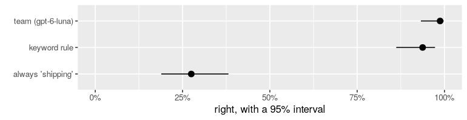

# 3. Is it right?

*A function that looks right on five messages can be wrong on one in five. By the end you will measure `team` on eighty messages with a number you can defend: how often it's right, how sure you can be, compared with what, and where it goes wrong.*

**Can you skip this one?** If you can answer these, jump to [tutorial 4](04-making-it-better.md). The answers are at the bottom.

1. A function is right on 72 of 80 rows. Between which two numbers is its true accuracy, probably?
2. Why is 90% accuracy not impressive when 90% of your rows are one class?
3. You run the same evaluation twice and get two different scores. Is something broken?

## Setting up

```r
library(functai)
library(dplyr)
library(ggplot2)

log_folder <- tempfile("functai-calls-")
ai_config(lm = "gpt-6-luna", log_calls = log_folder)

team_levels <- c("shipping", "billing", "product", "account")
tickets <- tickets |> mutate(category = factor(category, levels = team_levels))

team <- ai(team ~ message, "Which team should answer this customer message?",
  team = choice(team_levels))
```

This is tutorial 1's `team`, without the house rules, so it has something left to get wrong. We made `category` a factor with the same levels, so the right answers and the function's answers are the same kind of thing.

## A score and its interval

`evaluate()` runs a function on every row, compares each answer with the right one, and summarises:

```r
ev <- evaluate(team, tickets, expected = category)
ev
```

```output
<evaluation of team> 80 rows
  exact_match: 0.99  (95% interval 0.93 to 1.00)
```

`expected = category` says which column holds the right answers. (Without it, `evaluate()` looks for a column named like the formula's output, `team`; the answer key here is called `category`.) The first number is the share it got right. The two after it are a **95% interval**: if you drew many more messages like these, the function's true accuracy would very likely lie between them. Read the interval before the score. It's the honest summary of what eighty rows can tell you.

There's nothing mysterious about it. Being right or wrong is a yes/no outcome, so the score is a proportion, and this is the interval R's `prop.test()` gives (Wilson's, without continuity correction):

```r
right <- sum(augment(ev)$exact_match)
prop.test(right, nrow(tickets), correct = FALSE)$conf.int
```

```output
[1] 0.9325373 0.9977900
attr(,"conf.level")
[1] 0.95
```

The evaluation follows broom's conventions, so it fits in a data frame with everything else you measure:

```r
tidy(ev)
```

```output
# A tibble: 1 × 6
  metric      estimate conf.low conf.high     n failed
  <chr>          <dbl>    <dbl>     <dbl> <int>  <int>
1 exact_match    0.988    0.933     0.998    80      0
```

`augment()` gives every row back with its answer, its score and the id of its call:

```r
augment(ev) |> select(category, .pred_class, exact_match, .call)
```

```output
# A tibble: 80 × 4
   category .pred_class exact_match .call                               
   <fct>    <fct>             <dbl> <chr>                               
 1 shipping shipping              1 01a0e345-bf36-7b53-99eb-9a3602c98fa1
 2 shipping shipping              1 01a0e345-bf3a-78ec-91e2-6c873e5c6721
 3 billing  billing               1 01a0e345-bf3d-7e4b-9573-5f87b310e8d4
 4 account  account               1 01a0e345-bf40-75e7-a59a-6faf6508af5a
 5 product  product               1 01a0e345-bf43-7071-b367-c5a92da95672
 6 billing  billing               1 01a0e345-bf46-7f1d-abff-b973551a2e36
 7 shipping shipping              1 01a0e345-bf48-7a8e-a71d-40cb2c9da563
 8 account  account               1 01a0e345-bf4b-7d8d-ac2d-b28b4fc8db75
 9 shipping shipping              1 01a0e345-bf4d-733b-9391-9d3bdd78411e
10 billing  billing               1 01a0e345-bf54-7355-9052-04e9002c8f70
# ℹ 70 more rows
```

## How many rows do you need?

The interval narrows as you add rows, by the square root of their number. You don't need a model to see it: `score_interval()` computes it for any set of scores. For a function that is right 85% of the time:

```r
tibble(rows = c(20, 50, 80, 200, 500, 2000)) |>
  rowwise() |>
  mutate(ci = list(score_interval(rep(c(1, 0), c(round(0.85 * rows), rows - round(0.85 * rows)))))) |>
  mutate(low = ci$low, high = ci$high) |>
  ungroup() |>
  select(-ci)
```

```output
# A tibble: 6 × 3
   rows   low  high
  <dbl> <dbl> <dbl>
1    20 0.640 0.948
2    50 0.715 0.917
3    80 0.756 0.912
4   200 0.794 0.893
5   500 0.816 0.879
6  2000 0.834 0.865
```

With twenty rows, "85%" means anything from about 64% to 95%. With two hundred, you can tell 85% from 80%. Fifty to two hundred carefully labelled rows is usually the sweet spot: an afternoon of work that tells you whether to trust the next hundred thousand.

## Compared with what?

A score means nothing on its own. Is 90% good? It depends on how well something much simpler would do. Always measure a **baseline**.

The simplest is the "null model": always answer the most common team.

```r
count(tickets, category, sort = TRUE)
```

```output
# A tibble: 4 × 2
  category     n
  <fct>    <int>
1 shipping    22
2 billing     22
3 product     18
4 account     18
```

Then something a person might write in ten minutes: a keyword rule.

```r
keyword_rule <- function(message) {
  m <- tolower(message)
  factor(case_when(
    grepl("charge|refund|invoice|coupon|card|pay|money", m)      ~ "billing",
    grepl("password|sign in|log in|login|account|email|data", m)  ~ "account",
    grepl("arriv|deliver|track|parcel|package|box|order", m)      ~ "shipping",
    .default = "product"
  ), levels = team_levels)
}
```

All three, with their intervals. `score_interval()` takes a vector of 0s and 1s:

```r
score <- function(right, model) {
  ci <- score_interval(as.numeric(right))
  tibble(model = model, accuracy = ci$mean, low = ci$low, high = ci$high)
}

scores <- bind_rows(
  score(tickets$category == "shipping", "always 'shipping'"),
  score(keyword_rule(tickets$message) == tickets$category, "keyword rule"),
  score(augment(ev)$exact_match, "team (gpt-6-luna)")
)
scores
```

```output
# A tibble: 3 × 4
  model             accuracy   low  high
  <chr>                <dbl> <dbl> <dbl>
1 always 'shipping'    0.275 0.189 0.381
2 keyword rule         0.938 0.862 0.973
3 team (gpt-6-luna)    0.988 0.933 0.998
```

```r
#| fig-height: 1.8
ggplot(scores, aes(accuracy, reorder(model, accuracy))) +
  geom_pointrange(aes(xmin = low, xmax = high)) +
  scale_x_continuous(labels = scales::percent, limits = c(0, 1)) +
  labs(x = "right, with a 95% interval", y = NULL)
```



The null model gets about one in four, by construction: four teams of roughly equal size. The keyword rule is the humbling one. Its interval overlaps the language model's, so on these eighty messages you can't tell them apart.

Two things keep that in proportion. First, the rule was written by someone who had read these very messages (it comes from functai's own getting-started vignette), so it has been fitted to them: next month's messages will use words it has never seen. Second, the language model got there with one sentence and no knowledge of the shop. But the lesson stands, and it's the reason to always measure a baseline: sometimes the simple thing is nearly as good, and much cheaper.

## Where does it go wrong?

A single accuracy hides *which* mistakes it makes. A **confusion matrix** shows them: one row per true team, one column per answer. yardstick, the tidymodels package for scoring, draws it:

```r
library(yardstick)

rows <- augment(ev)
conf_mat(rows, truth = category, estimate = .pred_class)
```

```output
          Truth
Prediction shipping billing product account
  shipping       22       1       0       0
  billing         0      21       0       0
  product         0       0      18       0
  account         0       0       0      18
```

The diagonal is where it was right. Everything off the diagonal is a kind of mistake (here only one or two, and all of them billing messages sent elsewhere). In most jobs they're far from spread evenly. Two questions, per team, make it precise:

- **Recall**: of the messages that really were billing, what share did it send to billing?
- **Precision**: of the messages it sent to billing, what share really were billing?

```r
recall <- rows |> group_by(team = category) |> summarise(recall = mean(.pred_class == category))
precision <- rows |> group_by(team = .pred_class) |> summarise(precision = mean(.pred_class == category))
left_join(recall, precision, by = "team")
```

```output
# A tibble: 4 × 3
  team     recall precision
  <fct>     <dbl>     <dbl>
1 shipping  1         0.957
2 billing   0.955     1    
3 product   1         1    
4 account   1         1    
```

Which one matters depends on what a mistake costs. If billing messages sent elsewhere are lost for days, you care about billing's recall. If the billing team is small and drowning, you care about its precision. That question, what each mistake costs, is the whole of [tutorial 6](06-decisions.md).

## Same question, another answer

Run the same evaluation again:

```r
ev2 <- evaluate(team, tickets, expected = category)
ev2
```

```output
<evaluation of team> 80 rows
  exact_match: 0.96  (95% interval 0.90 to 0.99)
```

The score may move, and some rows may flip. That's not a bug. A language model picks each word from a distribution, and recent models like `gpt-6-luna` also think before answering, differently each time. How often do the two runs agree, row by row?

```r
both <- tibble(message = tickets$message, category = tickets$category,
               first = augment(ev)$.pred_class, second = augment(ev2)$.pred_class)

both |> summarise(agree = mean(first == second))
both |> filter(first != second) |> select(category, first, second, message)
```

```output
# A tibble: 1 × 1
  agree
  <dbl>
1 0.975
# A tibble: 2 × 4
  category first   second  message                                              
  <fct>    <fct>   <fct>   <chr>                                                
1 billing  billing product The duvet shrank in the wash, I'd like my money back.
2 billing  billing account How do I stop my saved card from being used for futu…
```

The rows that flip are the ones the model finds hard: usually the same ones a person would hesitate over. Older models let you turn randomness down with `temperature = 0`. Current reasoning models don't take it:

```r
update(team, temperature = 0)("Where is my parcel?")
```

```output
Warning: openai:gpt-6-luna does not take temperature; left out of its requests
[1] shipping
Levels: shipping billing product account
```

functai leaves the setting out and tells you once, rather than failing every row. So the honest way to handle the variation is the one you already have: report intervals, and don't read much into a point or two. When a single decision matters, ask several times and look at the votes: [tutorial 6](06-decisions.md) turns that into a probability.

## What it cost

```r
prices <- tribble(
  ~model,       ~input, ~output,   # dollars per million tokens, 2026-09-27
  "gpt-6-luna",   0.10,    0.50
)

calls(folder = log_folder) |>
  left_join(prices, by = "model") |>
  summarise(calls = n(),
            dollars = sum(input_tokens * input + (total_tokens - input_tokens) * output, na.rm = TRUE) / 1e6)
```

```output
# A tibble: 1 × 2
  calls dollars
  <int>   <dbl>
1   161 0.00399
```

## Your turn

1. Evaluate tutorial 1's `team_rules` (with the house rules) on `tickets`. Does its interval overlap `team`'s? What does that tell you, and what doesn't it? (Tutorial 4 has a sharper test for two functions run on the same rows.)
2. The keyword rule has no model at all. Improve it by one line (the mistakes table is a good guide) and measure it again. Can a rule of ten lines reach the language model's interval?
3. Which team has the lowest recall? Read three of its missed messages. Is the model wrong, or is the label arguable?

## What you learned

- `evaluate(fn, data, expected = column)` scores a function on rows with known answers: a proportion with a 95% interval (Wilson's, like `prop.test()`). `tidy()`, `glance()` and `augment()` give it as data.
- Read the interval first. Its width depends on the number of rows: fifty to two hundred rows is usually enough to decide.
- Always compare with a baseline: the most common answer, and a simple rule.
- A confusion matrix shows which mistakes; recall and precision per class say which ones matter.
- The same function can answer differently twice. Measure how often, and let intervals absorb it.

**Answers to the check at the top.** (1) About 81% to 95%: `score_interval(rep(1:0, c(72, 8)))`. (2) Because always answering that class scores 90%; compare with the null model. (3) No: language models vary from run to run, reasoning models more so; compare runs with `mean(first == second)` and report intervals.

**Next:** [4. Making it better without fooling yourself](04-making-it-better.md) tries rules, examples and reasoning, and tests each change fairly.
