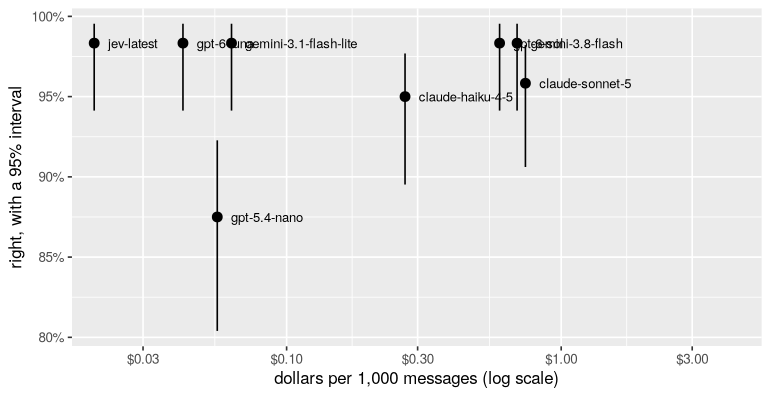

# 5. Choosing a model

*Eight current models, one job, 120 rows each. By the end you will have
a chart of accuracy against cost with honest intervals, a paired test
between the front-runners, and a rule for picking the cheapest model
that is good enough.*

**Can you skip this one?** If you can answer these, jump to
[tutorial 6](06-decisions.md). The answers are at the bottom.

1. Is the biggest, most expensive model the most accurate one?
2. Two models score 97% and 89% on the same 120 rows. How do you know the
   gap is real?
3. What does "the model is 20 times more expensive" mean for a job of a
   million rows?

## The job

The refund desk from tutorial 4 decides better when it knows what state
the item is in: still sealed, opened but unused, used, damaged on
arrival, the wrong item, or faulty. The customer never says it in those
words. Reading it from their message is a job worth doing well, and a
good one for comparing models: each message has one right answer, and
some are subtle.

```r
library(functai)
library(dplyr)
library(ggplot2)

log_folder <- tempfile("functai-calls-")
ai_config(log_calls = log_folder)

item_state <- ai("item_state", "What state is the item in, from the customer's message?",
  message = character(),
  .returns = described(factor(levels = levels(refunds$state)),
    "unopened: still sealed, never opened; opened_unused: unpacked and looked at, never used;
     used: used for a while, works fine, no longer wanted; damaged: broken or damaged when it arrived;
     wrong_item: not what was ordered, or part of the order missing; faulty: worked at first, then failed in normal use"))

count(refunds, state)
```

```output
# A tibble: 6 × 2
  state             n
  <fct>         <int>
1 unopened         14
2 opened_unused    16
3 used             22
4 damaged          20
5 wrong_item       14
6 faulty           34
```

## The candidates

Eight models from five families, as of September 2026, with their list
prices (dollars per million tokens, input and output; output includes the
model's hidden reasoning):

```r
candidates <- tribble(
  ~model,                          ~key,               ~input, ~output,
  "gpt-6-luna",                    "OPENAI_API_KEY",     0.10,    0.50,
  "gpt-6-sol",                     "OPENAI_API_KEY",     2.00,   10.00,
  "gpt-5.4-nano",                  "OPENAI_API_KEY",     0.20,    1.25,
  "claude-haiku-4-5",              "ANTHROPIC_API_KEY",  1.00,    5.00,
  "claude-sonnet-5",               "ANTHROPIC_API_KEY",  2.00,   10.00,
  "gemini:gemini-3.8-flash",       "GEMINI_API_KEY",     0.75,    3.75,
  "gemini:gemini-3.1-flash-lite",  "GEMINI_API_KEY",     0.25,    1.50,
  "jev-latest",                    "TYPESAFE_API_KEY",  0.042,   0
)

candidates <- candidates |> filter(nzchar(Sys.getenv(key)))   # only the providers you have a key for
candidates$model
```

```output
[1] "gpt-6-luna"                   "gpt-6-sol"                   
[3] "gpt-5.4-nano"                 "claude-haiku-4-5"            
[5] "claude-sonnet-5"              "gemini:gemini-3.8-flash"     
[7] "gemini:gemini-3.1-flash-lite" "jev-latest"                  
```

Note what `gpt-5.4-nano` is: the small model of six months ago. It's here
to show how fast this moves. And `jev-latest` is a different kind of
model: TypeSafe's Jev writes no text, it only answers typed questions
(one of these options, yes or no, a score), with a probability for each
answer, and charges only for what it reads. Reading an item's state is
exactly such a question, so it's in the race; tutorial 6 shows what its
probabilities are for.

## Running them all

The same function, one model at a time, on all 120 messages. `update()`
swaps the model and nothing else, so each model reads exactly the same
request:

```r
evaluations <- lapply(candidates$model, function(m) evaluate(update(item_state, lm = m), refunds, expected = state))
names(evaluations) <- candidates$model

accuracy <- bind_rows(lapply(evaluations, tidy), .id = "model")
accuracy |> select(model, estimate, conf.low, conf.high, failed)
```

```output
# A tibble: 8 × 5
  model                        estimate conf.low conf.high failed
  <chr>                           <dbl>    <dbl>     <dbl>  <int>
1 gpt-6-luna                      0.983    0.941     0.995      0
2 gpt-6-sol                       0.983    0.941     0.995      0
3 gpt-5.4-nano                    0.875    0.804     0.923      0
4 claude-haiku-4-5                0.95     0.895     0.977      0
5 claude-sonnet-5                 0.958    0.906     0.982      0
6 gemini:gemini-3.8-flash         0.983    0.941     0.995      0
7 gemini:gemini-3.1-flash-lite    0.983    0.941     0.995      0
8 jev-latest                      0.983    0.941     0.995      0
```

That was up to 960 calls. Now the other two things you care about, from
the call log: what each model cost, and how long a single answer took.

```r
usage <- calls(folder = log_folder) |>
  group_by(model) |>
  summarise(seconds = median(seconds),
            input_tokens = mean(input_tokens),
            output_tokens = mean(total_tokens - input_tokens))

compare <- accuracy |>
  left_join(usage, by = "model") |>
  left_join(candidates, by = "model") |>
  mutate(per_1000 = 1000 * (input_tokens * input + output_tokens * output) / 1e6)

compare |>
  select(model, accuracy = estimate, per_1000, seconds, output_tokens) |>
  arrange(desc(accuracy))
```

```output
# A tibble: 8 × 5
  model                        accuracy per_1000 seconds output_tokens
  <chr>                           <dbl>    <dbl>   <dbl>         <dbl>
1 gpt-6-luna                      0.983   0.0419   1.05          39.6 
2 gpt-6-sol                       0.983   0.597    1.03          19.8 
3 gemini:gemini-3.8-flash         0.983   0.691    1.20         142.  
4 gemini:gemini-3.1-flash-lite    0.983   0.063    0.527          6.91
5 jev-latest                      0.983   0.0199   0.175         67.2 
6 claude-sonnet-5                 0.958   0.741    1.22          16.9 
7 claude-haiku-4-5                0.95    0.270    0.512          9.92
8 gpt-5.4-nano                    0.875   0.0559   0.690         12.8 
```

`per_1000` is dollars per thousand messages, `seconds` the median time
for one answer, `output_tokens` how much each model wrote per answer,
thinking included. Look at that last column: some models think at length
before a one-word answer, and you pay for every word of it.

## Accuracy against cost

```r
#| fig-height: 3.6
ggplot(compare, aes(per_1000, estimate)) +
  geom_pointrange(aes(ymin = conf.low, ymax = conf.high)) +
  geom_text(aes(label = sub("^gemini:", "", model)), hjust = 0, size = 3, position = position_nudge(x = 0.05)) +
  scale_x_log10(labels = scales::dollar, expand = expansion(mult = c(0.05, 0.5))) +
  scale_y_continuous(labels = scales::percent) +
  labs(x = "dollars per 1,000 messages (log scale)", y = "right, with a 95% interval")
```



The best models are up and to the left: more accurate for less. The
expensive models buy almost nothing here. `gpt-6-sol` is at best a
message or two ahead of the cheapest current models, at more than ten
times the price; Claude Sonnet 5 costs more and gets more wrong. And the
cheapest of all is the one that isn't a language model: Jev charges only
for what it reads (its answers are free), and answers in a fraction of
the time. Reading
the state of an item from a short message is a narrow job, and a recent
small model does it about as well as anything. Big models earn their
price on long, hard problems; for a column of short texts, measure
before you assume.

## Is the gap real?

The intervals overlap for the front-runners. As in tutorial 4, the
sharper question uses the fact that every model answered the *same*
rows: count the disagreements.

```r
right <- function(m) factor(augment(evaluations[[m]])$exact_match, levels = c(0, 1), labels = c("wrong", "right"))

paired <- function(a, b) {
  t <- table(right(a), right(b))
  tibble(a = a, b = b, a_only = t["right", "wrong"], b_only = t["wrong", "right"],
         p_value = if (t["right", "wrong"] + t["wrong", "right"] > 0) mcnemar.test(t)$p.value else 1)
}

best <- compare$model[which.max(compare$estimate)]
bind_rows(lapply(setdiff(compare$model, best), function(m) paired(best, m)))
```

```output
# A tibble: 7 × 5
  a          b                            a_only b_only p_value
  <chr>      <chr>                         <int>  <int>   <dbl>
1 gpt-6-luna gpt-6-sol                         0      0 1      
2 gpt-6-luna gpt-5.4-nano                     14      1 0.00195
3 gpt-6-luna claude-haiku-4-5                  4      0 0.134  
4 gpt-6-luna claude-sonnet-5                   3      0 0.248  
5 gpt-6-luna gemini:gemini-3.8-flash           0      0 1      
6 gpt-6-luna gemini:gemini-3.1-flash-lite      1      1 1      
7 gpt-6-luna jev-latest                        1      1 1      
```

`a_only` is how many messages the best model got right and the other
got wrong; `b_only` the reverse. A model that loses 10 to 1 is really
worse. One that splits 2 to 1 isn't distinguishable on 120 rows.

## A rule for choosing

Write the rule down before you look at the chart, so the chart can't
talk you into anything:

> Among the models whose accuracy is **not clearly worse** than the best
> (paired p-value above 0.05, and at most 3 points behind), pick the
> **cheapest**. If speed matters more than money, pick the fastest of
> those instead.

```r
gaps <- bind_rows(lapply(setdiff(compare$model, best), function(m) paired(best, m))) |>
  select(model = b, p_value) |>
  bind_rows(tibble(model = best, p_value = 1))

compare |>
  left_join(gaps, by = "model") |>
  filter(p_value > 0.05, estimate >= max(estimate) - 0.03) |>
  select(model, accuracy = estimate, per_1000, seconds) |>
  arrange(per_1000)
```

```output
# A tibble: 6 × 4
  model                        accuracy per_1000 seconds
  <chr>                           <dbl>    <dbl>   <dbl>
1 jev-latest                      0.983   0.0199   0.175
2 gpt-6-luna                      0.983   0.0419   1.05 
3 gemini:gemini-3.1-flash-lite    0.983   0.063    0.527
4 gpt-6-sol                       0.983   0.597    1.03 
5 gemini:gemini-3.8-flash         0.983   0.691    1.20 
6 claude-sonnet-5                 0.958   0.741    1.22 
```

The first row is the choice. The trade-off it absorbs is stated in the
rule: "not clearly worse on 120 rows" is not "equal". If a point of
accuracy is worth a lot to you, label more rows and run the comparison
again, rather than paying for the biggest model on faith.

## Thinking less

Reasoning models let you choose how hard they think. `gpt-6-luna` thinks
at "medium" effort unless told otherwise; at "off" it answers straight
away, the way models did two years ago, and writes far fewer tokens. Is
the thinking worth paying for on this job? The setting passes straight
through to the provider with `config`:

```r
luna_off <- update(item_state, lm = "gpt-6-luna", config = list(reasoning = lm15::reasoning("off")))
ev_off <- evaluate(luna_off, refunds, expected = state)
ev_off
```

```output
<evaluation of item_state> 120 rows
  exact_match: 0.99  (95% interval 0.95 to 1.00)
```

Every call an evaluation makes is logged with the evaluation's id (in
the `caller` list column), so the log can tell the two efforts apart.
Their tokens and time, then their answers on the same rows:

```r
log <- calls(folder = log_folder) |> filter(model == "gpt-6-luna")
effort <- ifelse(vapply(log$caller, function(c) identical(c$evaluation, ev_off$run), NA), "off", "medium")

log |>
  mutate(effort = effort) |>
  group_by(effort) |>
  summarise(calls = n(), seconds = median(seconds), output_tokens = mean(total_tokens - input_tokens))

table(medium = right("gpt-6-luna"),
      off = factor(augment(ev_off)$exact_match, levels = c(0, 1), labels = c("wrong", "right")))
```

```output
# A tibble: 2 × 4
  effort calls seconds output_tokens
  <chr>  <int>   <dbl>         <dbl>
1 medium   120   1.05           39.6
2 off      120   0.943          14.1
       off
medium  wrong right
  wrong     1     1
  right     0   118
```

Switched off, it writes about a third as many tokens and is as accurate
on this job, within a row or two either way. For reading short messages
the thinking isn't worth paying for. On a job that combines several
rules with arithmetic (tutorial 4's decision), check again: that's where
thinking earns its tokens.

## What it cost

```r
calls(folder = log_folder) |>
  left_join(candidates, by = "model") |>
  group_by(model) |>
  summarise(calls = n(), dollars = sum(input_tokens * input + (total_tokens - input_tokens) * output, na.rm = TRUE) / 1e6) |>
  arrange(desc(dollars))
```

```output
# A tibble: 8 × 3
  model                        calls dollars
  <chr>                        <int>   <dbl>
1 claude-sonnet-5                120 0.0889 
2 gemini:gemini-3.8-flash        120 0.0829 
3 gpt-6-sol                      120 0.0716 
4 claude-haiku-4-5               120 0.0324 
5 gpt-6-luna                     240 0.00881
6 gemini:gemini-3.1-flash-lite   120 0.00756
7 gpt-5.4-nano                   120 0.00671
8 jev-latest                     120 0.00239
```

```r
calls(folder = log_folder) |>
  left_join(candidates, by = "model") |>
  summarise(calls = n(), dollars = sum(input_tokens * input + (total_tokens - input_tokens) * output, na.rm = TRUE) / 1e6)
```

```output
# A tibble: 1 × 2
  calls dollars
  <int>   <dbl>
1  1080   0.301
```

## Your turn

1. Run the comparison on tutorial 4's decision (`refund_rules`), which
   has the rules to follow. Do the same models lead? Which ones fall
   behind when there's a policy to apply?
2. Add a model you have access to (any provider lm15 reaches, even a
   local `ollama:` one at zero cost) to `candidates` and rerun.
3. Change the rule's "3 points" to 1. Which model does it choose? What
   would it cost you, per million messages, to be that strict?

## What you learned

- Compare models on your job, your rows: `update(fn, lm = ...)` changes
  only the model.
- Cost is tokens times price, and output tokens include hidden
  reasoning: measure it from the log, don't guess it from the price list.
- Bigger is not better by default. For narrow jobs on short text, a
  recent small model is often the best and the cheapest.
- Compare front-runners in pairs, by their disagreements on the same
  rows.
- Write the choosing rule down first. Then the chart informs the choice
  instead of making it.
- Reasoning effort is a dial (`config = list(reasoning =
  lm15::reasoning("off"))`): less thinking is cheaper; check it stays
  accurate.

**Answers to the check at the top.** (1) Not necessarily: here the most
expensive models were no better, within noise, than the cheapest current
one. Measure it. (2) Count the rows one got right and the other wrong,
each way, and test that split (`mcnemar.test()`). (3) It's the difference
between tens of dollars and hundreds or thousands for the same column:
multiply dollars per 1,000 by 1,000.

**Next:** [6. Decision models](06-decisions.md): approve, deny, or ask a
person, when mistakes cost different amounts.
