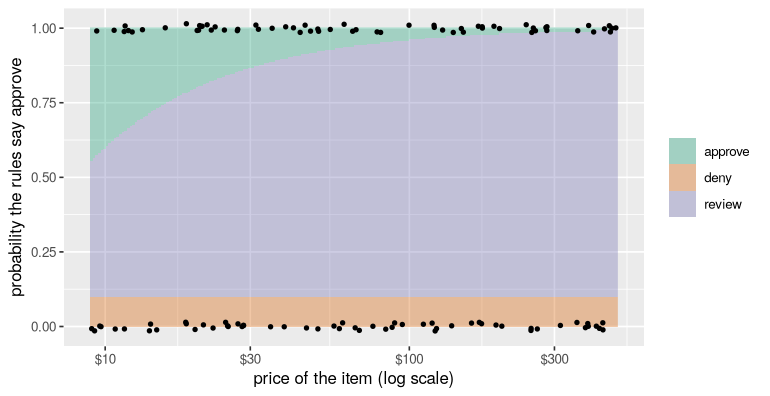
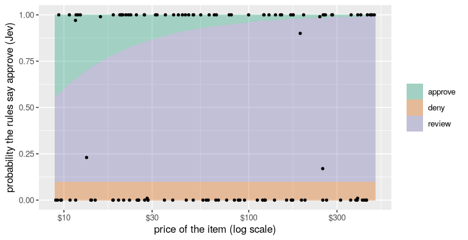
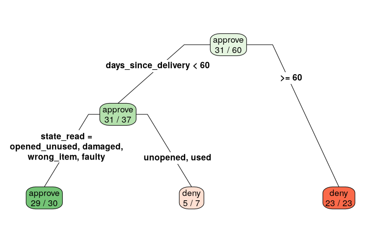

# 6. Decision models

*Approve, deny, or ask a person. Paying a refund the rules forbid costs
the price of the item; refusing one the rules allow costs a customer; a
person's review costs a few dollars of their time. By the end you will
have a decision model that reads the facts, applies the rules exactly,
knows when it isn't sure, and chooses the action with the lowest
expected cost, all measured in dollars.*

**Can you skip this one?** If you can answer these, jump to
[tutorial 7](07-tidymodels.md). The answers are at the bottom.

1. A model is right 97% of the time. Why might it still be the wrong one
   to let decide?
2. Five votes say "approve" four times. For a $400 espresso machine, do
   you approve? For a $12 mug?
3. What do you gain by letting the model read the facts and R apply the
   rules, instead of letting the model decide?
4. Five votes all agree. Why isn't that the same as a probability of 1,
   and what kind of model gives you a real one?

## What you need

This tutorial uses `rpart` (it comes with R) and `rpart.plot`, `parsnip`
and `rsample` (`install.packages(c("rpart.plot", "parsnip", "rsample"))`).
One section uses TypeSafe's Jev, which needs a `TYPESAFE_API_KEY` from
[console.typesafe.ai](https://console.typesafe.ai/keys) in your
`~/.Renviron`. It costs about seven cents.

```r
library(functai)
library(dplyr)
library(ggplot2)

log_folder <- tempfile("functai-calls-")
ai_config(lm = "gpt-6-luna", log_calls = log_folder)
```

## A decision is a choice with costs

The refund desk of tutorials 4 and 5 again: 120 requests, each with the
decision the shop's rules give (`?refunds`).

```r
refunds |> select(item, price, days_since_delivery, final_sale, state, decision)
```

```output
# A tibble: 120 × 6
   item                 price days_since_delivery final_sale state      decision
   <chr>                <dbl>               <int> <lgl>      <fct>      <fct>   
 1 wall clock           28.5                   66 FALSE      wrong_item deny    
 2 floor rug            39.2                   28 FALSE      wrong_item approve 
 3 stand mixer           9.38                   9 FALSE      faulty     approve 
 4 ceramic planter     139.                    57 FALSE      faulty     approve 
 5 bath towels          75.9                  368 FALSE      used       deny    
 6 desk chair          389.                    17 FALSE      faulty     approve 
 7 cast-iron casserole 458.                    26 FALSE      opened_un… approve 
 8 teapot               11.6                   28 TRUE       wrong_item approve 
 9 pillow pair         129.                    25 FALSE      faulty     approve 
10 ceramic planter      50.0                   94 FALSE      unopened   deny    
# ℹ 110 more rows
```

Accuracy treats every mistake the same. The desk doesn't. There are two
ways to be wrong and one way to be careful:

- **approving** a refund the rules forbid: the shop loses the price of
  the item;
- **denying** a refund the rules allow: the customer complains, disputes
  the charge and doesn't come back. Call it $40;
- sending it to a **person**, who reads it and gets it right: five
  minutes of their time, about $4.

Those numbers are the shop's to set, and they are the most important
part of the model. Write them down as code:

```r
review_cost <- 4       # a person reads it
lost_customer <- 40    # a wrong "no"

cost_of <- function(action, decision, price) {
  case_when(
    action == "review"  ~ review_cost,
    action == decision  ~ 0,
    action == "approve" ~ price,          # paid what the rules don't allow
    action == "deny"    ~ lost_customer)  # refused what they do
}

outcome <- function(action, strategy) {
  action <- as.character(action)
  tibble(strategy = strategy,
         reviews = sum(action == "review"),
         wrong_approvals = sum(action == "approve" & refunds$decision == "deny"),
         wrong_denials = sum(action == "deny" & refunds$decision == "approve"),
         dollars = sum(cost_of(action, refunds$decision, refunds$price)))
}
```

Before any model, three strategies anyone could follow:

```r
n <- nrow(refunds)
baselines <- bind_rows(
  outcome(rep("approve", n), "approve everything"),
  outcome(rep("deny", n), "deny everything"),
  outcome(rep("review", n), "a person reads everything")
)
baselines
```

```output
# A tibble: 3 × 5
  strategy                  reviews wrong_approvals wrong_denials dollars
  <chr>                       <int>           <int>         <int>   <dbl>
1 approve everything              0              58             0   7114.
2 deny everything                 0               0            62   2480 
3 a person reads everything     120               0             0    480 
```

A person reading everything is the benchmark to beat: never wrong, and
$480 for 120 requests. A model has to be cheaper than that *including
the cost of its mistakes*.

## The model decides

Tutorial 4's function, with the rules in its description:

```r
refund_rules <- ai(decision ~ message + price + days_since_delivery + final_sale,
  "Should the shop refund this request? Follow the refund rules exactly:
  - Damaged on arrival, or the wrong item (or part of the order missing): refund within 60 days
    of delivery, final sale or not.
  - Faulty (it failed in normal use): refund within 365 days, final sale or not.
  - Unopened, or opened but not used, and no longer wanted: refund within 30 days, never for a
    final-sale item.
  - Used and no longer wanted: no refund.",
  .data = refunds, .name = "refund")

direct <- with(refunds, refund_rules(message, price, days_since_delivery, final_sale))
outcome(direct, "the model decides")
```

```output
# A tibble: 1 × 5
  strategy          reviews wrong_approvals wrong_denials dollars
  <chr>               <int>           <int>         <int>   <dbl>
1 the model decides       0               1             0    13.3
```

Compare that with the person reading everything. And ask the question a
manager would ask about each decision: *why?* The function answered
"approve" or "deny". It can't show its work in a form you could audit,
and if the policy changes next month, you'd change a paragraph of prose
and hope.

## The model reads, R decides

Split the job in two. The part that needs reading (what state is the
item in?) goes to the model, which is good at it: tutorial 5 measured
it. The part that is arithmetic on facts (how many days, final sale or
not) goes to R, which is never wrong about whether 31 is more than 30.

The rules, as a function:

```r
policy <- function(state, days, final_sale) {
  state <- rep_len(as.character(state), length(days))
  approve <- case_when(
    state %in% c("damaged", "wrong_item")     ~ days <= 60,
    state == "faulty"                         ~ days <= 365,
    state %in% c("unopened", "opened_unused") ~ days <= 30 & !final_sale,
    .default = FALSE)                         # used, no longer wanted
  factor(if_else(approve, "approve", "deny"), levels = c("approve", "deny"))
}
```

Test it like any R function: given the true states, it must reproduce
every decision, because it *is* the rules.

```r
with(refunds, mean(policy(state, days_since_delivery, final_sale) == decision))
```

```output
[1] 1
```

The reading, from tutorial 5. This time we ask each question **five
times** (`samples = 5`) and keep all the answers. The class is the
majority; the share of votes for each state is a probability you can
use:

```r
item_state <- ai(state ~ message, "What state is the item in, from the customer's message?",
  state = choice(
    unopened      = "still sealed, never opened",
    opened_unused = "unpacked and looked at, never used",
    used          = "used for a while, works fine, no longer wanted",
    damaged       = "broken or damaged when it arrived",
    wrong_item    = "not what was ordered, or part of the order missing",
    faulty        = "worked at first, then failed in normal use"),
  .name = "item_state")

votes <- augment(item_state, refunds, samples = 5)
votes |> select(state, .pred_class, .pred_unopened:.pred_faulty)
```

```output
# A tibble: 120 × 8
   state .pred_class .pred_unopened .pred_opened_unused .pred_used .pred_damaged
   <fct> <fct>                <dbl>               <dbl>      <dbl>         <dbl>
 1 wron… wrong_item               0                   0          0             0
 2 wron… wrong_item               0                   0          0             0
 3 faul… faulty                   0                   0          0             0
 4 faul… faulty                   0                   0          0             0
 5 used  used                     0                   0          1             0
 6 faul… faulty                   0                   0          0             0
 7 open… opened_unu…              0                   1          0             0
 8 wron… wrong_item               0                   0          0             0
 9 faul… faulty                   0                   0          0             0
10 unop… unopened                 1                   0          0             0
# ℹ 110 more rows
# ℹ 2 more variables: .pred_wrong_item <dbl>, .pred_faulty <dbl>
```

Now the decision, read then ruled:

```r
two_step <- with(votes, policy(.pred_class, days_since_delivery, final_sale))
outcome(two_step, "the model reads, R decides")
```

```output
# A tibble: 1 × 5
  strategy                   reviews wrong_approvals wrong_denials dollars
  <chr>                        <int>           <int>         <int>   <dbl>
1 the model reads, R decides       0               1             0    13.3
```

And every decision comes with its reason, in words a manager can check:

```r
votes |>
  mutate(decision_made = two_step,
         because = paste0(.pred_class, ", ", days_since_delivery, " days", if_else(final_sale, ", final sale", ""))) |>
  select(item, decision_made, because) |>
  head(8)
```

```output
# A tibble: 8 × 3
  item                decision_made because                        
  <chr>               <fct>         <chr>                          
1 wall clock          deny          wrong_item, 66 days            
2 floor rug           approve       wrong_item, 28 days            
3 stand mixer         approve       faulty, 9 days                 
4 ceramic planter     approve       faulty, 57 days                
5 bath towels         deny          used, 368 days                 
6 desk chair          approve       faulty, 17 days                
7 cast-iron casserole approve       opened_unused, 26 days         
8 teapot              approve       wrong_item, 28 days, final sale
```

When the policy changes, you change `policy()`, test it against the
true states again, and the model doesn't need to know.

## Knowing when it isn't sure

Five votes per request give a probability for each state. Push those
probabilities through the policy and you get the probability that the
rules say **approve**: add up the shares of every state that leads to
approve, for this request's days and final-sale flag.

```r
p_approve <- function(votes) {
  states <- levels(refunds$state)
  leads_to_approve <- sapply(states, function(s) policy(s, votes$days_since_delivery, votes$final_sale) == "approve")
  shares <- as.matrix(votes[paste0(".pred_", states)])
  rowSums(shares * leads_to_approve)
}

votes <- votes |> mutate(p = p_approve(votes))
count(votes, p)
```

```output
# A tibble: 2 × 2
      p     n
  <dbl> <int>
1     0    57
2     1    63
```

Most requests are unanimous, one way or the other. Any that aren't are
exactly the ones worth a second look.

## The action with the lowest expected cost

For each request, each action has an **expected cost**: what it costs in
each case, weighted by how likely each case is.

- approve: wrong with probability `1 - p`, and then it costs the price;
- deny: wrong with probability `p`, and then it costs $40;
- review: always $4.

Choose the cheapest:

```r
choose <- function(p, price) {
  expected <- cbind(approve = (1 - p) * price, deny = p * lost_customer, review = review_cost)
  colnames(expected)[max.col(-expected, ties.method = "first")]
}

votes <- votes |> mutate(action = choose(p, price))
outcome(votes$action, "expected cost, gpt-6-luna")
votes |> filter(action == "review") |> select(item, price, p, state, .pred_class)
```

```output
# A tibble: 1 × 5
  strategy                  reviews wrong_approvals wrong_denials dollars
  <chr>                       <int>           <int>         <int>   <dbl>
1 expected cost, gpt-6-luna       0               1             0    13.3
# A tibble: 0 × 5
# ℹ 5 variables: item <chr>, price <dbl>, p <dbl>, state <fct>,
#   .pred_class <fct>
```

The rule depends on the price, which is the point. A 90% sure "approve"
for a $12 mug is worth taking (expected loss $1.20, less than a review).
The same 90% for a $400 espresso machine risks $40 on average: a person
should look. Here is the whole rule as a map:

```r
#| fig-height: 3.6
map <- expand.grid(price = exp(seq(log(9), log(480), length.out = 200)), p = seq(0, 1, length.out = 200))
map$action <- choose(map$p, map$price)

ggplot(map, aes(price, p)) +
  geom_raster(aes(fill = action), alpha = 0.35) +
  geom_jitter(data = votes, aes(price, p), width = 0, height = 0.015, size = 1) +
  scale_fill_manual(values = c(approve = "#1b9e77", deny = "#d95f02", review = "#7570b3")) +
  scale_x_log10(labels = scales::label_dollar(accuracy = 1)) +
  labs(x = "price of the item (log scale)", y = "probability the rules say approve", fill = NULL)
```



Every dot is a request. With a reader this sure of itself, almost every
dot sits on the top or bottom edge, where the map says "approve" or
"deny" at any price. The middle band, where a person reads it, is for
split votes, and the dearer the item, the wider the band.

## What votes can't see

Which decisions were still wrong, and how sure was the model about them?

```r
votes |>
  mutate(decision_made = policy(.pred_class, days_since_delivery, final_sale)) |>
  filter(decision_made != decision) |>
  select(item, price, p, state, .pred_class, decision)
```

```output
# A tibble: 1 × 6
  item       price     p state .pred_class   decision
  <chr>      <dbl> <dbl> <fct> <fct>         <fct>   
1 wool throw  13.3     1 used  opened_unused deny    
```

Look at `p` for any row there. If it's in between, the rule saw the
doubt and judged the item too cheap for a review to be worth $4: a risk
taken on purpose, and priced. If it's 0 or 1, all five votes agreed, and
were wrong. Votes measure how *consistent* a model is, not whether
it's right, and a model that misreads a message the same way five times
looks certain. The expected-cost rule can't catch what looks certain.
That's called being badly **calibrated**, and the only way to know how
badly is to check, on labelled rows, how often "five out of five" is
really right:

```r
votes |>
  group_by(p) |>
  summarise(requests = n(), rules_said_approve = mean(decision == "approve"))
```

```output
# A tibble: 2 × 3
      p requests rules_said_approve
  <dbl>    <int>              <dbl>
1     0       57              0    
2     1       63              0.984
```

If "unanimous approve" is right only 98% of the time, you can tell the
rule so: treat 1 as 0.98 and 0 as 0.02. Then any confident approval of
an item dear enough (0.02 × price > $4, so above $200) goes to a person:

```r
outcome(choose(pmin(pmax(votes$p, 0.02), 0.98), votes$price), "expected cost, votes capped at 2%-98%")
```

```output
# A tibble: 1 × 5
  strategy                         reviews wrong_approvals wrong_denials dollars
  <chr>                              <int>           <int>         <int>   <dbl>
1 expected cost, votes capped at …      15               1             0    73.3
```

Is that worth it? The table says. Capping buys insurance against a
confident mistake on an expensive item, and pays for it in reviews of
expensive items the model got right. Whether it pays off depends on how
often the confident mistakes happen and how dear they are, which is
exactly what your costs and your labelled rows are for.

## A model built for decisions: Jev

Everything so far used language models, which are built to write text,
and squeezed a probability out of them by asking five times. TypeSafe's
**Jev** is built the other way round. It writes no text at all. It
answers typed questions (pick one of these options, yes or no, a score
on a scale) with a probability for every possible answer, and it is
trained so those probabilities are **calibrated**: of all the answers it
gives at 80%, about 80% should be right. That is exactly what `choose()`
needs.

It also costs almost nothing ($0.042 per million tokens read, and
nothing for its answers) and answers in a fraction of a second. In
functai it's just another model, because `item_state` is already a typed
question with a set of answers:

```r
jev_state <- update(item_state, lm = "jev-latest")

read_jev <- augment(jev_state, refunds)
read_jev |> select(state, .pred_class, .pred_unopened:.pred_faulty)
```

```output
# A tibble: 120 × 8
   state .pred_class .pred_unopened .pred_opened_unused .pred_used .pred_damaged
   <fct> <fct>                <dbl>               <dbl>      <dbl>         <dbl>
 1 wron… wrong_item            0                   0             0             0
 2 wron… wrong_item            0                   0             0             0
 3 faul… faulty                0                   0             0             0
 4 faul… faulty                0                   0             0             0
 5 used  used                  0                   0             1             0
 6 faul… faulty                0                   0             0             0
 7 open… opened_unu…           0.02                0.98          0             0
 8 wron… wrong_item            0                   0             0             0
 9 faul… faulty                0                   0             0             0
10 unop… unopened              0.99                0.01          0             0
# ℹ 110 more rows
# ℹ 2 more variables: .pred_wrong_item <dbl>, .pred_faulty <dbl>
```

One call a row, and the probabilities come with the answer: no votes.
How often is its reading right, next to `gpt-6-luna`'s majority of five?

```r
tibble(model = c("gpt-6-luna, 5 votes", "jev-latest, 1 call"),
       state_read_right = c(mean(votes$.pred_class == refunds$state), mean(read_jev$.pred_class == refunds$state)))
```

```output
# A tibble: 2 × 2
  model               state_read_right
  <chr>                          <dbl>
1 gpt-6-luna, 5 votes            0.983
2 jev-latest, 1 call             0.983
```

The real test is the calibration check that votes failed: group the
answers by how sure Jev said it was, and see how often each group was
right.

```r
read_jev |>
  mutate(sure = pmax(.pred_unopened, .pred_opened_unused, .pred_used, .pred_damaged, .pred_wrong_item, .pred_faulty),
         said = cut(sure, c(0, 0.8, 0.95, 0.99, 1), include.lowest = TRUE)) |>
  group_by(said) |>
  summarise(answers = n(), right = mean(.pred_class == state))
```

```output
# A tibble: 4 × 3
  said        answers right
  <fct>         <int> <dbl>
1 [0,0.8]           6 0.833
2 (0.8,0.95]        8 0.875
3 (0.95,0.99]      24 1    
4 (0.99,1]         82 1    
```

The answers it was very sure of were right, and its mistakes, if any,
sit among the answers it was less sure of: its doubt is where the
errors are, which is what votes could not promise. With 120 rows the
lower groups hold a handful of answers each, so read this as a sanity
check, not a measurement; checking calibration properly takes a few
hundred labelled rows. And its probabilities spread over the whole
range, instead of piling up at 0 and 1. The same
functions from above turn them into decisions, because the columns have
the same names:

```r
read_jev <- read_jev |> mutate(p = p_approve(read_jev), action = choose(p, price))
outcome(read_jev$action, "expected cost, jev-latest")
read_jev |> filter(action == "review") |> select(item, price, p, state, .pred_class)
```

```output
# A tibble: 1 × 5
  strategy                  reviews wrong_approvals wrong_denials dollars
  <chr>                       <int>           <int>         <int>   <dbl>
1 expected cost, jev-latest       3               0             0      12
# A tibble: 3 × 5
  item            price     p state      .pred_class
  <chr>           <dbl> <dbl> <fct>      <fct>      
1 wool throw       13.3  0.23 used       used       
2 coffee grinder  251.   0.17 used       used       
3 ceramic planter 190.   0.9  wrong_item wrong_item 
```

On the map, most of Jev's requests still sit at the edges: it was sure,
and right. But a few now sit in between, the ones it was honestly unsure
about, and there the map can act, sending the dear ones to a person:

```r
#| fig-height: 3.6
ggplot(map, aes(price, p)) +
  geom_raster(aes(fill = action), alpha = 0.35) +
  geom_point(data = read_jev, aes(price, p), size = 1) +
  scale_fill_manual(values = c(approve = "#1b9e77", deny = "#d95f02", review = "#7570b3")) +
  scale_x_log10(labels = scales::label_dollar(accuracy = 1)) +
  labs(x = "price of the item (log scale)", y = "probability the rules say approve (Jev)", fill = NULL)
```



TypeSafe's advice for Jev is the design of this whole tutorial: ask it
narrow questions a knowledgeable person could answer in a few seconds
(what state is this item in?), and combine the answers with logic in
your code (`policy()`, `choose()`). Jev can't write a reply to the
customer or explain itself in prose; for that you'd still call a language
model. For the decision itself, a model that measures its doubt is the
right tool.

## When the reader is weaker

Here's the same pipeline with `gpt-5.4-nano`, the small model of six
months ago, which tutorial 5 found a clearly worse reader:

```r
votes_nano <- augment(update(item_state, lm = "gpt-5.4-nano"), refunds, samples = 5)
votes_nano <- votes_nano |> mutate(p = p_approve(votes_nano), action = choose(p, price))

votes_nano |> summarise(state_read_right = mean(.pred_class == state))

bind_rows(
  outcome(with(votes_nano, policy(.pred_class, days_since_delivery, final_sale)), "trust nano's majority"),
  outcome(votes_nano$action, "expected cost, gpt-5.4-nano")
)
```

```output
# A tibble: 1 × 1
  state_read_right
             <dbl>
1            0.917
# A tibble: 2 × 5
  strategy                    reviews wrong_approvals wrong_denials dollars
  <chr>                         <int>           <int>         <int>   <dbl>
1 trust nano's majority             0               0             0       0
2 expected cost, gpt-5.4-nano       3               0             0      12
```

A worse reader made far fewer wrong *decisions* than wrong *readings*.
Many misreadings don't change the decision: "used" and "opened but
unused" are both a "no" after 30 days, "damaged" and "faulty" both a
"yes" within 60. What you should measure is the decision, because that's
what costs money. Measuring only the reading would have made this model
look much worse than it is at the job.

## All the strategies, in dollars

```r
all_strategies <- bind_rows(
  baselines,
  outcome(direct, "the model decides"),
  outcome(two_step, "the model reads, R decides"),
  outcome(votes$action, "expected cost, gpt-6-luna"),
  outcome(choose(pmin(pmax(votes$p, 0.02), 0.98), votes$price), "expected cost, capped, gpt-6-luna"),
  outcome(read_jev$action, "expected cost, jev-latest"),
  outcome(votes_nano$action, "expected cost, gpt-5.4-nano")
)
all_strategies |> arrange(dollars)
```

```output
# A tibble: 9 × 5
  strategy                         reviews wrong_approvals wrong_denials dollars
  <chr>                              <int>           <int>         <int>   <dbl>
1 expected cost, jev-latest              3               0             0    12  
2 expected cost, gpt-5.4-nano            3               0             0    12  
3 the model decides                      0               1             0    13.3
4 the model reads, R decides             0               1             0    13.3
5 expected cost, gpt-6-luna              0               1             0    13.3
6 expected cost, capped, gpt-6-lu…      15               1             0    73.3
7 a person reads everything            120               0             0   480  
8 deny everything                        0               0            62  2480  
9 approve everything                     0              58             0  7114. 
```

Remember what isn't in those dollars: the model calls themselves. They
are in the log, and they are small:

```r
prices <- tribble(
  ~model,         ~input, ~output,   # dollars per million tokens, 2026-09-27
  "gpt-6-luna",     0.10,    0.50,
  "gpt-5.4-nano",   0.20,    1.25,
  "jev-latest",    0.042,    0       # Jev charges only for what it reads
)

calls(folder = log_folder) |>
  left_join(prices, by = "model") |>
  group_by(model) |>
  summarise(calls = n(), dollars = sum(input_tokens * input + (total_tokens - input_tokens) * output, na.rm = TRUE) / 1e6)
```

```output
# A tibble: 3 × 3
  model        calls dollars
  <chr>        <int>   <dbl>
1 gpt-5.4-nano   600 0.0333 
2 gpt-6-luna     720 0.0299 
3 jev-latest     120 0.00238
```

## If nobody wrote the rules down

Sometimes there's no written policy, only past decisions: staff decided
case by case, and you want to know what rule they were following. That's
a job for a classic decision model: a **decision tree**, which learns
yes/no questions from past cases. The model reads the state; the tree
learns the rules from the history:

```r
library(parsnip)
library(rsample)

read <- votes |> mutate(state_read = .pred_class)

set.seed(2026)
halves <- initial_split(read, prop = 1/2, strata = decision)
history <- training(halves)     # past decisions to learn from
incoming <- testing(halves)     # new requests to decide

tree <- decision_tree(mode = "classification", tree_depth = 4, min_n = 5) |>
  set_engine("rpart") |>
  fit(decision ~ state_read + days_since_delivery + final_sale + price, data = history)
```

```r
#| fig-height: 4.5
wrap <- function(x, labs, digits, varlen, faclen)     # long lists of states, over several lines
  sapply(strwrap(gsub(",", ", ", labs), 26, simplify = FALSE), paste, collapse = "\n")

rpart.plot::rpart.plot(extract_fit_engine(tree), roundint = FALSE, type = 4, extra = 2, branch = 0.4,
                       fallen.leaves = TRUE, box.palette = "GnRd", split.fun = wrap)
```



Read the picture from the top: each branch is labelled with the answer
that leads down it; each box shows the decision there, and how many of
the past requests that reached it had that decision, out of how many.

The same tree as rules, one line per leaf, is easier to put next to a
policy. The number is the share of past requests there that were
**denied**:

```r
rpart.plot::rpart.rules(extract_fit_engine(tree), roundint = FALSE)
```

```output
 decision                                                                                                
     0.03 when days_since_delivery <  60 & state_read is opened_unused or damaged or wrong_item or faulty
     0.71 when days_since_delivery <  60 & state_read is                                 unopened or used
     1.00 when days_since_delivery >= 60                                                                 
```

Put its questions next to the rules in `?refunds`. Which lines did it
find? Which did it miss, or invent from the accidents of sixty past
cases? And how well does it decide the other sixty, next to the written
rules?

```r
incoming |>
  mutate(tree = predict(tree, incoming)$.pred_class,
         written_rules = policy(state_read, days_since_delivery, final_sale)) |>
  summarise(tree = mean(tree == decision), written_rules = mean(written_rules == decision))
```

```output
# A tibble: 1 × 2
   tree written_rules
  <dbl>         <dbl>
1 0.817             1
```

Sixty cases are not enough to learn four rules with three different
time limits. The tree is still useful: it's a readable summary of what
people *actually* did, and where it disagrees with what you think the
policy is, you've found something to talk about. But when the rules can
be written, write them.

## Your turn

1. Change `lost_customer` to $10 and then $200. How does the map change?
   Which strategy wins at each value?
2. Add a fourth action: ask `gpt-6-sol` to read the state again, at a
   cost of about $0.001, and send to a person only when the two readers
   disagree. How much does it save over reviewing every unsure request?
3. Ask Jev atomic yes/no questions instead of one choice: a function
   with `opened + used + broken_on_arrival ~ message`, each
   `described(logical(), "Has the customer opened the package?")` and so on,
   one question each. Write the policy on those answers. Is it as accurate?
   Is it easier to explain?
4. Fit the tree on all 120 rows. Does it find the final-sale rule? Why
   is that rule hard to learn from this data? (`count(refunds, final_sale,
   decision)` is a hint.)

## What you learned

- A decision model is a choice with costs. Write the costs down; they
  matter more than the last point of accuracy.
- Let the model read and R rule: `policy()` is exact, testable,
  explainable, and changes without touching the prompt.
- `samples = 5` gives votes; push their shares through the policy to get
  the probability of each decision.
- Choose the action with the lowest expected cost. The same doubt means
  "approve" for a mug and "ask a person" for an espresso machine.
- Votes are rough probabilities, and a consistently wrong model looks
  certain: check on labelled rows how often "unanimous" is right, and
  cap the probabilities accordingly.
- A model built for decisions, like TypeSafe's Jev
  (`lm = "jev-latest"`), answers a typed question with a calibrated
  probability for every answer, in one call; `augment()` gives them as
  `.pred_` columns, ready for the expected-cost rule.
- Measure decisions, not readings: many misreadings don't change the
  decision.
- A decision tree learns rules from past decisions; it needs far more
  cases than writing the rules down.

**Answers to the check at the top.** (1) Because its 3% of mistakes may
be the expensive ones (a wrong approval on a $450 machine costs more than
a hundred reviews of mugs); judge it in dollars. (2) With p = 0.8: for
the $400 machine, approving risks 0.2 × $400 = $80, more than a $4
review, so a person looks; for the $12 mug, approving risks $2.40, less
than a review, so approve. (3) Exact arithmetic on the facts, a reason
for every decision, a policy you can test and change without the model,
and a probability you can reason with. (4) Five identical answers only
say the model is consistent; it can be consistently wrong. A model
trained to be calibrated, like Jev, gives a probability per answer that
you can check against labelled rows, and use.

**Next:** [7. AI functions in tidymodels](07-tidymodels.md) puts a
language model in the same workflows, resampling and tuning as any other
model.
