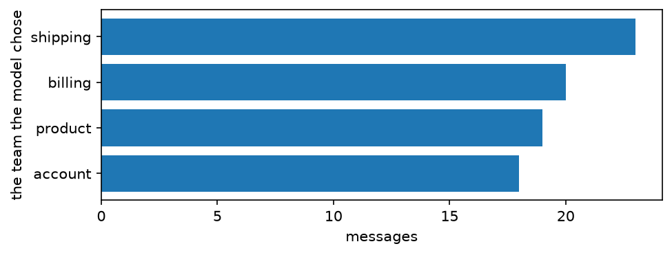

---
rat:
  project: ../../python
  python:
    dependencies: ["-e .[data]", "matplotlib"]
---

# 1. Your first AI function

*Eighty customer messages, four teams, and a function whose body is a
language model. By the end you will have sorted every message, counted
how many it got right, made it better, and know what it cost to the
cent.*

A small homeware shop gets messages all day: a parcel that never came, a
card charged twice, a kettle that won't boil, a password that won't work.
Someone reads each one and forwards it to the team that can help:
**shipping**, **billing**, **product** or **account**. Reading eighty
messages is a morning. Reading eighty thousand is a job nobody wants.

You are going to write the function that does the reading, and use it
like any other Python function. This is where we are going:

```{.python .no-run}
tickets.mutate(team=team(col.message)).count(col.team)
```

A column of text goes in; a column of teams comes out, one model call
per row. Everything else in this tutorial is about trusting that column.

## What you need

- Python 3.11 or later, and functai with its table support (tables are
  [dpyr](https://github.com/MaximeRivest/dpyr) data frames, dplyr's
  grammar in Python):

```{.python .no-run}
pip install "functai[data]" matplotlib
```

- A key for a model provider. This series mostly uses OpenAI's: set
  `OPENAI_API_KEY` in your environment, or run `functai.login("openai")`
  once.
- Less than a cent of model calls. You will see the exact bill at the
  end.

## Setting up

```python
import tempfile
from typing import Literal

import matplotlib.pyplot as plt
from dpyr import col, n, read

import functai
from functai import ai

log_folder = tempfile.mkdtemp()
functai.configure(lm="gpt-6-luna", log_calls=log_folder)
```

```output
configure(lm='gpt-6-luna', log_calls='/tmp/tmp76ikb1gg')
```

`functai.configure()` sets choices for the whole session:

- `lm` is the language model that will do the work. `gpt-6-luna` is
  OpenAI's cheapest current model (September 2026): fast, and cheap
  enough that a thousand messages cost a few cents.
- `log_calls` keeps a record of every call in a folder. We will read it
  at the end to count what we spent. (`tempfile.mkdtemp()` makes a fresh,
  empty folder, so this tutorial only counts its own calls.)

## The messages

functai comes with the shop's messages as a dataset. A person has already
decided which team should answer each one: that's the `category` column.
We won't show it to the model; it's the answer key.

```python
tickets = functai.datasets.tickets()
tickets
```

```output
# dpyr dataframe · source: polars · showing 10 of ? rows
┌─────┬─────────────────────────────────────────────────────────────────────┬─────────┬──────────┬──────────┐
│ id  ┆ message                                                             ┆ channel ┆ category ┆ order_id │
│ --- ┆ ---                                                                 ┆ ---     ┆ ---      ┆ ---      │
│ i64 ┆ str                                                                 ┆ str     ┆ str      ┆ str      │
╞═════╪═════════════════════════════════════════════════════════════════════╪═════════╪══════════╪══════════╡
│ 1   ┆ Hi, my order A-1042 still hasn't arrived and it's been three weeks. ┆ email   ┆ shipping ┆ A-1042   │
│ 2   ┆ The mug arrived in pieces.                                          ┆ chat    ┆ shipping ┆ null     │
│ 3   ┆ I was charged twice for order B-2210, please fix this.              ┆ email   ┆ billing  ┆ B-2210   │
│ 4   ┆ How do I change the email on my account?                            ┆ chat    ┆ account  ┆ null     │
│ 5   ┆ The kettle lid doesn't close properly anymore after a month of use. ┆ email   ┆ product  ┆ null     │
│ 6   ┆ I'd like my money back for the toaster, it burns everything.        ┆ email   ┆ billing  ┆ null     │
│ 7   ┆ Tracking for C-3319 hasn't moved since Monday.                      ┆ chat    ┆ shipping ┆ C-3319   │
│ 8   ┆ I forgot my password and the reset email never comes.               ┆ chat    ┆ account  ┆ null     │
│ 9   ┆ Box was crushed and the lamp inside is cracked. Order D-4001.       ┆ email   ┆ shipping ┆ D-4001   │
│ 10  ┆ My coupon code SPRING10 didn't apply at checkout.                   ┆ chat    ┆ billing  ┆ null     │
└─────┴─────────────────────────────────────────────────────────────────────┴─────────┴──────────┴──────────┘
```

```python
tickets.count(col.category)
```

```output
# dpyr dataframe · source: polars · showing 4 of 4 rows
┌──────────┬─────┐
│ category ┆ n   │
│ ---      ┆ --- │
│ str      ┆ i64 │
╞══════════╪═════╡
│ account  ┆ 18  │
│ billing  ┆ 22  │
│ product  ┆ 18  │
│ shipping ┆ 22  │
└──────────┴─────┘
```

## A function with no body

Here is the function:

```python
@ai
def team(message: str) -> Literal["shipping", "billing", "product", "account"]:
    """Which team should answer this customer message?"""
    ...
```

Read it like any function definition:

- `team` is its name.
- The docstring says what it does, the way you'd explain the job to a new
  colleague.
- `message: str` is its one input: some text.
- The return type is what comes back: one of exactly these four words.
  The model may only answer one of them.

There is no body for you to write. The type hints, the name and the
docstring *are* the program; a language model does the rest, every time
the function is called.

## What the model reads

A language model reads text and writes text. So what text does `team`
send? `render()` builds the exact request, without sending it (and
without paying for it):

```python
request = team.render("My card was charged twice for order B-2210.")
print(request.system)
print(request.messages[0].parts[0].text)
```

```output
Function: team

Which team should answer this customer message?

Reply in exactly this form:
<result>
one of: shipping, billing, product, account
</result>

<message>
My card was charged twice for order B-2210.
</message>
```

The first part is the instruction, written from your function: its name,
your docstring, and the form the reply must take. The second part is the
message itself. When the reply comes back, functai reads the text between
`<result>` and `</result>`, checks it is one of the four allowed words,
and returns it. A reply that doesn't fit is asked again once; if it
still doesn't fit, you get an error, never a made-up value.

## One call

```python
team("My card was charged twice for order B-2210.")
```

```output
'billing'
```

That took a second or two: the question went to OpenAI's servers, the
model thought about it, and the answer came back as one of your four
words.

## A whole column

Called on a column instead of a value, `team` makes a new column. It
goes straight into `mutate()`, like any dpyr expression:

```python
answered = tickets.mutate(guess=team(col.message))
answered.select(col.category, col.guess, col.message)
```

```output
# dpyr dataframe · source: polars · showing 10 of 80 rows
┌──────────┬──────────┬─────────────────────────────────────────────────────────────────────┐
│ category ┆ guess    ┆ message                                                             │
│ ---      ┆ ---      ┆ ---                                                                 │
│ str      ┆ str      ┆ str                                                                 │
╞══════════╪══════════╪═════════════════════════════════════════════════════════════════════╡
│ shipping ┆ shipping ┆ Hi, my order A-1042 still hasn't arrived and it's been three weeks. │
│ shipping ┆ shipping ┆ The mug arrived in pieces.                                          │
│ billing  ┆ billing  ┆ I was charged twice for order B-2210, please fix this.              │
│ account  ┆ account  ┆ How do I change the email on my account?                            │
│ product  ┆ product  ┆ The kettle lid doesn't close properly anymore after a month of use. │
│ billing  ┆ billing  ┆ I'd like my money back for the toaster, it burns everything.        │
│ shipping ┆ shipping ┆ Tracking for C-3319 hasn't moved since Monday.                      │
│ account  ┆ account  ┆ I forgot my password and the reset email never comes.               │
│ shipping ┆ shipping ┆ Box was crushed and the lamp inside is cracked. Order D-4001.       │
│ billing  ┆ billing  ┆ My coupon code SPRING10 didn't apply at checkout.                   │
└──────────┴──────────┴─────────────────────────────────────────────────────────────────────┘
```

That was eighty model calls. functai sends eight at a time, so it took
seconds, not minutes. The result is an ordinary table, so everything you
know about tables works on it, plots included:

```python
counts = answered.count(col.guess).arrange(col.n).collect()

plt.figure(figsize=(7, 2.4))
plt.barh(counts["guess"], counts["n"])
plt.xlabel("messages")
plt.ylabel("the team the model chose")
plt.show()
```



## Was it right?

We have a person's answer (`category`) next to the model's (`guess`), so
"how often is it right?" is a proportion, one line of dpyr:

```python
answered.summarize(right=(col.guess == col.category).sum(), n=n(),
                   accuracy=(col.guess == col.category).mean())
```

```output
# dpyr dataframe · source: polars · showing 1 of 1 rows
┌───────┬─────┬──────────┐
│ right ┆ n   ┆ accuracy │
│ ---   ┆ --- ┆ ---      │
│ i64   ┆ i64 ┆ f64      │
╞═══════╪═════╪══════════╡
│ 78    ┆ 80  ┆ 0.975    │
└───────┴─────┴──────────┘
```

A good score for a function you wrote in three lines. But the interesting
rows are the wrong ones:

```python
answered.filter(col.guess != col.category).select(col.category, col.guess, col.message)
```

```output
# dpyr dataframe · source: polars · showing 2 of 2 rows
┌──────────┬──────────┬────────────────────────────────────────────────────────────┐
│ category ┆ guess    ┆ message                                                    │
│ ---      ┆ ---      ┆ ---                                                        │
│ str      ┆ str      ┆ str                                                        │
╞══════════╪══════════╪════════════════════════════════════════════════════════════╡
│ billing  ┆ shipping ┆ Why was I charged for shipping when my order was over $50? │
│ billing  ┆ product  ┆ The duvet shrank in the wash, I'd like my money back.      │
└──────────┴──────────┴────────────────────────────────────────────────────────────┘
```

Read them next to the shop's house rules (they're in the docstring of
`functai.datasets.tickets`). Two rules trip up anyone who hasn't read
them:

- anything that **arrived broken** is *shipping*, because the carrier
  pays;
- **every request for money back** is *billing*, whatever the reason.

The misses are mostly about money: a refund asked for because a product
is poor looks like a *product* problem, a shipping charge sounds like
*shipping*. A new colleague would make the same sensible guesses, and
they wouldn't be the shop's. The model doesn't know the rules either.

## Tell it what you know

The docstring is the function's code. The most direct fix is to write
the rules into it:

```python
@ai
def team_rules(message: str) -> Literal["shipping", "billing", "product", "account"]:
    """Which team should answer this customer message?

    House rules:
    - Anything wrong with the delivery itself (late, lost, wrong address, wrong item,
      something missing, or broken when it arrived) is shipping: the carrier pays.
    - Anything about money (charges, invoices, coupons, cards, and every request for
      money back, whatever the reason) is billing.
    - Problems that appear while using a product, and questions about products, are product.
    - Signing in, passwords, profile details, personal data and emails from the shop are account.
    """
    ...

answered = answered.mutate(guess_rules=team_rules(col.message))
answered.summarize(without_rules=(col.guess == col.category).mean(),
                   with_rules=(col.guess_rules == col.category).mean())
```

```output
# dpyr dataframe · source: polars · showing 1 of 1 rows
┌───────────────┬────────────┐
│ without_rules ┆ with_rules │
│ ---           ┆ ---        │
│ f64           ┆ f64        │
╞═══════════════╪════════════╡
│ 0.975         ┆ 1.0        │
└───────────────┴────────────┘
```

The rules came from the shop's policy, not from peeking at the wrong
answers, and they helped. One honest caveat: we measured both versions
on the same eighty messages we've been staring at. That flatters any
change you make. Tutorial 4 shows how to test a change fairly, and
tutorial 3 how sure you can be of a score from eighty rows.

## The same function, another model

Nothing in `team_rules` is specific to OpenAI. `using()` makes a copy
with other settings, such as another provider's model. Here is a message
that sits exactly where two rules meet, asked of both:

```python
vase = "The vase came in pieces, can I get my money back?"
team_claude = team_rules.using(lm="claude-haiku-4-5")

{"gpt-6-luna": team_rules(vase), "claude-haiku-4-5": team_claude(vase)}
```

```output
{'gpt-6-luna': 'billing', 'claude-haiku-4-5': 'shipping'}
```

(The second call needs an `ANTHROPIC_API_KEY`. Skip it if you don't have
one: nothing below depends on it.)

Broken on arrival says *shipping*; a request for money back says
*billing*. The shop's answer is billing, because the money rule says
"whatever the reason". Two models reading the same rules can land on
different sides, because the docstring never says which rule wins when
both apply. That's the most useful thing to learn here: where two rules
meet is exactly where a model hesitates. The fix is more words ("if a
message asks for money back, it is billing, even when the item arrived
broken"), then checking again, on messages you didn't write the rule
from.

## What it cost

Every call went into the log folder. `functai.calls()` reads it back as
a table, one row per call:

```python
log = functai.calls(folder=log_folder)
log.select(col.model, col.seconds, col.input_tokens, col.output_tokens, col.total_tokens)
```

```output
# dpyr dataframe · source: polars · showing 10 of ? rows
┌────────────┬──────────┬──────────────┬───────────────┬──────────────┐
│ model      ┆ seconds  ┆ input_tokens ┆ output_tokens ┆ total_tokens │
│ ---        ┆ ---      ┆ ---          ┆ ---           ┆ ---          │
│ str        ┆ f64      ┆ i64          ┆ i64           ┆ i64          │
╞════════════╪══════════╪══════════════╪═══════════════╪══════════════╡
│ gpt-6-luna ┆ 0.827873 ┆ 63           ┆ 25            ┆ 88           │
│ gpt-6-luna ┆ 0.929804 ┆ 68           ┆ 26            ┆ 94           │
│ gpt-6-luna ┆ 1.129156 ┆ 57           ┆ 31            ┆ 88           │
│ gpt-6-luna ┆ 1.342417 ┆ 66           ┆ 26            ┆ 92           │
│ gpt-6-luna ┆ 1.180546 ┆ 61           ┆ 26            ┆ 87           │
│ gpt-6-luna ┆ 1.162027 ┆ 64           ┆ 42            ┆ 106          │
│ gpt-6-luna ┆ 1.14584  ┆ 64           ┆ 51            ┆ 115          │
│ gpt-6-luna ┆ 0.94984  ┆ 62           ┆ 26            ┆ 88           │
│ gpt-6-luna ┆ 0.978058 ┆ 62           ┆ 26            ┆ 88           │
│ gpt-6-luna ┆ 1.151087 ┆ 67           ┆ 38            ┆ 105          │
└────────────┴──────────┴──────────────┴───────────────┴──────────────┘
```

Providers charge by the **token**, a piece of a word (about three
quarters of an English word on average), with one price for what you
send and a higher one for what the model writes. What it writes includes
its hidden reasoning: recent models think before they answer, and you
pay for the thinking. That's why we count `total_tokens - input_tokens`
as the output.

Prices change, so write them down with the date you read them:

```python
prices = read([   # dollars per million tokens, 2026-09-27
    {"model": "gpt-6-luna", "input": 0.10, "output": 0.50},
    {"model": "claude-haiku-4-5", "input": 1.00, "output": 5.00},
])

log.left_join(prices, on=col.model).summarize(
    calls=n(),
    dollars=((col.input_tokens * col.input + (col.total_tokens - col.input_tokens) * col.output) / 1e6).sum())
```

```output
# dpyr dataframe · source: polars · showing 1 of 1 rows
┌───────┬──────────┐
│ calls ┆ dollars  │
│ ---   ┆ ---      │
│ i64   ┆ f64      │
╞═══════╪══════════╡
│ 163   ┆ 0.004896 │
└───────┴──────────┘
```

Keep that in mind when someone says language models are expensive. For
sorting short messages, the small ones cost about as much as the
electricity to read this page.

## Your turn

1. Write `urgent`, a function that returns `bool`: does this message need
   an answer today? Run it on `tickets` and `count()` the answers by
   `category`. Which team gets the most urgent messages?
2. Look at `team_rules.render("hi").system`. Where did your house rules
   go?
3. Give `team_rules` a message you write yourself that sits between two
   rules. What does it answer? Would a new colleague agree?

## What you learned

- `@ai` on a function with a docstring and type hints makes a function
  whose body is a language model. Called on a column, it makes a column.
- The answer comes back as the type you declared. A `Literal` means the
  model can only give one of your words.
- `render()` shows exactly what the model will read.
- "Is it right?" is a proportion when you have the right answers in a
  column.
- The docstring is your function's code. Writing down what you know (the
  house rules) is the most direct way to make it better.
- `functai.calls()` reads the log: calls, time and tokens, and so
  dollars.

**Next:** [2. Answers you can compute with](02-types.md) turns free-text
field notes into a table of numbers, categories and records you can
plot.
