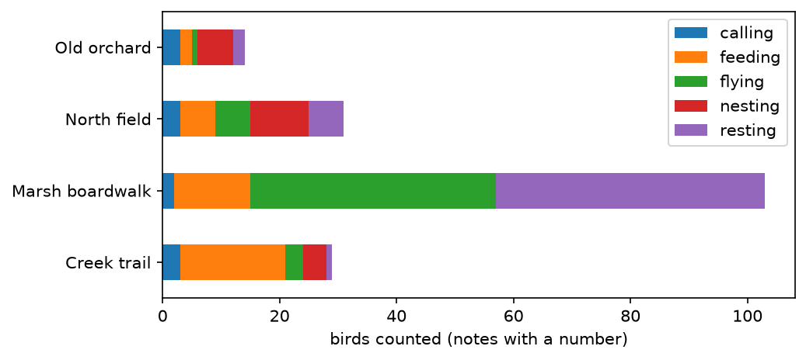

---
rat:
  project: ../../python
  python:
    dependencies: ["-e .[data]", "matplotlib"]
---

# 2. Answers you can compute with

*Sixty bird-survey notes, written however each volunteer liked. By the
end you will have turned them into a table of species, counts and
behaviours you can sum, plot and check, and you will know what to do
when a note doesn't say.*

**Can you skip this one?** If you can answer these, jump to
[tutorial 3](03-is-it-right.md). The answers are at the bottom.

1. A note says "a few mallards". What should a `count` column hold, and
   what do you write so the model is allowed to say it?
2. How do you get three answers from one call, as three columns?
3. What happens to a row whose call fails, and how do you find it?

## The notes

A bird survey sends volunteers along four trails in spring. They write
what they see, as they see it:

```python
import tempfile
from dataclasses import dataclass
from typing import Literal

import matplotlib.pyplot as plt
from dpyr import col, n, read

import functai
from functai import ai

log_folder = tempfile.mkdtemp()
functai.configure(lm="gpt-6-luna", log_calls=log_folder)

field_notes = functai.datasets.field_notes()
field_notes.select(col.id, col.site, col.note)
```

```output
# dpyr dataframe · source: polars · showing 10 of ? rows
┌─────┬─────────────────┬────────────────────────────────────────────────────────────────────────────────┐
│ id  ┆ site            ┆ note                                                                           │
│ --- ┆ ---             ┆ ---                                                                            │
│ i64 ┆ str             ┆ str                                                                            │
╞═════╪═════════════════╪════════════════════════════════════════════════════════════════════════════════╡
│ 1   ┆ Marsh boardwalk ┆ Great blue heron standing in the shallows, stabbing at fish. Caught one.       │
│ 2   ┆ North field     ┆ A pair of robins pulling worms on the lawn.                                    │
│ 3   ┆ Creek trail     ┆ Heard a chickadee calling 'chick-a-dee-dee' from the pines, didn't see it.     │
│ 4   ┆ Old orchard     ┆ Downy woodpecker drumming on a dead branch.                                    │
│ 5   ┆ Marsh boardwalk ┆ About 40 Canada geese flying over in a V, heading north.                       │
│ 6   ┆ North field     ┆ Red-tailed hawk perched on the fence post, just sitting there for ten minutes. │
│ 7   ┆ Creek trail     ┆ 3 blue jays squabbling at the feeder over peanuts.                             │
│ 8   ┆ Old orchard     ┆ Male cardinal singing from the top of the apple tree.                          │
│ 9   ┆ Marsh boardwalk ┆ Mallards, a few of them, dabbling near the reeds.                              │
│ 10  ┆ North field     ┆ Barn swallows swooping low over the grass, maybe 6.                            │
└─────┴─────────────────┴────────────────────────────────────────────────────────────────────────────────┘
```

The survey needs a table, not prose: which species, how many, doing
what. Someone has already filled it in for these sixty notes, following
the survey's protocol (it's in the docstring of
`functai.datasets.field_notes`):

- **Species** is a name from the checklist of twelve; nicknames count
  ("robin", "red-tail", "downy"), and a bird not on the list is `other`.
- **Count** is every bird seen or heard. One bird named on its own ("a
  blue jay") is 1, "a pair" is 2, "about 40" is 40, but a note with no
  number ("a few", "a flock") has **no count: never guess**.
- **Behaviour** is one of five: *feeding*, *nesting*, *flying*,
  *resting* or *calling* (singing and drumming are calling; sitting on a
  nest is nesting).

We'll keep that answer key to one side, and hand the model only what a
volunteer wrote:

```python
key = field_notes.select(col.id, col.species, col.count, col.behaviour)
notes = field_notes.select(col.id, col.site, col.date, col.note)
```

## A number

Start with the count. The obvious function asks for an integer:

```python
@ai
def how_many(note: str) -> int:
    """How many birds does the note report?"""
    ...

how_many("About 40 Canada geese flying over in a V, heading north.")
```

```output
40
```

`-> int` is a promise: whatever the model writes, you get a Python `int`
back, or an error. Not the string `"about 40"`, not `"40 geese"`. You can
add it, average it, plot it.

Now the whole column, next to the key:

```python
counted = (notes.mutate(count=how_many(col.note))
                .left_join(key.select(col.id, col.count).rename(true_count=col.count), on=col.id))

counted.filter(col.true_count.is_na()).select(col.note, col.true_count, col.count)
```

```output
# dpyr dataframe · source: polars · showing 7 of 7 rows
┌────────────────────────────────────────────────────────────────────┬────────────┬───────┐
│ note                                                               ┆ true_count ┆ count │
│ ---                                                                ┆ ---        ┆ ---   │
│ str                                                                ┆ i64        ┆ i64   │
╞════════════════════════════════════════════════════════════════════╪════════════╪═══════╡
│ Mallards, a few of them, dabbling near the reeds.                  ┆ null       ┆ 3     │
│ Crows, a whole noisy flock, going to roost in the oaks.            ┆ null       ┆ -1    │
│ Red-winged blackbirds everywhere on the cattails, singing.         ┆ null       ┆ 0     │
│ Several song sparrows hopping in the brush pile, picking at seeds. ┆ null       ┆ 3     │
│ Lots of crows mobbing a hawk and cawing like crazy.                ┆ null       ┆ -1    │
│ Several Canada geese flying low over the field, honking.           ┆ null       ┆ 3     │
│ Chickadees, a few, flying from the hedge into the woods.           ┆ null       ┆ 3     │
└────────────────────────────────────────────────────────────────────┴────────────┴───────┘
```

Here is the trap. The protocol says a note with no number has no count.
But we asked for an integer, and an integer is what we got: the model
had to invent one. "A few" became 3, "a whole flock" became something.
Every one of those numbers will end up in a sum, looking exactly like a
real count.

The type made the model answer. It should have let it *not* answer.
`int | None` does that: the answer may be missing, and missing comes back
as `None` (null in a table). A comment on the return line is read by the
model as words about the answer: here, the protocol's counting rule.

```python
@ai
def how_many(note: str) -> int | None:  # every bird seen or heard, young included; one bird named on its own ('a blue jay') is 1; 'a pair' is 2; an approximate number ('about 40', 'maybe 6') is that number; no number in the note ('a few', 'several', 'a flock') means no count: never guess
    """How many birds does the note report?"""
    ...

counted = counted.mutate(count=how_many(col.note))
counted.filter(col.true_count.is_na()).select(col.note, col.true_count, col.count)
```

```output
# dpyr dataframe · source: polars · showing 7 of 7 rows
┌────────────────────────────────────────────────────────────────────┬────────────┬───────┐
│ note                                                               ┆ true_count ┆ count │
│ ---                                                                ┆ ---        ┆ ---   │
│ str                                                                ┆ i64        ┆ i64   │
╞════════════════════════════════════════════════════════════════════╪════════════╪═══════╡
│ Mallards, a few of them, dabbling near the reeds.                  ┆ null       ┆ 0     │
│ Crows, a whole noisy flock, going to roost in the oaks.            ┆ null       ┆ 0     │
│ Red-winged blackbirds everywhere on the cattails, singing.         ┆ null       ┆ 0     │
│ Several song sparrows hopping in the brush pile, picking at seeds. ┆ null       ┆ 0     │
│ Lots of crows mobbing a hawk and cawing like crazy.                ┆ null       ┆ 0     │
│ Several Canada geese flying low over the field, honking.           ┆ null       ┆ 0     │
│ Chickadees, a few, flying from the hedge into the woods.           ┆ null       ┆ 0     │
└────────────────────────────────────────────────────────────────────┴────────────┴───────┘
```

Look at the counts: the notes without a number may still have got one.
The words say "never guess", so why? Read what the model reads:

```python
print(how_many.render("Mallards, a few of them.").system)
```

```output
Function: how_many

How many birds does the note report?

Output guidance:
- result: every bird seen or heard, young included; one bird named on its own ('a blue jay') is 1; 'a pair' is 2; an approximate number ('about 40', 'maybe 6') is that number; no number in the note ('a few', 'several', 'a flock') means no count: never guess

Return guidance: every bird seen or heard, young included; one bird named on its own ('a blue jay') is 1; 'a pair' is 2; an approximate number ('about 40', 'maybe 6') is that number; no number in the note ('a few', 'several', 'a flock') means no count: never guess

Reply in exactly this form:
<result>
(integer)
</result>
```

Your rule is there, under "Output guidance". But the form the model must
fill in says `(integer)`, and nothing on the page says the answer may be
empty, or how to write "nothing". Faced with a form that wants a number,
a model tends to write one.

functai can ask in another **layout**. The default one, which you've been
reading, writes the question as plain text and works with any model. The
`json` layout also sends the answer's exact type as a JSON schema (here:
"an integer, or null"), and OpenAI, Anthropic and Gemini hold the model
to that schema. For pulling typed fields out of text, especially fields
that may be missing, it's the better choice:

```python
how_many = how_many.using(adapter="json")

counted = counted.mutate(count=how_many(col.note))
counted.filter(col.true_count.is_na()).select(col.note, col.true_count, col.count)
```

```output
# dpyr dataframe · source: polars · showing 7 of 7 rows
┌────────────────────────────────────────────────────────────────────┬────────────┬───────┐
│ note                                                               ┆ true_count ┆ count │
│ ---                                                                ┆ ---        ┆ ---   │
│ str                                                                ┆ i64        ┆ i64   │
╞════════════════════════════════════════════════════════════════════╪════════════╪═══════╡
│ Mallards, a few of them, dabbling near the reeds.                  ┆ null       ┆ null  │
│ Crows, a whole noisy flock, going to roost in the oaks.            ┆ null       ┆ null  │
│ Red-winged blackbirds everywhere on the cattails, singing.         ┆ null       ┆ null  │
│ Several song sparrows hopping in the brush pile, picking at seeds. ┆ null       ┆ null  │
│ Lots of crows mobbing a hawk and cawing like crazy.                ┆ null       ┆ null  │
│ Several Canada geese flying low over the field, honking.           ┆ null       ┆ null  │
│ Chickadees, a few, flying from the hedge into the woods.           ┆ null       ┆ null  │
└────────────────────────────────────────────────────────────────────┴────────────┴───────┘
```

Now "no number" is null. That matters more than it looks: a missing
count stays visible instead of quietly becoming a zero in a total.

How close are the counts overall? Two missing values agree; a missing
value and a number don't:

```python
same = (col.count == col.true_count) | (col.count.is_na() & col.true_count.is_na())
counted.summarize(right=same.mean())
```

```output
# dpyr dataframe · source: polars · showing 1 of 1 rows
┌───────┐
│ right │
│ ---   │
│ f64   │
╞═══════╡
│ 1.0   │
└───────┘
```

## A choice

Behaviour is one of five words, so it's a `Literal`, like `team` in
tutorial 1:

```python
Behaviour = Literal["feeding", "nesting", "flying", "resting", "calling"]

@ai
def doing(note: str) -> Behaviour:
    """What is the bird doing, by the survey's protocol?"""
    ...

[doing("Robin singing at dawn from the roof antenna."),
 doing("Canada goose sitting on eggs on the island, mate standing guard.")]
```

```output
['calling', 'nesting']
```

## Three answers from one call

You could write one function per column and call the model three times
per note. It's cheaper to ask once, for all three. A **dataclass**
declares a record: its fields are the answers, their types are promises
like any other, and a comment after a field is read by the model as
words about that field.

```python
Species = Literal["American robin", "black-capped chickadee", "blue jay", "northern cardinal",
                  "mallard", "Canada goose", "great blue heron", "red-tailed hawk",
                  "downy woodpecker", "song sparrow", "American crow", "barn swallow", "other"]

@dataclass
class Sighting:
    species: Species        # the checklist name; nicknames count; a bird not on the checklist is 'other'
    count: int | None       # every bird seen or heard, young included; one bird named on its own is 1; 'a pair' is 2; an approximate number is that number; no number in the note means no count: never guess
    behaviour: Behaviour    # singing, calling and drumming are calling; building, sitting on a nest or feeding young are nesting; perched, swimming, roosting or standing still are resting

@ai(adapter="json")
def survey(note: str) -> Sighting:
    """Record the note as the bird survey's protocol says."""
    ...

survey("Pair of downies (male + female) excavating a hole in the old pear tree.")
```

```output
Sighting(species='downy woodpecker', count=2, behaviour='nesting')
```

The answer is a `Sighting`, an ordinary Python object. On a table,
`unpack()` spreads its fields into columns, one call per note:

```python
recorded = notes.mutate(**survey.unpack(col.note))
recorded.select(col.note, col.species, col.count, col.behaviour)
```

```output
# dpyr dataframe · source: polars · showing 10 of 60 rows
┌────────────────────────────────────────────────────────────────────────────────┬────────────────────────┬───────┬───────────┐
│ note                                                                           ┆ species                ┆ count ┆ behaviour │
│ ---                                                                            ┆ ---                    ┆ ---   ┆ ---       │
│ str                                                                            ┆ str                    ┆ i64   ┆ str       │
╞════════════════════════════════════════════════════════════════════════════════╪════════════════════════╪═══════╪═══════════╡
│ Great blue heron standing in the shallows, stabbing at fish. Caught one.       ┆ great blue heron       ┆ 1     ┆ feeding   │
│ A pair of robins pulling worms on the lawn.                                    ┆ American robin         ┆ 2     ┆ feeding   │
│ Heard a chickadee calling 'chick-a-dee-dee' from the pines, didn't see it.     ┆ black-capped chickadee ┆ 1     ┆ calling   │
│ Downy woodpecker drumming on a dead branch.                                    ┆ downy woodpecker       ┆ null  ┆ calling   │
│ About 40 Canada geese flying over in a V, heading north.                       ┆ Canada goose           ┆ 40    ┆ flying    │
│ Red-tailed hawk perched on the fence post, just sitting there for ten minutes. ┆ red-tailed hawk        ┆ 1     ┆ resting   │
│ 3 blue jays squabbling at the feeder over peanuts.                             ┆ blue jay               ┆ 3     ┆ feeding   │
│ Male cardinal singing from the top of the apple tree.                          ┆ northern cardinal      ┆ 1     ┆ calling   │
│ Mallards, a few of them, dabbling near the reeds.                              ┆ mallard                ┆ null  ┆ feeding   │
│ Barn swallows swooping low over the grass, maybe 6.                            ┆ barn swallow           ┆ 6     ┆ flying    │
└────────────────────────────────────────────────────────────────────────────────┴────────────────────────┴───────┴───────────┘
```

Sixty calls, three typed columns. Now it's data, so check it against the
key, one column at a time:

```python
checked = recorded.left_join(
    key.rename(species_key=col.species, count_key=col.count, behaviour_key=col.behaviour), on=col.id)

checked.summarize(
    species=(col.species == col.species_key).mean(),
    count=((col.count == col.count_key) | (col.count.is_na() & col.count_key.is_na())).mean(),
    behaviour=(col.behaviour == col.behaviour_key).mean())
```

```output
# dpyr dataframe · source: polars · showing 1 of 1 rows
┌─────────┬───────┬───────────┐
│ species ┆ count ┆ behaviour │
│ ---     ┆ ---   ┆ ---       │
│ f64     ┆ f64   ┆ f64       │
╞═════════╪═══════╪═══════════╡
│ 1.0     ┆ 1.0   ┆ 0.966667  │
└─────────┴───────┴───────────┘
```

And look at what it got wrong, because that's where you learn whether to
trust it:

```python
print(checked.filter(col.species != col.species_key).select(col.species_key, col.species, col.note))
print(checked.filter(col.behaviour != col.behaviour_key).select(col.behaviour_key, col.behaviour, col.note))
print(checked.filter(~((col.count == col.count_key) | (col.count.is_na() & col.count_key.is_na())))
             .select(col.count_key, col.count, col.note))
```

```output
# dpyr dataframe · source: polars · showing 0 of 0 rows
┌─────────────┬─────────┬──────┐
│ species_key ┆ species ┆ note │
│ ---         ┆ ---     ┆ ---  │
│ str         ┆ str     ┆ str  │
╞═════════════╪═════════╪══════╡
└─────────────┴─────────┴──────┘
# dpyr dataframe · source: polars · showing 2 of 2 rows
┌───────────────┬───────────┬──────────────────────────────────────────────────────────────────────┐
│ behaviour_key ┆ behaviour ┆ note                                                                 │
│ ---           ┆ ---       ┆ ---                                                                  │
│ str           ┆ str       ┆ str                                                                  │
╞═══════════════╪═══════════╪══════════════════════════════════════════════════════════════════════╡
│ feeding       ┆ flying    ┆ Osprey hovering then diving into the pond!                           │
│ nesting       ┆ feeding   ┆ Song sparrow carrying a caterpillar into the thicket (nest nearby?). │
└───────────────┴───────────┴──────────────────────────────────────────────────────────────────────┘
# dpyr dataframe · source: polars · showing 0 of 0 rows
┌───────────┬───────┬──────┐
│ count_key ┆ count ┆ note │
│ ---       ┆ ---   ┆ ---  │
│ i64       ┆ i64   ┆ str  │
╞═══════════╪═══════╪══════╡
└───────────┴───────┴──────┘
```

Read them. Some misses are arguable, the kind of disagreement two
volunteers might have: a bird "hovering then diving into the pond" is
fishing, so the key says feeding, though it's in the air; "~25 swallows"
doesn't say which swallow. Others are plain mistakes. And there's a
trade-off to know about: one call instead of three is cheaper, and often
just as good, but a model asked three things at once can apply a rule
less carefully than a function whose only job it was. Measure each
column against its own function when it matters, and when one slips,
give it back its own function or sharpen its words.

## Now it's just data

The point of all this is what comes next, which is ordinary Python:

```python
birds = (recorded.filter(~col.count.is_na())
                 .group_by(col.site, col.behaviour)
                 .summarize(birds=col.count.sum())
                 .pivot_wider(names_from=col.behaviour, values_from=col.birds)
                 .to_pandas().set_index("site").fillna(0))

birds.plot.barh(stacked=True, figsize=(7, 3.2))
plt.xlabel("birds counted (notes with a number)")
plt.ylabel("")
plt.show()
```



## Records inside, lists

Two more types cover most of what you'll need.

A record can be the whole answer, with fields that may be missing:

```python
@dataclass
class Ages:
    adults: int | None
    young: int | None

@ai(adapter="json")
def ages(note: str) -> Ages:
    """How many adult and how many young birds the note reports."""
    ...

(notes.filter(col.id.is_in([25, 42, 55, 57]))
      .mutate(**ages.unpack(col.note))
      .select(col.note, col.adults, col.young))
```

```output
# dpyr dataframe · source: polars · showing 4 of 4 rows
┌──────────────────────────────────────────────────────────────────────────────────┬────────┬───────┐
│ note                                                                             ┆ adults ┆ young │
│ ---                                                                              ┆ ---    ┆ ---   │
│ str                                                                              ┆ i64    ┆ i64   │
╞══════════════════════════════════════════════════════════════════════════════════╪════════╪═══════╡
│ Mallard hen with 9 ducklings swimming along the edge.                            ┆ 1      ┆ 9     │
│ Robins, three adults and two speckled juveniles, on the lawn doing nothing much. ┆ 3      ┆ 2     │
│ Robin feeding worms to 3 chicks in the nest by the bridge.                       ┆ 1      ┆ 3     │
│ Goose family: 2 adults, 5 goslings, swimming.                                    ┆ 2      ┆ 5     │
└──────────────────────────────────────────────────────────────────────────────────┴────────┴───────┘
```

A **list** is any number of values: `list[str]`. Here, the words in the
note that justify the behaviour, which is a handy way to audit an
answer:

```python
@ai
def evidence(note: str) -> list[str]:
    """Quote the words in the note that show what the bird is doing."""
    ...

evidence("Robin carrying mud and grass into the hedge. Nest in progress!")
```

```output
['carrying mud and grass into the hedge']
```

## When a note is missing, or a call fails

The input's type is a promise too. `note: str` means a missing note is
refused before any call: nothing is sent, and nothing is invented.

```python
try:
    doing(None)
except Exception as error:
    print(error)
```

```output
doing: input 'note': null does not bind to {"type":"string"}
```

And calls do fail: a provider has a bad minute, a reply can't be read
even after asking again. On a column, functai runs every row, keeps the
ones that worked, and then either raises (the default: run again and
only the failures are retried) or, with `errors="null"`, leaves the
failed rows empty. To see it, here's a copy of `survey` that can't
succeed: it allows the model 16 tokens, far too few to think and answer.

```python
starved = survey.using(max_tokens=16, retries=0)
notes.slice_head(n=3).mutate(**starved.unpack(col.note, errors="null")).select(col.note, col.species, col.count)
```

```output
/home/maxime/Projects/.pi-worktrees/functai-docs/python/.venv/lib/python3.13/site-packages/dpyr/rows.py:435: UserWarning: survey.species() failed on 3 of 3 rows (row 0: Refusal: [parse-truncated] the provider cut the reply at its length limit; reader 'json_object' cannot tell which outputs ended before it (json_object: reply contains no JSON object (not a JSON object)); the model spent 16 of its 16 output tokens thinking; raise max_tokens (it was 16) or ask for less); those rows are missing
  col = run(node, df)
/home/maxime/Projects/.pi-worktrees/functai-docs/python/.venv/lib/python3.13/site-packages/dpyr/rows.py:435: UserWarning: survey.count() failed on 3 of 3 rows (row 0: Refusal: [parse-truncated] the provider cut the reply at its length limit; reader 'json_object' cannot tell which outputs ended before it (json_object: reply contains no JSON object (not a JSON object)); the model spent 16 of its 16 output tokens thinking; raise max_tokens (it was 16) or ask for less); those rows are missing
  col = run(node, df)
/home/maxime/Projects/.pi-worktrees/functai-docs/python/.venv/lib/python3.13/site-packages/dpyr/rows.py:435: UserWarning: survey.behaviour() failed on 3 of 3 rows (row 0: Refusal: [parse-truncated] the provider cut the reply at its length limit; reader 'json_object' cannot tell which outputs ended before it (json_object: reply contains no JSON object (not a JSON object)); the model spent 16 of its 16 output tokens thinking; raise max_tokens (it was 16) or ask for less); those rows are missing
  col = run(node, df)
# dpyr dataframe · source: polars · showing 3 of 3 rows
┌────────────────────────────────────────────────────────────────────────────┬─────────┬───────┐
│ note                                                                       ┆ species ┆ count │
│ ---                                                                        ┆ ---     ┆ ---   │
│ str                                                                        ┆ str     ┆ i64   │
╞════════════════════════════════════════════════════════════════════════════╪═════════╪═══════╡
│ Great blue heron standing in the shallows, stabbing at fish. Caught one.   ┆ null    ┆ null  │
│ A pair of robins pulling worms on the lawn.                                ┆ null    ┆ null  │
│ Heard a chickadee calling 'chick-a-dee-dee' from the pines, didn't see it. ┆ null    ┆ null  │
└────────────────────────────────────────────────────────────────────────────┴─────────┴───────┘
```

The warnings say how many rows failed, and why. To keep each row's error
as data, `map()` runs a function on a table's rows and returns one row
per call, error included:

```python
starved.map(notes.slice_head(n=3), num_threads=3).select(col.note, col.error)
```

```output
# dpyr dataframe · source: polars · showing 3 of 3 rows
┌────────────────────────────────────────────────────────────────────────────┬────────────────────────────────────────────────────────────────────────────┐
│ note                                                                       ┆ error                                                                      │
│ ---                                                                        ┆ ---                                                                        │
│ str                                                                        ┆ str                                                                        │
╞════════════════════════════════════════════════════════════════════════════╪════════════════════════════════════════════════════════════════════════════╡
│ Great blue heron standing in the shallows, stabbing at fish. Caught one.   ┆ Refusal: [parse-truncated] the provider cut the reply at its length limit; │
│                                                                            ┆ reader 'json_ob…                                                           │
│ A pair of robins pulling worms on the lawn.                                ┆ Refusal: [parse-truncated] the provider cut the reply at its length limit; │
│                                                                            ┆ reader 'json_ob…                                                           │
│ Heard a chickadee calling 'chick-a-dee-dee' from the pines, didn't see it. ┆ Refusal: [parse-truncated] the provider cut the reply at its length limit; │
│                                                                            ┆ reader 'json_ob…                                                           │
└────────────────────────────────────────────────────────────────────────────┴────────────────────────────────────────────────────────────────────────────┘
```

The error says why. In real use you'd fix the cause (here: remove the
limit) and run just those rows again.

## What it cost

```python
prices = read([{"model": "gpt-6-luna", "input": 0.10, "output": 0.50}])   # dollars per million tokens, 2026-09-27

functai.calls(folder=log_folder).left_join(prices, on=col.model).summarize(
    calls=n(), failed=(~col.error.is_na()).sum(),
    dollars=((col.input_tokens * col.input + (col.total_tokens - col.input_tokens) * col.output) / 1e6).sum())
```

```output
# dpyr dataframe · source: polars · showing 1 of 1 rows
┌───────┬────────┬───────────┐
│ calls ┆ failed ┆ dollars   │
│ ---   ┆ ---    ┆ ---       │
│ i64   ┆ i64    ┆ f64       │
╞═══════╪════════╪═══════════╡
│ 262   ┆ 13     ┆ 0.0107814 │
└───────┴────────┴───────────┘
```

## Your turn

1. Which species did the volunteers see most of, counting only notes with
   a number? Answer it from `recorded` with `group_by()` and
   `summarize()`, then compare with the answer from `key`.
2. Add a fourth field to `Sighting`: `site_type: Literal["water",
   "field", "woods"]`, from the note alone. How often does it agree with
   the trail names in `site`?
3. Remove the comment after `behaviour` in `Sighting` and run it again.
   Which notes change? Were the words worth it?

## What you learned

- The type you give is a promise the answer keeps: `int`, `float`,
  `bool`, `str`, a `Literal` of your words, a dataclass, a list.
- A type that must have an answer makes the model invent one.
  `int | None` lets it say "not in the note"; the `json` layout
  (`adapter="json"`) makes sure the model knows it may.
- A comment after a field, a parameter or the return line is read by
  the model. That's where rules about the field belong.
- A dataclass asks several things in one call; `unpack()` spreads the
  answers into columns.
- A missing input is refused before any call. A failed call raises, or
  with `errors="null"` leaves the row empty; `map()` keeps each row's
  error.

**Answers to the check at the top.** (1) Null: the protocol says never
guess; `int | None` lets the model leave it empty, and
`adapter="json"` sends that type to the model as a schema it must
follow. (2) Return a dataclass with three fields, then
`table.mutate(**fn.unpack(col.x))`. (3) By default the column raises
after every row ran, keeping the rows that worked; with
`errors="null"` the failed rows are empty; `fn.map(table)` shows each
row's error.

**Next:** [3. Is it right?](03-is-it-right.md) turns "it looks good" into
a number, an interval and a fair comparison.
