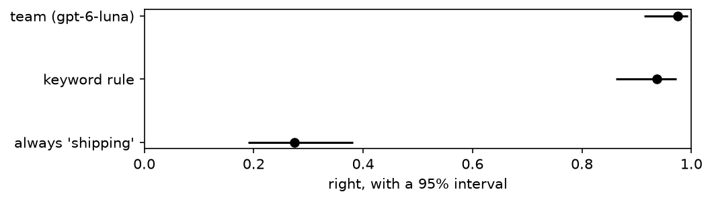

---
rat:
  project: ../../python
  python:
    dependencies: ["-e .[data]", "matplotlib"]
---

# 3. Is it right?

*A function that looks right on five messages can be wrong on one in
five. By the end you will measure `team` on eighty messages with a
number you can defend: how often it's right, how sure you can be,
compared with what, and where it goes wrong.*

**Can you skip this one?** If you can answer these, jump to
[tutorial 4](04-making-it-better.md). The answers are at the bottom.

1. A function is right on 72 of 80 rows. Between which two numbers is its
   true accuracy, probably?
2. Why is 90% accuracy not impressive when 90% of your rows are one
   class?
3. You run the same evaluation twice and get two different scores. Is
   something broken?

## Setting up

```python
import re
import tempfile
from typing import Literal

import matplotlib.pyplot as plt
from dpyr import col, desc, n, read, vectorize

import functai
from functai import ai
from functai.evaluation import interval

log_folder = tempfile.mkdtemp()
functai.configure(lm="gpt-6-luna", log_calls=log_folder)

tickets = functai.datasets.tickets()

@ai
def team(message: str) -> Literal["shipping", "billing", "product", "account"]:
    """Which team should answer this customer message?"""
```

This is tutorial 1's `team`, without the house rules, so it has something
left to get wrong.

## A score and its interval

`functai.evaluate()` runs a function on every row, compares each answer
with the right one, and summarizes:

```python
ev = functai.evaluate(team, tickets, expected="category", num_threads=8)
ev
```

```output
Evaluation(team, 80 examples: exact_match 0.97 [0.91, 0.99])
```

`expected="category"` says which column holds the right answers. The
first number is the share it got right. The two in brackets are a **95%
interval**: if you drew many more messages like these, the function's
true accuracy would very likely lie between them. Read the interval
before the score. It's the honest summary of what eighty rows can tell
you.

There's nothing mysterious about it. Being right or wrong is a yes/no
outcome, so the score is a proportion, and this is Wilson's interval for
a proportion, the one statisticians recommend for it (`interval()` works
on any list of scores):

```python
right = ev.table.pull(col.exact_match)
interval(right)          # (mean, low, high)
```

```output
(0.975, 0.9133556694270627, 0.9931171068589743)
```

The summary and the table are ordinary tables:

```python
ev.summary
```

```output
# dpyr dataframe · source: polars · showing 1 of 1 rows
┌─────────────┬───────┬──────────┬──────────┬─────┬────────┐
│ metric      ┆ mean  ┆ low      ┆ high     ┆ n   ┆ failed │
│ ---         ┆ ---   ┆ ---      ┆ ---      ┆ --- ┆ ---    │
│ str         ┆ f64   ┆ f64      ┆ f64      ┆ i64 ┆ i64    │
╞═════════════╪═══════╪══════════╪══════════╪═════╪════════╡
│ exact_match ┆ 0.975 ┆ 0.913356 ┆ 0.993117 ┆ 80  ┆ 0      │
└─────────────┴───────┴──────────┴──────────┴─────┴────────┘
```

```python
ev.table.select(col.category, col.pred_result, col.exact_match, col.seconds)
```

```output
# dpyr dataframe · source: polars · showing 10 of ? rows
┌──────────┬─────────────┬─────────────┬──────────┐
│ category ┆ pred_result ┆ exact_match ┆ seconds  │
│ ---      ┆ ---         ┆ ---         ┆ ---      │
│ str      ┆ str         ┆ f64         ┆ f64      │
╞══════════╪═════════════╪═════════════╪══════════╡
│ shipping ┆ shipping    ┆ 1.0         ┆ 1.554531 │
│ shipping ┆ shipping    ┆ 1.0         ┆ 1.420876 │
│ billing  ┆ billing     ┆ 1.0         ┆ 1.418334 │
│ account  ┆ account     ┆ 1.0         ┆ 0.978765 │
│ product  ┆ product     ┆ 1.0         ┆ 1.073679 │
│ billing  ┆ billing     ┆ 1.0         ┆ 1.215069 │
│ shipping ┆ shipping    ┆ 1.0         ┆ 0.948176 │
│ account  ┆ account     ┆ 1.0         ┆ 1.099904 │
│ shipping ┆ shipping    ┆ 1.0         ┆ 0.934892 │
│ billing  ┆ billing     ┆ 1.0         ┆ 1.2271   │
└──────────┴─────────────┴─────────────┴──────────┘
```

## How many rows do you need?

The interval narrows as you add rows, by the square root of their
number. You don't need a model to see it. For a function that is right
85% of the time:

```python
rows = []
for size in [20, 50, 80, 200, 500, 2000]:
    hits = round(0.85 * size)
    _, low, high = interval([1] * hits + [0] * (size - hits))
    rows.append({"rows": size, "low": round(low, 3), "high": round(high, 3)})
read(rows)
```

```output
# dpyr dataframe · source: polars · showing 6 of 6 rows
┌──────┬───────┬───────┐
│ rows ┆ low   ┆ high  │
│ ---  ┆ ---   ┆ ---   │
│ i64  ┆ f64   ┆ f64   │
╞══════╪═══════╪═══════╡
│ 20   ┆ 0.64  ┆ 0.948 │
│ 50   ┆ 0.715 ┆ 0.917 │
│ 80   ┆ 0.756 ┆ 0.912 │
│ 200  ┆ 0.794 ┆ 0.893 │
│ 500  ┆ 0.816 ┆ 0.879 │
│ 2000 ┆ 0.834 ┆ 0.865 │
└──────┴───────┴───────┘
```

With twenty rows, "85%" means anything from about 64% to 95%. With two
hundred, you can tell 85% from 80%. Fifty to two hundred carefully
labelled rows is usually the sweet spot: an afternoon of work that tells
you whether to trust the next hundred thousand.

## Compared with what?

A score means nothing on its own. Is 90% good? It depends on how well
something much simpler would do. Always measure a **baseline**.

The simplest is the "null model": always answer the most common team.

```python
tickets.count(col.category).arrange(desc(col.n))
```

```output
# dpyr dataframe · source: polars · showing 4 of 4 rows
┌──────────┬─────┐
│ category ┆ n   │
│ ---      ┆ --- │
│ str      ┆ i64 │
╞══════════╪═════╡
│ billing  ┆ 22  │
│ shipping ┆ 22  │
│ account  ┆ 18  │
│ product  ┆ 18  │
└──────────┴─────┘
```

Then something a person might write in ten minutes: a keyword rule. dpyr's
`vectorize` makes any Python function a column function, exactly like an
AI function:

```python
@vectorize
def keyword_rule(message: str) -> str:
    m = message.lower()
    if re.search(r"charge|refund|invoice|coupon|card|pay|money", m):
        return "billing"
    if re.search(r"password|sign in|log in|login|account|email|data", m):
        return "account"
    if re.search(r"arriv|deliver|track|parcel|package|box|order", m):
        return "shipping"
    return "product"
```

All three, with their intervals:

```python
def score(right, model):
    mean, low, high = interval([float(r) for r in right])
    return {"model": model, "accuracy": mean, "low": low, "high": high}

with_rule = tickets.mutate(rule=keyword_rule(col.message))
scores = read([
    score([c == "shipping" for c in tickets.pull(col.category)], "always 'shipping'"),
    score(with_rule.mutate(ok=col.rule == col.category).pull(col.ok), "keyword rule"),
    score(right, "team (gpt-6-luna)"),
])
scores
```

```output
# dpyr dataframe · source: polars · showing 3 of 3 rows
┌───────────────────┬──────────┬──────────┬──────────┐
│ model             ┆ accuracy ┆ low      ┆ high     │
│ ---               ┆ ---      ┆ ---      ┆ ---      │
│ str               ┆ f64      ┆ f64      ┆ f64      │
╞═══════════════════╪══════════╪══════════╪══════════╡
│ always 'shipping' ┆ 0.275    ┆ 0.189178 ┆ 0.381441 │
│ keyword rule      ┆ 0.9375   ┆ 0.861899 ┆ 0.973011 │
│ team (gpt-6-luna) ┆ 0.975    ┆ 0.913356 ┆ 0.993117 │
└───────────────────┴──────────┴──────────┴──────────┘
```

```python
s = scores.collect()
plt.figure(figsize=(7, 1.8))
plt.errorbar(s["accuracy"], range(len(s)), xerr=[s["accuracy"] - s["low"], s["high"] - s["accuracy"]],
             fmt="o", color="black")
plt.yticks(range(len(s)), s["model"])
plt.xlim(0, 1)
plt.xlabel("right, with a 95% interval")
plt.show()
```



The null model gets about one in four, by construction: four teams of
roughly equal size. The keyword rule is the humbling one. Its interval
probably overlaps the language model's, so on these eighty messages you
can't tell them apart.

Two things keep that in proportion. First, the rule was written by
someone who had read these very messages, so it has been fitted to them:
next month's messages will use words it has never seen. Second, the
language model got there with one sentence and no knowledge of the shop.
But the lesson stands, and it's the reason to always measure a baseline:
sometimes the simple thing is nearly as good, and much cheaper.

## Where does it go wrong?

A single accuracy hides *which* mistakes it makes. A **confusion
matrix** shows them: one row per true team, one column per answer.

```python
ev.table.count(col.category, col.pred_result).pivot_wider(names_from=col.pred_result, values_from=col.n)
```

```output
# dpyr dataframe · source: polars · showing 4 of 4 rows
┌──────────┬─────────┬─────────┬─────────┬──────────┐
│ category ┆ account ┆ billing ┆ product ┆ shipping │
│ ---      ┆ ---     ┆ ---     ┆ ---     ┆ ---      │
│ str      ┆ i64     ┆ i64     ┆ i64     ┆ i64      │
╞══════════╪═════════╪═════════╪═════════╪══════════╡
│ account  ┆ 18      ┆ null    ┆ null    ┆ null     │
│ billing  ┆ null    ┆ 20      ┆ 2       ┆ null     │
│ product  ┆ null    ┆ null    ┆ 18      ┆ null     │
│ shipping ┆ null    ┆ null    ┆ null    ┆ 22       │
└──────────┴─────────┴─────────┴─────────┴──────────┘
```

Each row is a true team; the counts where the answer matches the row are
the right ones, and everything else is a kind of mistake (here only a
few, mostly billing messages sent elsewhere). In most jobs they're far
from spread evenly. Two questions, per team, make it precise:

- **Recall**: of the messages that really were billing, what share did it
  send to billing?
- **Precision**: of the messages it sent to billing, what share really
  were billing?

```python
recall = ev.table.group_by(col.category).summarize(recall=col.exact_match.mean()).rename(team=col.category)
precision = ev.table.group_by(col.pred_result).summarize(precision=col.exact_match.mean()).rename(team=col.pred_result)
recall.left_join(precision, on=col.team)
```

```output
# dpyr dataframe · source: polars · showing 4 of 4 rows
┌──────────┬──────────┬───────────┐
│ team     ┆ recall   ┆ precision │
│ ---      ┆ ---      ┆ ---       │
│ str      ┆ f64      ┆ f64       │
╞══════════╪══════════╪═══════════╡
│ account  ┆ 1.0      ┆ 1.0       │
│ billing  ┆ 0.909091 ┆ 1.0       │
│ product  ┆ 1.0      ┆ 0.9       │
│ shipping ┆ 1.0      ┆ 1.0       │
└──────────┴──────────┴───────────┘
```

Which one matters depends on what a mistake costs. If billing messages
sent elsewhere are lost for days, you care about billing's recall. If the
billing team is small and drowning, you care about its precision. That
question, what each mistake costs, is the whole of
[tutorial 6](06-decisions.md).

## Same question, another answer

Run the same evaluation again:

```python
ev2 = functai.evaluate(team, tickets, expected="category", num_threads=8)
ev2
```

```output
Evaluation(team, 80 examples: exact_match 0.97 [0.91, 0.99])
```

The score may move, and some rows may flip. That's not a bug. A language
model picks each word from a distribution, and recent models like
`gpt-6-luna` also think before answering, differently each time.
`functai.compare()` pairs the two runs row by row:

```python
functai.compare(ev, ev2)
```

```output
# dpyr dataframe · source: polars · showing 1 of 1 rows
┌─────────────┬────────┬───────┬──────┬───────────┬──────────┬────────┬───────┬──────┬─────┐
│ metric      ┆ before ┆ after ┆ diff ┆ low       ┆ high     ┆ better ┆ worse ┆ same ┆ n   │
│ ---         ┆ ---    ┆ ---   ┆ ---  ┆ ---       ┆ ---      ┆ ---    ┆ ---   ┆ ---  ┆ --- │
│ str         ┆ f64    ┆ f64   ┆ f64  ┆ f64       ┆ f64      ┆ i64    ┆ i64   ┆ i64  ┆ i64 │
╞═════════════╪════════╪═══════╪══════╪═══════════╪══════════╪════════╪═══════╪══════╪═════╡
│ exact_match ┆ 0.975  ┆ 0.975 ┆ 0.0  ┆ -0.035408 ┆ 0.035408 ┆ 1      ┆ 1     ┆ 78   ┆ 80  │
└─────────────┴────────┴───────┴──────┴───────────┴──────────┴────────┴───────┴──────┴─────┘
```

`better` and `worse` count the rows that flipped each way; `same`, the
rows where both runs agreed on right or wrong. Which messages flipped?

```python
first = ev.table.select(col.example, col.category, col.message, col.pred_result).rename(first=col.pred_result)
second = ev2.table.select(col.example, col.pred_result).rename(second=col.pred_result)
first.left_join(second, on=col.example).filter(col.first != col.second).select(col.category, col.first, col.second, col.message)
```

```output
# dpyr dataframe · source: polars · showing 2 of 2 rows
┌──────────┬─────────┬──────────┬────────────────────────────────────────────────────────────────┐
│ category ┆ first   ┆ second   ┆ message                                                        │
│ ---      ┆ ---     ┆ ---      ┆ ---                                                            │
│ str      ┆ str     ┆ str      ┆ str                                                            │
╞══════════╪═════════╪══════════╪════════════════════════════════════════════════════════════════╡
│ billing  ┆ product ┆ billing  ┆ I want a refund for the chair, it wobbles no matter what I do. │
│ billing  ┆ billing ┆ shipping ┆ Why was I charged for shipping when my order was over $50?     │
└──────────┴─────────┴──────────┴────────────────────────────────────────────────────────────────┘
```

The rows that flip are the ones the model finds hard: usually the same
ones a person would hesitate over. Older models let you turn randomness
down with `temperature=0`. Current reasoning models don't take it:

```python
team.using(temperature=0)("Where is my parcel?")
```

```output
/home/maxime/Projects/functai/python/functai/core.py:788: UserWarning: [functai] openai:gpt-6-luna does not take temperature; left out of its requests
  s = models.adjust(s, route)
'shipping'
```

functai leaves the setting out and warns you once, rather than failing
every row. So the honest way to handle the variation is the one you
already have: report intervals, and don't read much into a point or two.

## What it cost

```python
prices = read([{"model": "gpt-6-luna", "input": 0.10, "output": 0.50}])   # dollars per million tokens, 2026-09-27

functai.calls(folder=log_folder).left_join(prices, on=col.model).summarize(
    calls=n(), dollars=((col.input_tokens * col.input + (col.total_tokens - col.input_tokens) * col.output) / 1e6).sum())
```

```output
# dpyr dataframe · source: polars · showing 1 of 1 rows
┌───────┬──────────┐
│ calls ┆ dollars  │
│ ---   ┆ ---      │
│ i64   ┆ f64      │
╞═══════╪══════════╡
│ 161   ┆ 0.004078 │
└───────┴──────────┘
```

## Your turn

1. Evaluate tutorial 1's `team_rules` (with the house rules) on
   `tickets`, and `functai.compare()` it with `ev`. Is the change's
   interval clear of zero? What does that tell you, and what doesn't it?
2. The keyword rule has no model at all. Improve it by one line (the
   mistakes table is a good guide) and measure it again. Can a rule of
   ten lines reach the language model's interval?
3. Which team has the lowest recall? Read its missed messages. Is the
   model wrong, or is the label arguable?

## What you learned

- `functai.evaluate(fn, data, expected="column")` scores a function on
  rows with known answers: a proportion with a 95% interval (Wilson's).
  `.summary` and `.table` give it as tables.
- Read the interval first. Its width depends on the number of rows: fifty
  to two hundred rows is usually enough to decide.
- Always compare with a baseline: the most common answer, and a simple
  rule (`dpyr.vectorize` makes any Python function a column function).
- A confusion matrix shows which mistakes; recall and precision per class
  say which ones matter.
- The same function can answer differently twice. `functai.compare()`
  pairs two runs row by row; intervals absorb the variation.

**Answers to the check at the top.** (1) About 81% to 95%:
`interval([1] * 72 + [0] * 8)`. (2) Because always answering that class
scores 90%; compare with the null model. (3) No: language models vary
from run to run, reasoning models more so; compare runs with
`functai.compare()` and report intervals.

**Next:** [4. Making it better without fooling yourself](04-making-it-better.md)
tries rules, examples and a teacher, and tests each change fairly.
