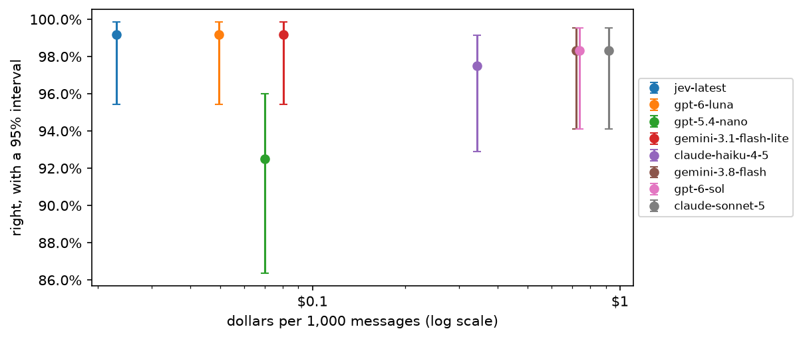

---
rat:
  project: ../../python
  python:
    dependencies: ["-e .[data]", "matplotlib"]
---

# 5. Choosing a model

*Eight current models, one job, 120 rows each. By the end you will have
a chart of accuracy against cost with honest intervals, a paired test
between the front-runners, and a rule for picking the cheapest model
that is good enough.*

**Can you skip this one?** If you can answer these, jump to
[tutorial 6](06-decisions.md). The answers are at the bottom.

1. Is the biggest, most expensive model the most accurate one?
2. Two models score 97% and 89% on the same 120 rows. How do you know the
   gap is real?
3. What does "the model is 20 times more expensive" mean for a job of a
   million rows?

## The job

The refund desk from tutorial 4 decides better when it knows what state
the item is in: still sealed, opened but unused, used, damaged on
arrival, the wrong item, or faulty. The customer never says it in those
words. Reading it from their message is a job worth doing well, and a
good one for comparing models: each message has one right answer, and
some are subtle.

```python
import os
import tempfile
from typing import Literal

import lm15
import matplotlib.pyplot as plt
from dpyr import col, desc, n, read

import functai
from functai import ai

log_folder = tempfile.mkdtemp()
functai.configure(log_calls=log_folder)

refunds = functai.datasets.refunds()

State = Literal["unopened", "opened_unused", "used", "damaged", "wrong_item", "faulty"]

@ai
def item_state(message: str) -> State:  # unopened: still sealed, never opened; opened_unused: unpacked and looked at, never used; used: used for a while, works fine, no longer wanted; damaged: broken or damaged when it arrived; wrong_item: not what was ordered, or part of the order missing; faulty: worked at first, then failed in normal use
    """What state is the item in, from the customer's message?"""
    ...

refunds.count(col.state)
```

```output
# dpyr dataframe · source: polars · showing 6 of 6 rows
┌───────────────┬─────┐
│ state         ┆ n   │
│ ---           ┆ --- │
│ str           ┆ i64 │
╞═══════════════╪═════╡
│ damaged       ┆ 20  │
│ faulty        ┆ 34  │
│ opened_unused ┆ 16  │
│ unopened      ┆ 14  │
│ used          ┆ 22  │
│ wrong_item    ┆ 14  │
└───────────────┴─────┘
```

## The candidates

Eight models from five families, as of September 2026, with their list
prices (dollars per million tokens, input and output; output includes the
model's hidden reasoning):

```python
candidates = read([
    {"model": "gpt-6-luna",                   "key": "OPENAI_API_KEY",    "input": 0.10,  "output": 0.50},
    {"model": "gpt-6-sol",                    "key": "OPENAI_API_KEY",    "input": 2.00,  "output": 10.00},
    {"model": "gpt-5.4-nano",                 "key": "OPENAI_API_KEY",    "input": 0.20,  "output": 1.25},
    {"model": "claude-haiku-4-5",             "key": "ANTHROPIC_API_KEY", "input": 1.00,  "output": 5.00},
    {"model": "claude-sonnet-5",              "key": "ANTHROPIC_API_KEY", "input": 2.00,  "output": 10.00},
    {"model": "gemini:gemini-3.8-flash",      "key": "GEMINI_API_KEY",    "input": 0.75,  "output": 3.75},
    {"model": "gemini:gemini-3.1-flash-lite", "key": "GEMINI_API_KEY",    "input": 0.25,  "output": 1.50},
    {"model": "jev-latest",                   "key": "TYPESAFE_API_KEY",  "input": 0.042, "output": 0.0},
])
models = [m for m, k in zip(candidates.pull(col.model), candidates.pull(col.key)) if os.environ.get(k)]
models    # only the providers you have a key for
```

```output
['gpt-6-luna', 'gpt-6-sol', 'gpt-5.4-nano', 'claude-haiku-4-5', 'claude-sonnet-5', 'gemini:gemini-3.8-flash', 'gemini:gemini-3.1-flash-lite', 'jev-latest']
```

Note what `gpt-5.4-nano` is: the small model of six months ago. It's here
to show how fast this moves. And `jev-latest` is a different kind of
model: TypeSafe's Jev writes no text, it only answers typed questions
(one of these options, yes or no, a score), with a probability for each
answer, and charges only for what it reads. Reading an item's state is
exactly such a question, so it's in the race; tutorial 6 shows what its
probabilities are for.

## Running them all

The same function, one model at a time, on all 120 messages. `using()`
swaps the model and nothing else, so each model reads exactly the same
question:

```python
evaluations = {m: functai.evaluate(item_state.using(lm=m), refunds, expected="state", num_threads=8)
               for m in models}

accuracy = read([{"model": m, **ev.summary.collect().to_dicts()[0]} for m, ev in evaluations.items()])
accuracy.select(col.model, col.mean, col.low, col.high, col.failed)
```

```output
# dpyr dataframe · source: polars · showing 8 of 8 rows
┌──────────────────────────────┬──────────┬──────────┬──────────┬────────┐
│ model                        ┆ mean     ┆ low      ┆ high     ┆ failed │
│ ---                          ┆ ---      ┆ ---      ┆ ---      ┆ ---    │
│ str                          ┆ f64      ┆ f64      ┆ f64      ┆ i64    │
╞══════════════════════════════╪══════════╪══════════╪══════════╪════════╡
│ gpt-6-luna                   ┆ 0.991667 ┆ 0.954304 ┆ 0.998527 ┆ 0      │
│ gpt-6-sol                    ┆ 0.983333 ┆ 0.941264 ┆ 0.995417 ┆ 0      │
│ gpt-5.4-nano                 ┆ 0.925    ┆ 0.863591 ┆ 0.960043 ┆ 0      │
│ claude-haiku-4-5             ┆ 0.975    ┆ 0.92907  ┆ 0.991462 ┆ 0      │
│ claude-sonnet-5              ┆ 0.983333 ┆ 0.941264 ┆ 0.995417 ┆ 0      │
│ gemini:gemini-3.8-flash      ┆ 0.983333 ┆ 0.941264 ┆ 0.995417 ┆ 0      │
│ gemini:gemini-3.1-flash-lite ┆ 0.991667 ┆ 0.954304 ┆ 0.998527 ┆ 0      │
│ jev-latest                   ┆ 0.991667 ┆ 0.954304 ┆ 0.998527 ┆ 0      │
└──────────────────────────────┴──────────┴──────────┴──────────┴────────┘
```

That was up to 960 calls. Now the other two things you care about, from
each evaluation's table: what each model cost, and how long a single
answer took.

```python
usage = read([{"model": m,
               "seconds": ev.table.summarize(s=col.seconds.median()).pull(col.s)[0],
               "input_tokens": ev.table.summarize(t=col.input_tokens.mean()).pull(col.t)[0],
               "output_tokens": ev.table.summarize(t=(col.total_tokens - col.input_tokens).mean()).pull(col.t)[0]}
              for m, ev in evaluations.items()])

compare = (accuracy.left_join(usage, on=col.model).left_join(candidates, on=col.model)
           .mutate(per_1000=1000 * (col.input_tokens * col.input + col.output_tokens * col.output) / 1e6))

compare.select(col.model, col.mean, col.per_1000, col.seconds, col.output_tokens).arrange(desc(col.mean))
```

```output
# dpyr dataframe · source: polars · showing 8 of 8 rows
┌──────────────────────────────┬──────────┬───────────┬──────────┬───────────────┐
│ model                        ┆ mean     ┆ per_1000  ┆ seconds  ┆ output_tokens │
│ ---                          ┆ ---      ┆ ---       ┆ ---      ┆ ---           │
│ str                          ┆ f64      ┆ f64       ┆ f64      ┆ f64           │
╞══════════════════════════════╪══════════╪═══════════╪══════════╪═══════════════╡
│ gpt-6-luna                   ┆ 0.991667 ┆ 0.049514  ┆ 1.392465 ┆ 38.691667     │
│ gemini:gemini-3.1-flash-lite ┆ 0.991667 ┆ 0.0805125 ┆ 0.619835 ┆ 6.916667      │
│ jev-latest                   ┆ 0.991667 ┆ 0.0230251 ┆ 0.132979 ┆ 67.225        │
│ gpt-6-sol                    ┆ 0.983333 ┆ 0.738567  ┆ 1.14401  ┆ 19.75         │
│ claude-sonnet-5              ┆ 0.983333 ┆ 0.918483  ┆ 4.036689 ┆ 13.708333     │
│ gemini:gemini-3.8-flash      ┆ 0.983333 ┆ 0.7202875 ┆ 1.443113 ┆ 135.966667    │
│ claude-haiku-4-5             ┆ 0.975    ┆ 0.342967  ┆ 0.423786 ┆ 9.925         │
│ gpt-5.4-nano                 ┆ 0.925    ┆ 0.070117  ┆ 0.655786 ┆ 12.808333     │
└──────────────────────────────┴──────────┴───────────┴──────────┴───────────────┘
```

`per_1000` is dollars per thousand messages, `seconds` the median time
for one answer, `output_tokens` how much each model wrote per answer,
thinking included. Look at that last column: some models think at length
before a one-word answer, and you pay for every word of it. (Jev's
output is free, so its cost is only what it reads.)

## Accuracy against cost

```python
c = compare.arrange(col.per_1000).collect()
plt.figure(figsize=(7, 3.6))
for row in c.iter_rows(named=True):
    plt.errorbar(row["per_1000"], row["mean"], yerr=[[row["mean"] - row["low"]], [row["high"] - row["mean"]]],
                 fmt="o", capsize=3, label=row["model"].removeprefix("gemini:"))
plt.legend(fontsize=8, loc="center left", bbox_to_anchor=(1, 0.5))
plt.xscale("log")
plt.gca().xaxis.set_major_formatter(plt.matplotlib.ticker.FuncFormatter(lambda v, _: f"${v:g}"))
plt.gca().yaxis.set_major_formatter(plt.matplotlib.ticker.PercentFormatter(1))
plt.xlabel("dollars per 1,000 messages (log scale)")
plt.ylabel("right, with a 95% interval")
plt.show()
```



The best models are up and to the left: more accurate for less. The
expensive models buy nothing measurable here: within a message or two,
they are no more accurate than the cheapest current models, at more than
ten times the price. And the cheapest of all is the one that isn't a language model:
Jev charges only for what it reads, and answers in a fraction of the
time. Reading the state of an item from a short message is a narrow
job, and a small, recent, specialised model does it about as well as
anything. Big models earn their price on long, hard problems; for a
column of short texts, measure before you assume.

## Is the gap real?

The intervals overlap for the front-runners. As in tutorial 4, the
sharper question uses the fact that every model answered the *same*
rows. `functai.compare()` pairs them:

```python
best = compare.arrange(desc(col.mean)).pull(col.model)[0]

paired = read([{"model": m, **functai.compare(evaluations[best], evaluations[m]).collect().to_dicts()[0]}
               for m in models if m != best])
paired.select(col.model, col.diff, col.low, col.high, col.better, col.worse)
```

```output
# dpyr dataframe · source: polars · showing 7 of 7 rows
┌──────────────────────────────┬───────────┬───────────┬───────────┬────────┬───────┐
│ model                        ┆ diff      ┆ low       ┆ high      ┆ better ┆ worse │
│ ---                          ┆ ---       ┆ ---       ┆ ---       ┆ ---    ┆ ---   │
│ str                          ┆ f64       ┆ f64       ┆ f64       ┆ i64    ┆ i64   │
╞══════════════════════════════╪═══════════╪═══════════╪═══════════╪════════╪═══════╡
│ gpt-6-sol                    ┆ -0.008333 ┆ -0.024834 ┆ 0.008167  ┆ 0      ┆ 1     │
│ gpt-5.4-nano                 ┆ -0.066667 ┆ -0.117649 ┆ -0.015684 ┆ 1      ┆ 9     │
│ claude-haiku-4-5             ┆ -0.016667 ┆ -0.039904 ┆ 0.006571  ┆ 0      ┆ 2     │
│ claude-sonnet-5              ┆ -0.008333 ┆ -0.024834 ┆ 0.008167  ┆ 0      ┆ 1     │
│ gemini:gemini-3.8-flash      ┆ -0.008333 ┆ -0.024834 ┆ 0.008167  ┆ 0      ┆ 1     │
│ gemini:gemini-3.1-flash-lite ┆ 0.0       ┆ 0.0       ┆ 0.0       ┆ 0      ┆ 0     │
│ jev-latest                   ┆ 0.0       ┆ 0.0       ┆ 0.0       ┆ 0      ┆ 0     │
└──────────────────────────────┴───────────┴───────────┴───────────┴────────┴───────┘
```

`diff` is each model's accuracy minus the best one's, with its interval.
`worse` counts the messages the best model got right and this one got
wrong; `better`, the reverse. A model that loses 10 to 1 is really worse.
One that splits 2 to 1 isn't distinguishable on 120 rows.

## A rule for choosing

Write the rule down before you look at the chart, so the chart can't
talk you into anything:

> Among the models whose accuracy is **not clearly worse** than the best
> (the paired interval reaches zero, and at most 3 points behind), pick
> the **cheapest**. If speed matters more than money, pick the fastest of
> those instead.

```python
not_worse = [best] + paired.filter((col.high >= 0) & (col.diff >= -0.03)).pull(col.model)

compare.filter(col.model.is_in(not_worse)).select(col.model, col.mean, col.per_1000, col.seconds).arrange(col.per_1000)
```

```output
# dpyr dataframe · source: polars · showing 7 of 7 rows
┌──────────────────────────────┬──────────┬───────────┬──────────┐
│ model                        ┆ mean     ┆ per_1000  ┆ seconds  │
│ ---                          ┆ ---      ┆ ---       ┆ ---      │
│ str                          ┆ f64      ┆ f64       ┆ f64      │
╞══════════════════════════════╪══════════╪═══════════╪══════════╡
│ jev-latest                   ┆ 0.991667 ┆ 0.0230251 ┆ 0.132979 │
│ gpt-6-luna                   ┆ 0.991667 ┆ 0.049514  ┆ 1.392465 │
│ gemini:gemini-3.1-flash-lite ┆ 0.991667 ┆ 0.0805125 ┆ 0.619835 │
│ claude-haiku-4-5             ┆ 0.975    ┆ 0.342967  ┆ 0.423786 │
│ gemini:gemini-3.8-flash      ┆ 0.983333 ┆ 0.7202875 ┆ 1.443113 │
│ gpt-6-sol                    ┆ 0.983333 ┆ 0.738567  ┆ 1.14401  │
│ claude-sonnet-5              ┆ 0.983333 ┆ 0.918483  ┆ 4.036689 │
└──────────────────────────────┴──────────┴───────────┴──────────┘
```

The first row is the choice. The trade-off it absorbs is stated in the
rule: "not clearly worse on 120 rows" is not "equal". If a point of
accuracy is worth a lot to you, label more rows and run the comparison
again, rather than paying for the biggest model on faith.

## Thinking less

Reasoning models let you choose how hard they think. `gpt-6-luna` thinks
at "medium" effort unless told otherwise; at "off" it answers straight
away, the way models did two years ago, and writes far fewer tokens. Is
the thinking worth paying for on this job? The setting passes straight
through to the provider:

```python
luna_off = item_state.using(lm="gpt-6-luna", reasoning=lm15.Reasoning(effort="off"))
ev_off = functai.evaluate(luna_off, refunds, expected="state", num_threads=8)
ev_off
```

```output
Evaluation(item_state, 120 examples: exact_match 0.99 [0.95, 1.00])
```

```python
read([{"effort": name,
       "seconds": ev.table.summarize(s=col.seconds.median()).pull(col.s)[0],
       "output_tokens": ev.table.summarize(t=(col.total_tokens - col.input_tokens).mean()).pull(col.t)[0]}
      for name, ev in [("medium", evaluations["gpt-6-luna"]), ("off", ev_off)]])
```

```output
# dpyr dataframe · source: polars · showing 2 of 2 rows
┌────────┬──────────┬───────────────┐
│ effort ┆ seconds  ┆ output_tokens │
│ ---    ┆ ---      ┆ ---           │
│ str    ┆ f64      ┆ f64           │
╞════════╪══════════╪═══════════════╡
│ medium ┆ 1.392465 ┆ 38.691667     │
│ off    ┆ 1.488239 ┆ 15.908333     │
└────────┴──────────┴───────────────┘
```

```python
functai.compare(evaluations["gpt-6-luna"], ev_off)
```

```output
# dpyr dataframe · source: polars · showing 1 of 1 rows
┌─────────────┬──────────┬──────────┬──────┬─────┬──────┬────────┬───────┬──────┬─────┐
│ metric      ┆ before   ┆ after    ┆ diff ┆ low ┆ high ┆ better ┆ worse ┆ same ┆ n   │
│ ---         ┆ ---      ┆ ---      ┆ ---  ┆ --- ┆ ---  ┆ ---    ┆ ---   ┆ ---  ┆ --- │
│ str         ┆ f64      ┆ f64      ┆ f64  ┆ f64 ┆ f64  ┆ i64    ┆ i64   ┆ i64  ┆ i64 │
╞═════════════╪══════════╪══════════╪══════╪═════╪══════╪════════╪═══════╪══════╪═════╡
│ exact_match ┆ 0.991667 ┆ 0.991667 ┆ 0.0  ┆ 0.0 ┆ 0.0  ┆ 0      ┆ 0     ┆ 120  ┆ 120 │
└─────────────┴──────────┴──────────┴──────┴─────┴──────┴────────┴───────┴──────┴─────┘
```

Switched off, it writes a fraction of the tokens; the paired comparison
says whether it's still as accurate on this job. For reading short
messages the thinking is rarely worth paying for. On a job that
combines several rules with arithmetic (tutorial 4's decision), check
again: that's where thinking earns its tokens.

## What it cost

```python
spent = functai.calls(folder=log_folder).left_join(candidates, on=col.model).mutate(
    dollars=(col.input_tokens * col.input + (col.total_tokens - col.input_tokens) * col.output) / 1e6)

spent.group_by(col.model).summarize(calls=n(), dollars=col.dollars.sum()).arrange(desc(col.dollars))
```

```output
# dpyr dataframe · source: polars · showing 8 of 8 rows
┌──────────────────────────────┬───────┬───────────┐
│ model                        ┆ calls ┆ dollars   │
│ ---                          ┆ ---   ┆ ---       │
│ str                          ┆ i64   ┆ f64       │
╞══════════════════════════════╪═══════╪═══════════╡
│ claude-sonnet-5              ┆ 120   ┆ 0.110218  │
│ gpt-6-sol                    ┆ 120   ┆ 0.088628  │
│ gemini:gemini-3.8-flash      ┆ 120   ┆ 0.0864345 │
│ claude-haiku-4-5             ┆ 120   ┆ 0.041156  │
│ gpt-6-luna                   ┆ 240   ┆ 0.0116885 │
│ gemini:gemini-3.1-flash-lite ┆ 120   ┆ 0.0096615 │
│ gpt-5.4-nano                 ┆ 120   ┆ 0.008414  │
│ jev-latest                   ┆ 120   ┆ 0.002763  │
└──────────────────────────────┴───────┴───────────┘
```

```python
spent.summarize(calls=n(), dollars=col.dollars.sum())
```

```output
# dpyr dataframe · source: polars · showing 1 of 1 rows
┌───────┬──────────┐
│ calls ┆ dollars  │
│ ---   ┆ ---      │
│ i64   ┆ f64      │
╞═══════╪══════════╡
│ 1080  ┆ 0.358964 │
└───────┴──────────┘
```

## Your turn

1. Run the comparison on tutorial 4's decision (`refund_rules`), which
   has the rules to follow. Do the same models lead? Which ones fall
   behind when there's a policy to apply? (Jev can't take that job: it
   answers questions about one text, and the decision needs the price
   and dates too; see tutorial 6.)
2. Add a model you have access to (any provider functai reaches, even a
   local `ollama:` one at zero cost) to `candidates` and rerun.
3. Change the rule's "3 points" to 1. Which model does it choose? What
   would it cost you, per million messages, to be that strict?

## What you learned

- Compare models on your job, your rows: `fn.using(lm=...)` changes only
  the model.
- Cost is tokens times price, and output tokens include hidden
  reasoning: measure it from the tables, don't guess it from the price
  list.
- Bigger is not better by default. For narrow jobs on short text, a
  recent small model, or a model built for the job, is often the best
  and the cheapest.
- Compare front-runners in pairs, by their disagreements on the same
  rows (`functai.compare()`).
- Write the choosing rule down first. Then the chart informs the choice
  instead of making it.
- Reasoning effort is a dial (`reasoning=lm15.Reasoning(effort="off")`):
  less thinking is cheaper; check it stays accurate.

**Answers to the check at the top.** (1) Not necessarily: here the most
expensive models were no better, within noise, than the cheapest
current one. Measure it. (2) Pair the rows: count the rows one got right
and the other wrong, each way, and look at the paired interval
(`functai.compare()`). (3) It's the difference between tens of dollars
and hundreds or thousands for the same column: multiply dollars per
1,000 by 1,000.

**Next:** [6. Decision models](06-decisions.md): approve, deny, or ask a
person, when mistakes cost different amounts.
