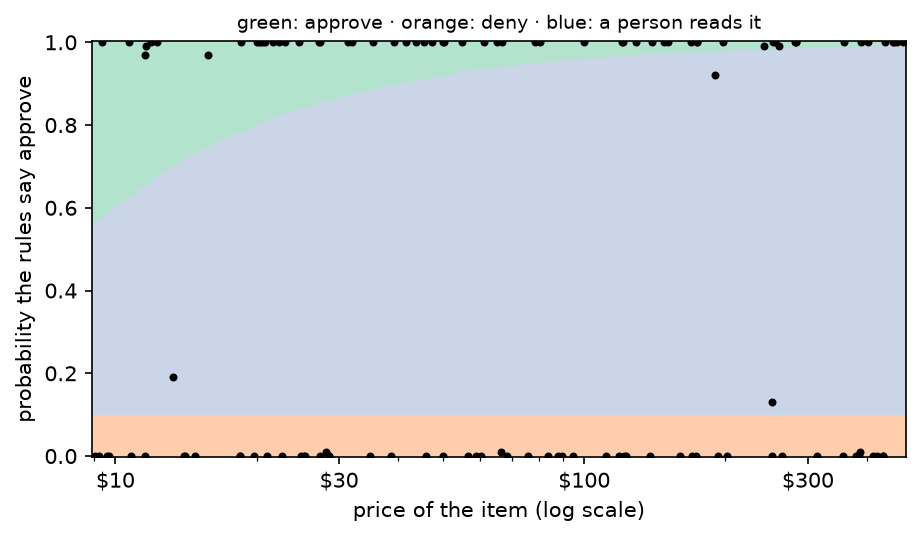

---
rat:
  project: ../../python
  python:
    dependencies: ["-e .[data]", "matplotlib", "scikit-learn"]
---

# 6. Decision models

*Approve, deny, or ask a person. Paying a refund the rules forbid costs
the price of the item; refusing one the rules allow costs a customer; a
person's review costs a few dollars of their time. By the end you will
have a decision model that reads the facts, applies the rules exactly,
knows when it isn't sure, and chooses the action with the lowest
expected cost, all measured in dollars.*

**Can you skip this one?** If you can answer these, jump to
[tutorial 7](07-a-model-you-own.md). The answers are at the bottom.

1. A model is right 97% of the time. Why might it still be the wrong one
   to let decide?
2. The probability that the rules say "approve" is 0.8. For a $400
   espresso machine, do you approve? For a $12 mug?
3. What do you gain by letting the model read the facts and Python apply
   the rules, instead of letting the model decide?
4. You ask a language model how sure it is, and it says 95%. Why isn't
   that a probability you can use, and what kind of model gives you one?

## What you need

scikit-learn for the last section (`pip install scikit-learn`), and a
`TYPESAFE_API_KEY` from [console.typesafe.ai](https://console.typesafe.ai/keys)
for TypeSafe's Jev, a model built for decisions. It costs about ten
cents.

```python
import tempfile
from dataclasses import dataclass
from typing import Literal

import matplotlib.pyplot as plt
from dpyr import case_when, col, desc, lit, n, read, vectorize

import functai
from functai import ai

log_folder = tempfile.mkdtemp()
functai.configure(lm="gpt-6-luna", log_calls=log_folder)

refunds = functai.datasets.refunds()
```

## A decision is a choice with costs

The refund desk of tutorials 4 and 5 again: 120 requests, each with the
decision the shop's rules give (see the docstring of
`functai.datasets.refunds`).

```python
refunds.select(col.item, col.price, col.days_since_delivery, col.final_sale, col.state, col.decision)
```

```output
# dpyr dataframe · source: polars · showing 10 of ? rows
┌─────────────────────┬────────┬─────────────────────┬────────────┬───────────────┬──────────┐
│ item                ┆ price  ┆ days_since_delivery ┆ final_sale ┆ state         ┆ decision │
│ ---                 ┆ ---    ┆ ---                 ┆ ---        ┆ ---           ┆ ---      │
│ str                 ┆ f64    ┆ i64                 ┆ bool       ┆ str           ┆ str      │
╞═════════════════════╪════════╪═════════════════════╪════════════╪═══════════════╪══════════╡
│ wall clock          ┆ 28.51  ┆ 66                  ┆ false      ┆ wrong_item    ┆ deny     │
│ floor rug           ┆ 39.22  ┆ 28                  ┆ false      ┆ wrong_item    ┆ approve  │
│ stand mixer         ┆ 9.38   ┆ 9                   ┆ false      ┆ faulty        ┆ approve  │
│ ceramic planter     ┆ 139.47 ┆ 57                  ┆ false      ┆ faulty        ┆ approve  │
│ bath towels         ┆ 75.9   ┆ 368                 ┆ false      ┆ used          ┆ deny     │
│ desk chair          ┆ 388.71 ┆ 17                  ┆ false      ┆ faulty        ┆ approve  │
│ cast-iron casserole ┆ 458.27 ┆ 26                  ┆ false      ┆ opened_unused ┆ approve  │
│ teapot              ┆ 11.63  ┆ 28                  ┆ true       ┆ wrong_item    ┆ approve  │
│ pillow pair         ┆ 128.65 ┆ 25                  ┆ false      ┆ faulty        ┆ approve  │
│ ceramic planter     ┆ 50.05  ┆ 94                  ┆ false      ┆ unopened      ┆ deny     │
└─────────────────────┴────────┴─────────────────────┴────────────┴───────────────┴──────────┘
```

Accuracy treats every mistake the same. The desk doesn't. There are two
ways to be wrong and one way to be careful:

- **approving** a refund the rules forbid: the shop loses the price of
  the item;
- **denying** a refund the rules allow: the customer complains, disputes
  the charge and doesn't come back. Call it $40;
- sending it to a **person**, who reads it and gets it right: five
  minutes of their time, about $4.

Those numbers are the shop's to set, and they are the most important
part of the model. Write them down as code:

```python
review_cost = 4.0      # a person reads it
lost_customer = 40.0   # a wrong "no"

def outcome(table, strategy):
    """What a column of actions would have cost, against the right decisions."""
    cost = case_when(
        (col.action == "review", review_cost),
        (col.action == col.decision, 0.0),
        (col.action == "approve", col.price),     # paid what the rules don't allow
        default=lost_customer)                    # refused what they do
    return table.mutate(cost=cost).summarize(
        reviews=(col.action == "review").sum(),
        wrong_approvals=((col.action == "approve") & (col.decision == "deny")).sum(),
        wrong_denials=((col.action == "deny") & (col.decision == "approve")).sum(),
        dollars=col.cost.sum(),
    ).mutate(strategy=lit(strategy)).relocate(col.strategy)
```

Before any model, three strategies anyone could follow:

```python
baselines = [outcome(refunds.mutate(action=lit(a)), name) for a, name in
             [("approve", "approve everything"), ("deny", "deny everything"), ("review", "a person reads everything")]]
read([b.collect().to_dicts()[0] for b in baselines])
```

```output
# dpyr dataframe · source: polars · showing 3 of 3 rows
┌───────────────────────────┬─────────┬─────────────────┬───────────────┬─────────┐
│ strategy                  ┆ reviews ┆ wrong_approvals ┆ wrong_denials ┆ dollars │
│ ---                       ┆ ---     ┆ ---             ┆ ---           ┆ ---     │
│ str                       ┆ i64     ┆ i64             ┆ i64           ┆ f64     │
╞═══════════════════════════╪═════════╪═════════════════╪═══════════════╪═════════╡
│ approve everything        ┆ 0       ┆ 58              ┆ 0             ┆ 7113.74 │
│ deny everything           ┆ 0       ┆ 0               ┆ 62            ┆ 2480.0  │
│ a person reads everything ┆ 120     ┆ 0               ┆ 0             ┆ 480.0   │
└───────────────────────────┴─────────┴─────────────────┴───────────────┴─────────┘
```

A person reading everything is the benchmark to beat: never wrong, and
$480 for 120 requests. A model has to be cheaper than that *including
the cost of its mistakes*.

## The model decides

Tutorial 4's function, with the rules in its docstring:

```python
@ai
def refund_rules(message: str, price: float, days_since_delivery: int, final_sale: bool) -> Literal["approve", "deny"]:
    """Should the shop refund this request? Follow the refund rules exactly:

    - Damaged on arrival, or the wrong item (or part of the order missing): refund within 60 days
      of delivery, final sale or not.
    - Faulty (it failed in normal use): refund within 365 days, final sale or not.
    - Unopened, or opened but not used, and no longer wanted: refund within 30 days, never for a
      final-sale item.
    - Used and no longer wanted: no refund.
    """
    ...

direct = refunds.mutate(action=refund_rules(col.message, col.price, col.days_since_delivery, col.final_sale))
outcome(direct, "the model decides")
```

```output
# dpyr dataframe · source: polars · showing 1 of 1 rows
┌───────────────────┬─────────┬─────────────────┬───────────────┬─────────┐
│ strategy          ┆ reviews ┆ wrong_approvals ┆ wrong_denials ┆ dollars │
│ ---               ┆ ---     ┆ ---             ┆ ---           ┆ ---     │
│ str               ┆ i64     ┆ i64             ┆ i64           ┆ f64     │
╞═══════════════════╪═════════╪═════════════════╪═══════════════╪═════════╡
│ the model decides ┆ 0       ┆ 1               ┆ 1             ┆ 53.26   │
└───────────────────┴─────────┴─────────────────┴───────────────┴─────────┘
```

Compare that with the person reading everything. And ask the question a
manager would ask about each decision: *why?* The function answered
"approve" or "deny". It can't show its work in a form you could audit,
and if the policy changes next month, you'd change a paragraph of prose
and hope.

## The model reads, Python decides

Split the job in two. The part that needs reading (what state is the
item in?) goes to the model, which is good at it: tutorial 5 measured
it. The part that is arithmetic on facts (how many days, final sale or
not) goes to Python, which is never wrong about whether 31 is more than
30.

The rules, as a plain Python function. `vectorize` lets it work on
columns too:

```python
@vectorize
def policy(state: str, days: int, final_sale: bool) -> str:
    if state in ("damaged", "wrong_item"):
        ok = days <= 60
    elif state == "faulty":
        ok = days <= 365
    elif state in ("unopened", "opened_unused"):
        ok = days <= 30 and not final_sale
    else:                                   # used, no longer wanted
        ok = False
    return "approve" if ok else "deny"
```

Test it like any Python function: given the true states, it must
reproduce every decision, because it *is* the rules.

```python
refunds.mutate(ruled=policy(col.state, col.days_since_delivery, col.final_sale)).summarize(
    same=(col.ruled == col.decision).mean())
```

```output
# dpyr dataframe · source: polars · showing 1 of 1 rows
┌──────┐
│ same │
│ ---  │
│ f64  │
╞══════╡
│ 1.0  │
└──────┘
```

The reading, from tutorial 5:

```python
State = Literal["unopened", "opened_unused", "used", "damaged", "wrong_item", "faulty"]

@ai
def item_state(message: str) -> State:  # unopened: still sealed, never opened; opened_unused: unpacked and looked at, never used; used: used for a while, works fine, no longer wanted; damaged: broken or damaged when it arrived; wrong_item: not what was ordered, or part of the order missing; faulty: worked at first, then failed in normal use
    """What state is the item in, from the customer's message?"""
    ...

read_luna = refunds.mutate(state_read=item_state(col.message))
two_step = read_luna.mutate(action=policy(col.state_read, col.days_since_delivery, col.final_sale))
outcome(two_step, "the model reads, Python decides")
```

```output
# dpyr dataframe · source: polars · showing 1 of 1 rows
┌─────────────────────────────────┬─────────┬─────────────────┬───────────────┬─────────┐
│ strategy                        ┆ reviews ┆ wrong_approvals ┆ wrong_denials ┆ dollars │
│ ---                             ┆ ---     ┆ ---             ┆ ---           ┆ ---     │
│ str                             ┆ i64     ┆ i64             ┆ i64           ┆ f64     │
╞═════════════════════════════════╪═════════╪═════════════════╪═══════════════╪═════════╡
│ the model reads, Python decides ┆ 0       ┆ 1               ┆ 0             ┆ 13.26   │
└─────────────────────────────────┴─────────┴─────────────────┴───────────────┴─────────┘
```

And every decision comes with its reason, in words a manager can check:

```python
@vectorize
def because(state: str, days: int, final_sale: bool) -> str:
    return f"{state}, {days} days" + (", final sale" if final_sale else "")

two_step.mutate(reason=because(col.state_read, col.days_since_delivery, col.final_sale)) \
        .select(col.item, col.action, col.reason).slice_head(n=8)
```

```output
# dpyr dataframe · source: polars · showing 8 of 8 rows
┌─────────────────────┬─────────┬─────────────────────────────────┐
│ item                ┆ action  ┆ reason                          │
│ ---                 ┆ ---     ┆ ---                             │
│ str                 ┆ str     ┆ str                             │
╞═════════════════════╪═════════╪═════════════════════════════════╡
│ wall clock          ┆ deny    ┆ wrong_item, 66 days             │
│ floor rug           ┆ approve ┆ wrong_item, 28 days             │
│ stand mixer         ┆ approve ┆ faulty, 9 days                  │
│ ceramic planter     ┆ approve ┆ faulty, 57 days                 │
│ bath towels         ┆ deny    ┆ used, 368 days                  │
│ desk chair          ┆ approve ┆ faulty, 17 days                 │
│ cast-iron casserole ┆ approve ┆ opened_unused, 26 days          │
│ teapot              ┆ approve ┆ wrong_item, 28 days, final sale │
└─────────────────────┴─────────┴─────────────────────────────────┘
```

When the policy changes, you change `policy()`, test it against the true
states again, and the model doesn't need to know.

## How sure is it? Don't ask it

To choose between approving, denying and asking a person, you need to
know how likely each decision is to be right. The tempting shortcut is
to ask the model how sure it is:

```python
@dataclass
class Reading:
    state: State
    confidence: float   # how sure you are of the state, from 0 to 1

@ai(adapter="json")
def read_and_rate(message: str) -> Reading:
    """What state is the item in, from the customer's message, and how sure are you?"""
    ...

rated_reads = refunds.mutate(**read_and_rate.unpack(col.message, prefix="read_"))
rated_reads.select(col.item, col.state, col.read_state, col.read_confidence).slice_head(n=6)
```

```output
# dpyr dataframe · source: polars · showing 6 of 6 rows
┌─────────────────┬────────────┬────────────┬─────────────────┐
│ item            ┆ state      ┆ read_state ┆ read_confidence │
│ ---             ┆ ---        ┆ ---        ┆ ---             │
│ str             ┆ str        ┆ str        ┆ f64             │
╞═════════════════╪════════════╪════════════╪═════════════════╡
│ wall clock      ┆ wrong_item ┆ wrong_item ┆ 0.99            │
│ floor rug       ┆ wrong_item ┆ wrong_item ┆ 0.99            │
│ stand mixer     ┆ faulty     ┆ faulty     ┆ 0.99            │
│ ceramic planter ┆ faulty     ┆ faulty     ┆ 0.99            │
│ bath towels     ┆ used       ┆ used       ┆ 0.99            │
│ desk chair      ┆ faulty     ┆ faulty     ┆ 0.99            │
└─────────────────┴────────────┴────────────┴─────────────────┘
```

That number is text the model wrote, not a measurement. Language models
are trained to sound helpful, and "95% sure" is what a helpful answer
sounds like. Check it the only way that counts, against the right
answers: group the answers by the confidence the model gave them, and
see how often each group was right.

```python
said = case_when((col.read_confidence >= 0.99, "0.99 or more"), (col.read_confidence >= 0.9, "0.90-0.99"),
                 (col.read_confidence >= 0.7, "0.70-0.90"), default="under 0.70")
rated_reads.mutate(said=said).group_by(col.said).summarize(answers=n(), right=(col.read_state == col.state).mean())
```

```output
# dpyr dataframe · source: polars · showing 4 of 4 rows
┌──────────────┬─────────┬──────────┐
│ said         ┆ answers ┆ right    │
│ ---          ┆ ---     ┆ ---      │
│ str          ┆ i64     ┆ f64      │
╞══════════════╪═════════╪══════════╡
│ 0.70-0.90    ┆ 3       ┆ 0.666667 │
│ 0.90-0.99    ┆ 24      ┆ 1.0      │
│ 0.99 or more ┆ 90      ┆ 0.988889 │
│ under 0.70   ┆ 3       ┆ 0.666667 │
└──────────────┴─────────┴──────────┘
```

It may look better than you'd fear: current models are often roughly
right about their own doubt on easy jobs. But look for mistakes it made
while saying 0.99, and remember what this number is: words the model
chose, not something it was trained to get right. Nothing keeps it
**calibrated** (right 90% of the time when it says 0.9) when the model
version changes or the messages get harder, so you would have to repeat
this check forever before building a cost rule on it.

## A model built for decisions: Jev

TypeSafe's **Jev** is built the other way round from a language model.
It writes no text at all. It answers typed questions (pick one of these
options, yes or no, a score on a scale) with a probability for every
possible answer, and it is trained so those probabilities are
**calibrated**: of all the answers it gives at 80%, about 80% should be
right. It costs almost nothing ($0.042 per million tokens read, and
nothing for its answers) and answers in a fraction of a second.

In functai it's just another model, because `item_state` is already a
typed question with a set of answers. With `predict`, a call returns
everything it produced, the probabilities included:

```python
jev_state = item_state.using(lm="jev-latest")

p = jev_state.predict("Opened the box and the lid was cracked right across.")
p.result, p.probabilities, p.confidence
```

```output
('damaged', {'result': {'unopened': 0.0, 'opened_unused': 0.01, 'used': 0.0, 'damaged': 0.99, 'wrong_item': 0.0, 'faulty': 0.0}}, 0.99)
```

On all 120 requests, in parallel, keeping every prediction:

```python
ev_jev = functai.evaluate(jev_state, refunds, expected="state", num_threads=8)
ev_jev
```

```output
Evaluation(item_state, 120 examples: exact_match 0.99 [0.95, 1.00])
```

Now the check that self-rated confidence failed: group Jev's answers by
the probability it gave them, and see how often each group was right.

```python
jev = read([{**row, "state_read": pred.result, "probs": pred.probabilities["result"], "sure": pred.confidence}
            for row, pred in zip(refunds.collect().to_dicts(), ev_jev.predictions)])

sure = case_when((col.sure >= 0.99, "0.99 or more"), (col.sure >= 0.9, "0.90-0.99"),
                 (col.sure >= 0.7, "0.70-0.90"), default="under 0.70")
jev.mutate(said=sure).group_by(col.said).summarize(answers=n(), right=(col.state_read == col.state).mean())
```

```output
# dpyr dataframe · source: polars · showing 4 of 4 rows
┌──────────────┬─────────┬──────────┐
│ said         ┆ answers ┆ right    │
│ ---          ┆ ---     ┆ ---      │
│ str          ┆ i64     ┆ f64      │
╞══════════════╪═════════╪══════════╡
│ 0.70-0.90    ┆ 6       ┆ 1.0      │
│ 0.90-0.99    ┆ 19      ┆ 0.947368 │
│ 0.99 or more ┆ 92      ┆ 1.0      │
│ under 0.70   ┆ 3       ┆ 1.0      │
└──────────────┴─────────┴──────────┘
```

The answers it was very sure of were right, and its mistakes, if any,
sit among the answers it was less sure of: its doubt is where the errors
are. With 120 rows the lower groups hold a handful of answers each, so
read this as a sanity check, not a measurement; checking calibration
properly takes a few hundred labelled rows.

## From probabilities to decisions

Jev gives a probability for each *state*. Push those through the policy
and you get the probability that the rules say **approve**: add up the
probabilities of every state that leads to approve, for this request's
days and final-sale flag. (`policy` still works on plain values.)

```python
def p_approve(row):
    return sum(p for state, p in row["probs"].items()
               if policy(state, row["days_since_delivery"], row["final_sale"]) == "approve")

jev = read([{**row, "p": p_approve(row)} for row in jev.collect().to_dicts()])
jev.select(col.item, col.price, col.state, col.state_read, col.p).arrange(col.p).slice_head(n=5)
```

```output
# dpyr dataframe · source: polars · showing 5 of 5 rows
┌──────────────────┬────────┬────────────┬────────────┬─────┐
│ item             ┆ price  ┆ state      ┆ state_read ┆ p   │
│ ---              ┆ ---    ┆ ---        ┆ ---        ┆ --- │
│ str              ┆ f64    ┆ str        ┆ str        ┆ f64 │
╞══════════════════╪════════╪════════════╪════════════╪═════╡
│ wall clock       ┆ 28.51  ┆ wrong_item ┆ wrong_item ┆ 0.0 │
│ bath towels      ┆ 75.9   ┆ used       ┆ used       ┆ 0.0 │
│ ceramic planter  ┆ 50.05  ┆ unopened   ┆ unopened   ┆ 0.0 │
│ salad bowl       ┆ 87.79  ┆ used       ┆ used       ┆ 0.0 │
│ set of four mugs ┆ 263.48 ┆ damaged    ┆ damaged    ┆ 0.0 │
└──────────────────┴────────┴────────────┴────────────┴─────┘
```

For each request, each action has an **expected cost**: what it costs in
each case, weighted by how likely each case is.

- approve: wrong with probability `1 - p`, and then it costs the price;
- deny: wrong with probability `p`, and then it costs $40;
- review: always $4.

Choose the cheapest:

```python
@vectorize
def choose(p: float, price: float) -> str:
    expected = {"approve": (1 - p) * price, "deny": p * lost_customer, "review": review_cost}
    return min(expected, key=expected.get)

jev = jev.mutate(action=choose(col.p, col.price))
outcome(jev, "expected cost, jev-latest")
```

```output
# dpyr dataframe · source: polars · showing 1 of 1 rows
┌───────────────────────────┬─────────┬─────────────────┬───────────────┬─────────┐
│ strategy                  ┆ reviews ┆ wrong_approvals ┆ wrong_denials ┆ dollars │
│ ---                       ┆ ---     ┆ ---             ┆ ---           ┆ ---     │
│ str                       ┆ i64     ┆ i64             ┆ i64           ┆ f64     │
╞═══════════════════════════╪═════════╪═════════════════╪═══════════════╪═════════╡
│ expected cost, jev-latest ┆ 3       ┆ 0               ┆ 0             ┆ 12.0    │
└───────────────────────────┴─────────┴─────────────────┴───────────────┴─────────┘
```

```python
jev.filter(col.action == "review").select(col.item, col.price, col.p, col.state, col.state_read)
```

```output
# dpyr dataframe · source: polars · showing 3 of 3 rows
┌─────────────────┬────────┬──────┬────────────┬────────────┐
│ item            ┆ price  ┆ p    ┆ state      ┆ state_read │
│ ---             ┆ ---    ┆ ---  ┆ ---        ┆ ---        │
│ str             ┆ f64    ┆ f64  ┆ str        ┆ str        │
╞═════════════════╪════════╪══════╪════════════╪════════════╡
│ wool throw      ┆ 13.26  ┆ 0.19 ┆ used       ┆ used       │
│ coffee grinder  ┆ 251.17 ┆ 0.13 ┆ used       ┆ used       │
│ ceramic planter ┆ 189.77 ┆ 0.92 ┆ wrong_item ┆ wrong_item │
└─────────────────┴────────┴──────┴────────────┴────────────┘
```

The rule depends on the price, which is the point. A 90% sure "approve"
for a $12 mug is worth taking (expected loss $1.20, less than a review).
The same 90% for a $400 espresso machine risks $40 on average: a person
should look. Here is the whole rule as a map, with every request on it:

```python
import numpy as np

prices = np.exp(np.linspace(np.log(9), np.log(480), 200))
ps = np.linspace(0, 1, 200)
colour = {"approve": 0, "deny": 1, "review": 2}
grid = np.array([[colour[choose(p, price)] for price in prices] for p in ps])

j = jev.collect()
plt.figure(figsize=(7, 3.6))
plt.pcolormesh(prices, ps, grid, cmap=plt.matplotlib.colors.ListedColormap(["#b3e2cd", "#fdcdac", "#cbd5e8"]),
               shading="auto")
plt.scatter(j["price"], j["p"], s=8, color="black")
plt.xscale("log")
plt.xticks([10, 30, 100, 300], ["$10", "$30", "$100", "$300"])
plt.xlabel("price of the item (log scale)")
plt.ylabel("probability the rules say approve")
plt.title("green: approve · orange: deny · blue: a person reads it", fontsize=9)
plt.show()
```



Most requests sit at the top or bottom edge: Jev was sure, and right.
The few in between are the ones it was honestly unsure about, and there
the map acts, sending the dear ones to a person.

## Small model first, big model when unsure

A person isn't the only second opinion. functai can **escalate**: ask
Jev first, and only when it is less sure than a threshold, ask a bigger
model instead. One setting:

```python
careful = jev_state.using(escalate_to="gpt-6-sol", escalate_below=0.9)

ev_careful = functai.evaluate(careful, refunds, expected="state", num_threads=8)
escalated = sum(bool(p and p.escalated) for p in ev_careful.predictions)
ev_careful, f"{escalated} of {len(ev_careful)} asked gpt-6-sol"
```

```output
(Evaluation(item_state, 120 examples: exact_match 0.98 [0.94, 1.00]), '8 of 120 asked gpt-6-sol')
```

Both answers are logged, the first one as the call's child, so you can
see what escalation cost and bought. Then the same policy on the
readings:

```python
careful_reads = read([{**row, "state_read": pred.result} for row, pred in
                      zip(refunds.collect().to_dicts(), ev_careful.predictions)])
outcome(careful_reads.mutate(action=policy(col.state_read, col.days_since_delivery, col.final_sale)),
        "Jev, gpt-6-sol when unsure")
```

```output
# dpyr dataframe · source: polars · showing 1 of 1 rows
┌────────────────────────────┬─────────┬─────────────────┬───────────────┬─────────┐
│ strategy                   ┆ reviews ┆ wrong_approvals ┆ wrong_denials ┆ dollars │
│ ---                        ┆ ---     ┆ ---             ┆ ---           ┆ ---     │
│ str                        ┆ i64     ┆ i64             ┆ i64           ┆ f64     │
╞════════════════════════════╪═════════╪═════════════════╪═══════════════╪═════════╡
│ Jev, gpt-6-sol when unsure ┆ 0       ┆ 1               ┆ 0             ┆ 13.26   │
└────────────────────────────┴─────────┴─────────────────┴───────────────┴─────────┘
```

TypeSafe's advice for Jev is the design of this whole tutorial: ask it
narrow questions a knowledgeable person could answer in a few seconds
(what state is this item in?), and combine the answers with logic in
your code (`policy()`, `choose()`). Jev can't write a reply to the
customer or explain itself in prose; for that you'd still call a
language model. For the decision itself, a model that measures its
doubt is the right tool.

## All the strategies, in dollars

```python
strategies = [*baselines, outcome(direct, "the model decides"), outcome(two_step, "the model reads, Python decides"),
              outcome(jev, "expected cost, jev-latest"),
              outcome(careful_reads.mutate(action=policy(col.state_read, col.days_since_delivery, col.final_sale)),
                      "Jev, gpt-6-sol when unsure")]
read([s.collect().to_dicts()[0] for s in strategies]).arrange(col.dollars)
```

```output
# dpyr dataframe · source: polars · showing 7 of 7 rows
┌─────────────────────────────────┬─────────┬─────────────────┬───────────────┬─────────┐
│ strategy                        ┆ reviews ┆ wrong_approvals ┆ wrong_denials ┆ dollars │
│ ---                             ┆ ---     ┆ ---             ┆ ---           ┆ ---     │
│ str                             ┆ i64     ┆ i64             ┆ i64           ┆ f64     │
╞═════════════════════════════════╪═════════╪═════════════════╪═══════════════╪═════════╡
│ expected cost, jev-latest       ┆ 3       ┆ 0               ┆ 0             ┆ 12.0    │
│ the model reads, Python decides ┆ 0       ┆ 1               ┆ 0             ┆ 13.26   │
│ Jev, gpt-6-sol when unsure      ┆ 0       ┆ 1               ┆ 0             ┆ 13.26   │
│ the model decides               ┆ 0       ┆ 1               ┆ 1             ┆ 53.26   │
│ a person reads everything       ┆ 120     ┆ 0               ┆ 0             ┆ 480.0   │
│ deny everything                 ┆ 0       ┆ 0               ┆ 62            ┆ 2480.0  │
│ approve everything              ┆ 0       ┆ 58              ┆ 0             ┆ 7113.74 │
└─────────────────────────────────┴─────────┴─────────────────┴───────────────┴─────────┘
```

Remember what isn't in those dollars: the model calls themselves. They
are in the log, and they are small:

```python
prices_per_m = read([   # dollars per million tokens, 2026-09-27
    {"model": "gpt-6-luna", "input": 0.10, "output": 0.50},
    {"model": "gpt-6-sol", "input": 2.00, "output": 10.00},
    {"model": "jev-latest", "input": 0.042, "output": 0.0},   # Jev charges only for what it reads
])

functai.calls(folder=log_folder).left_join(prices_per_m, on=col.model).group_by(col.model).summarize(
    calls=n(), dollars=((col.input_tokens * col.input + (col.total_tokens - col.input_tokens) * col.output) / 1e6).sum())
```

```output
# dpyr dataframe · source: polars · showing 3 of 3 rows
┌────────────┬───────┬──────────┐
│ model      ┆ calls ┆ dollars  │
│ ---        ┆ ---   ┆ ---      │
│ str        ┆ i64   ┆ f64      │
╞════════════╪═══════╪══════════╡
│ gpt-6-luna ┆ 360   ┆ 0.016502 │
│ gpt-6-sol  ┆ 8     ┆ 0.02123  │
│ jev-latest ┆ 233   ┆ 0.005364 │
└────────────┴───────┴──────────┘
```

## If nobody wrote the rules down

Sometimes there's no written policy, only past decisions: staff decided
case by case, and you want to know what rule they were following. That's
a job for a classic decision model: a **decision tree**, which learns
yes/no questions from past cases. Jev reads the state; the tree learns
the rules from the history:

```python
import random
from sklearn.tree import DecisionTreeClassifier, export_text

rows = jev.collect().to_dicts()
random.Random(2026).shuffle(rows)
history, incoming = rows[:60], rows[60:]      # past decisions to learn from; new requests to decide

states = ["unopened", "opened_unused", "used", "damaged", "wrong_item", "faulty"]
def features(r):
    return [r["days_since_delivery"], int(r["final_sale"]), r["price"]] + [int(r["state_read"] == s) for s in states]
names = ["days_since_delivery", "final_sale", "price"] + [f"state={s}" for s in states]

tree = DecisionTreeClassifier(max_depth=4, min_samples_leaf=5, random_state=0)
tree.fit([features(r) for r in history], [r["decision"] for r in history])
print(export_text(tree, feature_names=names))
```

```output
|--- days_since_delivery <= 60.00
|   |--- price <= 19.90
|   |   |--- price <= 11.78
|   |   |   |--- class: approve
|   |   |--- price >  11.78
|   |   |   |--- class: deny
|   |--- price >  19.90
|   |   |--- days_since_delivery <= 30.50
|   |   |   |--- days_since_delivery <= 13.00
|   |   |   |   |--- class: approve
|   |   |   |--- days_since_delivery >  13.00
|   |   |   |   |--- class: approve
|   |   |--- days_since_delivery >  30.50
|   |   |   |--- class: approve
|--- days_since_delivery >  60.00
|   |--- days_since_delivery <= 76.00
|   |   |--- days_since_delivery <= 65.50
|   |   |   |--- class: deny
|   |   |--- days_since_delivery >  65.50
|   |   |   |--- class: deny
|   |--- days_since_delivery >  76.00
|   |   |--- class: deny
```

Read it from the top: each line is a question, indented under the answer
that leads to it, down to a decision. Put its questions next to the
rules in the refunds docstring. Which lines did it find? Which did it
miss, or invent from the accidents of sixty past cases? And how well
does it decide the other sixty, next to the written rules?

```python
guess = tree.predict([features(r) for r in incoming])
{"tree": sum(g == r["decision"] for g, r in zip(guess, incoming)) / len(incoming),
 "written rules": sum(policy(r["state_read"], r["days_since_delivery"], r["final_sale"]) == r["decision"]
                      for r in incoming) / len(incoming)}
```

```output
{'tree': 0.8166666666666667, 'written rules': 1.0}
```

Sixty cases are not enough to learn four rules with three different
time limits. The tree is still useful: it's a readable summary of what
people *actually* did, and where it disagrees with what you think the
policy is, you've found something to talk about. But when the rules can
be written, write them.

## Your turn

1. Change `lost_customer` to $10 and then $200. How does the map change?
   Which strategy wins at each value?
2. Try `escalate_below=0.99` and `0.7`. How many requests go to
   `gpt-6-sol`, and what does each setting cost and buy?
3. Ask Jev atomic yes/no questions instead of one choice: a dataclass of
   `bool` fields (`opened`, `used`, `broken_on_arrival`, ...) with a
   comment each. Write the policy on those answers. Is it as accurate?
   Is it easier to explain?
4. Fit the tree on all 120 rows. Does it find the final-sale rule? Why
   is that rule hard to learn from this data?

## What you learned

- A decision model is a choice with costs. Write the costs down; they
  matter more than the last point of accuracy.
- Let the model read and Python rule: `policy()` is exact, testable,
  explainable, and changes without touching the prompt.
- A language model's self-rated confidence is text, not a measurement:
  check it against labelled rows before you trust it.
- A model built for decisions, like TypeSafe's Jev (`lm="jev-latest"`),
  answers a typed question with a calibrated probability for every
  answer (`predict` gives `.probabilities`). Push them through the
  policy, then choose the action with the lowest expected cost.
- The same doubt means "approve" for a mug and "ask a person" for an
  espresso machine.
- `escalate_to=` sends only the unsure answers to a bigger model.
- A decision tree learns rules from past decisions; it needs far more
  cases than writing the rules down.

**Answers to the check at the top.** (1) Because its 3% of mistakes may
be the expensive ones (a wrong approval on a $450 machine costs more
than a hundred reviews of mugs); judge it in dollars. (2) For the $400
machine, approving risks 0.2 × $400 = $80, more than a $4 review, so a
person looks; for the $12 mug, approving risks $2.40, less than a
review, so approve. (3) Exact arithmetic on the facts, a reason for
every decision, a policy you can test and change without the model, and
a probability you can reason with. (4) It's text the model wrote to
sound helpful, not a measurement: it can be high when the answer is
wrong, and nothing keeps it honest when the model or the data change. A
model trained to be calibrated, like Jev, gives a probability per answer
that you can check against labelled rows, and use.

**Next:** [7. A model you own](07-a-model-you-own.md): train a small
model on your function's answers, run it for free, and escalate only
when it's unsure.
