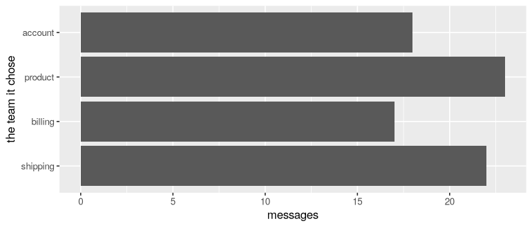
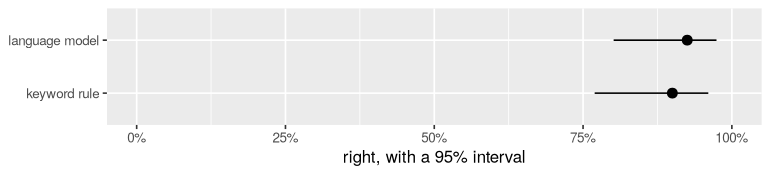
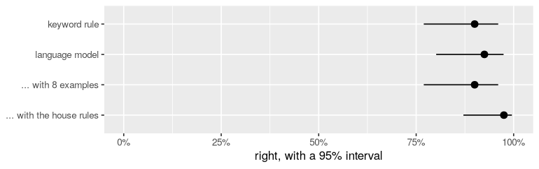

<!-- This file is getting-started.Rmd.orig. It calls real models (a few
cents), so it is knitted by hand into getting-started.Rmd, outputs included:
  cd r/vignettes && R_LIBS=../.lib Rscript -e 'knitr::knit("getting-started.Rmd.orig", "getting-started.Rmd")'
Edit this file, never getting-started.Rmd. -->


This is for you if you know dplyr and ggplot2, you have fitted an `lm()`
or run a `t.test()`, and you have heard of *tidymodels* and *functai* but
never used either. By the end you will have:

1. written a function that reads text, and used it like any column in `mutate()`;
2. measured how often it is right, with the statistics you already know;
3. learned the four steps tidymodels uses for every model;
4. turned your function into a tidymodels model and compared it fairly with a simpler one;
5. made it better, and checked that it really got better.

Nothing needs installing beyond the packages below, and the whole thing
costs a few cents of model calls.

## Before you start

functai sends your text to a language model, a program like the one
behind ChatGPT, and reads back its answer. You need a key for one. The
simplest is an OpenAI key, which you put in your `~/.Renviron` file:

```
OPENAI_API_KEY=sk-...
```

Restart R after saving it. (Any other provider works too: Anthropic,
Google Gemini, or a free model running on your own computer with Ollama.)


``` r
library(dplyr)
library(ggplot2)
library(functai)

log_folder <- tempfile("functai-calls-")
ai_config(lm = "gpt-4.1-mini", temperature = 0, log_calls = log_folder)
```

`ai_config()` sets choices for the whole session:

- `lm` is which language model to use;
- `temperature = 0` asks for its most likely answer every time (higher
  values make it more varied, which you don't want for measuring);
- `log_calls` keeps a record of every call, so we can count them at the end.

## Part 1: a function that reads text

functai comes with `tickets`: 80 messages that customers sent to a small
homeware shop. A person has already decided which team should answer each
one; that's the `category` column.


``` r
tickets
#> # A tibble: 80 × 5
#>       id message                                                 channel category order_id
#>    <int> <chr>                                                   <chr>   <chr>    <chr>   
#>  1     1 Hi, my order A-1042 still hasn't arrived and it's been… email   shipping A-1042  
#>  2     2 The mug arrived in pieces.                              chat    shipping <NA>    
#>  3     3 I was charged twice for order B-2210, please fix this.  email   billing  B-2210  
#>  4     4 How do I change the email on my account?                chat    account  <NA>    
#>  5     5 The kettle lid doesn't close properly anymore after a … email   product  <NA>    
#>  6     6 I'd like my money back for the toaster, it burns every… email   billing  <NA>    
#>  7     7 Tracking for C-3319 hasn't moved since Monday.          chat    shipping C-3319  
#>  8     8 I forgot my password and the reset email never comes.   chat    account  <NA>    
#>  9     9 Box was crushed and the lamp inside is cracked. Order … email   shipping D-4001  
#> 10    10 My coupon code SPRING10 didn't apply at checkout.       chat    billing  <NA>    
#> # ℹ 70 more rows
count(tickets, category)
#> # A tibble: 4 × 2
#>   category     n
#>   <chr>    <int>
#> 1 account     18
#> 2 billing     22
#> 3 product     18
#> 4 shipping    22
```

Reading 80 messages by hand is fine. Reading 80,000 isn't. So let's write a
function that does it:


``` r
team <- ai(team ~ message, "Which team should answer this customer message?",
  team = choice("shipping", "billing", "product", "account"))
```

Read it like a model formula:

- `team ~ message` is *team, from the message*, as `lm(weight ~ height)`
  is weight from height. The function is named after what it gives,
  `team`, and takes one input, `message`, which is text;
- the sentence says what it does, as you would tell a new colleague;
- `team = choice(...)` says what comes back: one of these four teams, as
  a factor with these levels. The model is only allowed to answer one of
  them.

There is no body. The language model *is* the body. Try it:


``` r
team("My card was charged twice for order B-2210.")
#> [1] billing
#> Levels: shipping billing product account
```

It's a normal R function, and it works on a whole column at once, so it
goes straight into `mutate()`:


``` r
answered <- tickets |>
  mutate(guess = team(message))

answered |> select(message, category, guess)
#> # A tibble: 80 × 3
#>    message                                                             category guess   
#>    <chr>                                                               <chr>    <fct>   
#>  1 Hi, my order A-1042 still hasn't arrived and it's been three weeks. shipping shipping
#>  2 The mug arrived in pieces.                                          shipping shipping
#>  3 I was charged twice for order B-2210, please fix this.              billing  billing 
#>  4 How do I change the email on my account?                            account  account 
#>  5 The kettle lid doesn't close properly anymore after a month of use. product  product 
#>  6 I'd like my money back for the toaster, it burns everything.        billing  billing 
#>  7 Tracking for C-3319 hasn't moved since Monday.                      shipping shipping
#>  8 I forgot my password and the reset email never comes.               account  account 
#>  9 Box was crushed and the lamp inside is cracked. Order D-4001.       shipping shipping
#> 10 My coupon code SPRING10 didn't apply at checkout.                   billing  billing 
#> # ℹ 70 more rows
```

That was 80 calls to the model. They run 8 at a time, so it took a few
seconds. Everything you know from dplyr and ggplot2 works on the result:


``` r
answered |>
  count(guess) |>
  ggplot(aes(n, guess)) +
  geom_col() +
  labs(x = "messages", y = "the team it chose")
```

<div class="figure">

<p class="caption">plot of chunk team-plot</p>
</div>

## Part 2: is it right?

We have the person's answer (`category`) next to the function's (`guess`),
so this is just a proportion:


``` r
answered |>
  summarise(right = sum(guess == category),
            n = n(),
            accuracy = mean(guess == category))
#> # A tibble: 1 × 3
#>   right     n accuracy
#>   <int> <int>    <dbl>
#> 1    74    80    0.925
```


74 right out of 80. How sure can we be of that? If the function
read another 80 messages like these, it wouldn't get exactly the same
share right. You already know the tool for this: a confidence interval for
a proportion.


``` r
prop.test(right, 80, correct = FALSE)$conf.int
#> [1] 0.8458798 0.9651748
#> attr(,"conf.level")
#> [1] 0.95
```

functai has a shortcut, `evaluate()`. It runs the function on the rows,
compares with the right answers, and gives the same interval:


``` r
ev <- evaluate(team, tickets, expected = category)
ev
#> <evaluation of team> 80 rows
#>   exact_match: 0.91  (95% interval 0.83 to 0.96)
```


`evaluate()` asked the model all 80 questions again, and this time it got
73 right, where our first pass got 74. Even at temperature 0, a language model's answers can shift a little from one run to the next. That's one more reason to report an interval rather than a single number.
The interval is the one `prop.test()` gives for that count, the same
formula (Wilson's):


``` r
prop.test(sum(augment(ev)$exact_match), 80, correct = FALSE)$conf.int
#> [1] 0.830232 0.956968
#> attr(,"conf.level")
#> [1] 0.95
```

When you already have the answers in a column, `mean()` and `prop.test()`
are free. `evaluate()` is for when you don't: it calls the model for you.

Where does it go wrong? That's a `filter()`:


``` r
answered |>
  filter(guess != category) |>
  select(message, category, guess)
#> # A tibble: 6 × 3
#>   message                                                         category guess   
#>   <chr>                                                           <chr>    <fct>   
#> 1 Refund the blender please, it stopped working after two days.   billing  product 
#> 2 Money back please, the knife set is not as sharp as advertised. billing  product 
#> 3 The duvet shrank in the wash, I'd like my money back.           billing  product 
#> 4 Refund please: the towels are much thinner than in the photos.  billing  product 
#> 5 Package arrived but the bowl inside was in three pieces.        shipping product 
#> 6 Return the headphones and give me a refund please.              billing  shipping
```

Look at these against the shop's house rules (they're in `?tickets`).
Anything that **arrived broken** is *shipping*, because the carrier pays.
**Every request for money back** is *billing*, whatever the reason. The
model doesn't know those rules, so it makes a reasonable guess that isn't
the shop's. Keep that in mind: we'll fix it in Part 5.

## Part 3: what tidymodels is, using `lm()`

So far we've worked with our function directly. That's often all you need.
But you'll soon want to ask "is this better than something simpler?", "did
my change help, or was it luck?", and "how do I test fairly?". Those
questions are the same for every kind of model, and tidymodels is a set of
packages that answers them the same way for all of them.

Start with a model you know. Here is `lm()`:


``` r
fit_lm <- lm(mpg ~ wt, data = mtcars)
coef(fit_lm)
#> (Intercept)          wt 
#>   37.285126   -5.344472
predict(fit_lm, newdata = data.frame(wt = 3))
#>        1 
#> 21.25171
```

And here is the same model, the tidymodels way:


``` r
library(tidymodels)

spec <- linear_reg()                           # 1. say which kind of model
fit_tm <- fit(spec, mpg ~ wt, data = mtcars)   # 2. fit it to data
tidy(fit_tm)                                   # the same coefficients as coef()
#> # A tibble: 2 × 5
#>   term        estimate std.error statistic  p.value
#>   <chr>          <dbl>     <dbl>     <dbl>    <dbl>
#> 1 (Intercept)    37.3      1.88      19.9  8.24e-19
#> 2 wt             -5.34     0.559     -9.56 1.29e-10
predict(fit_tm, new_data = tibble(wt = 3))     # 3. predict: the same number
#> # A tibble: 1 × 1
#>   .pred
#>   <dbl>
#> 1  21.3
```

That's more typing for the same result, so why bother? Because steps 1 to
3 are the same for every model. Swap `linear_reg()` for a random forest, or
for a language model, and the rest of your code doesn't change. Step 4 is
scoring, and it's the same too:

| step | what it does | with `lm()` |
|---|---|---|
| 1. **specify** | say which kind of model | (built into `lm`) |
| 2. **fit** | learn from data | `lm(y ~ x, data)` |
| 3. **predict** | answer new rows | `predict(fit, newdata)` |
| 4. **score** | compare predictions with the truth | you write it yourself |

Notice what `predict()` returns: a tibble with a column called `.pred`.
When the answer is a category, that column is called `.pred_class`
instead. tidymodels always uses these names, so scoring works on any
model's output.

## Part 4: the AI function as a model, tested fairly

### Keeping some data aside

To test fairly, you test on rows that played no part in building the model.
Otherwise you're grading an exam the student wrote the answers to. So we
split the tickets in two: half to build with (*training* data), half to
test on (*test* data), with the same mix of teams in each (`strata`):


``` r
tickets <- tickets |> mutate(category = factor(category))   # tidymodels wants a factor for categories

set.seed(2026)
split <- initial_split(tickets, prop = 0.5, strata = category)
train <- training(split)
test  <- testing(split)
nrow(train); nrow(test)
#> [1] 40
#> [1] 40
```

### Something simple to beat

A model is only impressive compared with something simpler. Here's the
simplest thing you might write yourself: a keyword rule, with
`case_when()`.


``` r
keyword_rule <- function(message) {
  m <- tolower(message)
  factor(case_when(
    grepl("charge|refund|invoice|coupon|card|pay|money", m)       ~ "billing",
    grepl("password|sign in|log in|login|account|email|data", m)   ~ "account",
    grepl("arriv|deliver|track|parcel|package|box|order", m)       ~ "shipping",
    .default = "product"
  ), levels = levels(tickets$category))
}

test |>
  mutate(.pred_class = keyword_rule(message)) |>
  accuracy(truth = category, estimate = .pred_class)
#> # A tibble: 1 × 3
#>   .metric  .estimator .estimate
#>   <chr>    <chr>          <dbl>
#> 1 accuracy multiclass       0.9
```

`accuracy()` comes from *yardstick*, the tidymodels package for scoring.
It's `mean(estimate == truth)`, in a form that works on any model's
predictions.


90% is better than it looks for a dozen keywords. The rule
checks money words first, and "anything about money is billing" is the
shop's most important house rule. Knowing your domain is worth a lot, and
a baseline like this keeps a fancier model honest.

### The language model, in four steps


``` r
ai_spec <- ai_model("classification",
  description = "Which team should answer this customer message?")   # 1. specify

ai_fit <- fit(ai_spec, category ~ message, data = train)               # 2. fit

ai_test <- augment(ai_fit, test)                                       # 3. predict
#> Warning: probabilities are NA: one answer per row measures no probability
#> ℹ for them, answer each row several times: `set_engine("functai", samples = 5)` (costs 5
#>   calls a row)
ai_test |> accuracy(truth = category, estimate = .pred_class)          # 4. score
#> # A tibble: 1 × 3
#>   .metric  .estimator .estimate
#>   <chr>    <chr>          <dbl>
#> 1 accuracy multiclass     0.925
```

A few things are new here:

- `ai_model("classification", ...)` is step 1: "a model that picks a
  category, done by a language model, with this description".
- `category ~ message` is a formula, just as in `lm()`: predict `category`
  from `message`.
- **Fitting is instant, and free.** A language model has already learned
  language, so `fit()` only notes that the input is `message` and that the
  answers are the four levels of `category`. It doesn't learn from the
  answers in `train` at all. (In Part 5 it will, if we ask.)
- `augment()` is `predict()` plus the original columns, so you can see each
  message next to its prediction.

`augment()` also printed a warning about probabilities. Ignore it for now:
tidymodels asks every model for probabilities, and this one gives only
answers unless you ask for more (the tidymodels vignette explains how).

### Which is better?

Two accuracies on 40 test messages each. Is the difference real, or luck?
Put both on one plot, with their confidence intervals:


``` r
score <- function(truth, guess, model) {
  ci <- prop.test(sum(truth == guess), length(truth), correct = FALSE)
  tibble(model = model, accuracy = mean(truth == guess), low = ci$conf.int[1], high = ci$conf.int[2])
}

scores <- bind_rows(
  score(test$category, keyword_rule(test$message), "keyword rule"),
  score(test$category, ai_test$.pred_class, "language model")
)
scores
#> # A tibble: 2 × 4
#>   model          accuracy   low  high
#>   <chr>             <dbl> <dbl> <dbl>
#> 1 keyword rule      0.9   0.769 0.960
#> 2 language model    0.925 0.801 0.974
```


``` r
ggplot(scores, aes(accuracy, model)) +
  geom_pointrange(aes(xmin = low, xmax = high)) +
  scale_x_continuous(labels = scales::percent, limits = c(0, 1)) +
  labs(x = "right, with a 95% interval", y = NULL)
```

<div class="figure">

<p class="caption">Accuracy on the 40 test messages, with 95% confidence intervals.</p>
</div>


The intervals overlap, so 40 test messages aren't enough to be sure which is better. More test data would narrow them.
That's the habit worth keeping: **never compare two accuracies without
their intervals**, especially on small test sets.

## Part 5: making it better, without fooling yourself

The language model's mistakes come from the house rules it doesn't know.
The most direct fix is to tell it. The description is your model's code,
so write the rules into it:


``` r
rules <- "Which team should answer this customer message?
House rules:
- Anything wrong with the delivery itself (late, lost, wrong address, wrong item,
  something missing, or broken when it arrived) is shipping: the carrier pays.
- Anything about money (charges, invoices, coupons, cards, and every request for
  money back, whatever the reason) is billing.
- Problems that appear while using a product, and questions about products, are product.
- Signing in, passwords, profile details, personal data and emails from the shop are account."

rules_fit <- ai_model("classification", description = rules) |>
  fit(category ~ message, data = train)

rules_test <- augment(rules_fit, test)
rules_test |> accuracy(truth = category, estimate = .pred_class)
#> # A tibble: 1 × 3
#>   .metric  .estimator .estimate
#>   <chr>    <chr>          <dbl>
#> 1 accuracy multiclass     0.975
```

Where did these rules come from? From the shop's policy (`?tickets`), not
from looking at the test messages we got wrong. That matters. If you
tweak a description until the test set comes out right, the test set
stops being a fair test: you've fitted the description to it, the way
`lm()` would fit noise with too many variables.

A second way to teach: **show examples**. With `examples = 8`, the model
sees 8 training messages with their right teams before every question.
Now `fit()` really does use the training data:


``` r
examples_fit <- ai_model("classification",
  description = "Which team should answer this customer message?",
  examples = 8) |>
  fit(category ~ message, data = train)

examples_test <- augment(examples_fit, test)
examples_test |> accuracy(truth = category, estimate = .pred_class)
#> # A tibble: 1 × 3
#>   .metric  .estimator .estimate
#>   <chr>    <chr>          <dbl>
#> 1 accuracy multiclass       0.9
```

All four, side by side:


``` r
scores <- bind_rows(
  score(test$category, keyword_rule(test$message), "keyword rule"),
  score(test$category, ai_test$.pred_class, "language model"),
  score(test$category, examples_test$.pred_class, "... with 8 examples"),
  score(test$category, rules_test$.pred_class, "... with the house rules")
) |> mutate(model = factor(model, levels = rev(model)))
scores
#> # A tibble: 4 × 4
#>   model                    accuracy   low  high
#>   <fct>                       <dbl> <dbl> <dbl>
#> 1 keyword rule                0.9   0.769 0.960
#> 2 language model              0.925 0.801 0.974
#> 3 ... with 8 examples         0.9   0.769 0.960
#> 4 ... with the house rules    0.975 0.871 0.996
```


``` r
ggplot(scores, aes(accuracy, model)) +
  geom_pointrange(aes(xmin = low, xmax = high)) +
  scale_x_continuous(labels = scales::percent, limits = c(0, 1)) +
  labs(x = "right, with a 95% interval", y = NULL)
```

<div class="figure">

<p class="caption">Accuracy on the 40 test messages, with 95% confidence intervals.</p>
</div>


The house rules took it from 92% to 98%; eight
examples took it to 90%.
Writing down what you know beat hoping the model would pick it up from a few examples. That's usually true when the rules are yours to write.
Remember the intervals, though: on 40 messages, a difference of a few
points is within the noise. With the rules, 1 test message still went wrong:


``` r
wrong_rules |> select(message, category, .pred_class)
#> # A tibble: 1 × 3
#>   message                                                       category .pred_class
#>   <chr>                                                         <fct>    <fct>      
#> 1 Refund the blender please, it stopped working after two days. billing  product
```

## Part 6: using it

`fit()` gave us a model. Inside it is an ordinary function, which you can
take out and use anywhere, with no tidymodels in sight:


``` r
team_with_rules <- extract_fit_engine(rules_fit)

new_messages <- tibble(message = c(
  "The vase came in pieces, can I get my money back?",
  "Where do I change the email address on my profile?",
  "Does the blue kettle work on induction hobs?"
))

new_messages |> mutate(team = team_with_rules(message))
#> # A tibble: 3 × 2
#>   message                                            team    
#>   <chr>                                              <fct>   
#> 1 The vase came in pieces, can I get my money back?  shipping
#> 2 Where do I change the email address on my profile? account 
#> 3 Does the blue kettle work on induction hobs?       product
```


The first message is a good test: broken on arrival (*shipping*) and a
request for money back (*billing*) at once. The rules say every request for
money back is *billing*, whatever the reason.
It answered *shipping*. Two of the rules apply, and the description never says which one wins, so the model picked the one about the broken item. That's the most useful lesson here: rules in a description are guidance, and where two rules meet is exactly where a model hesitates. The fix is to settle the conflict in words, for example: "If a message asks for money back, it is billing, even when the item arrived broken." Then check again, on messages you didn't write the rule from.

## What it cost

Every call was logged, so let's count them, with dplyr:


``` r
calls(folder = log_folder) |>
  summarise(calls = n(), input_tokens = sum(input_tokens), output_tokens = sum(output_tokens))
#> # A tibble: 1 × 3
#>   calls input_tokens output_tokens
#>   <int>        <dbl>         <dbl>
#> 1   285        33954          2565
```

A *token* is roughly three quarters of a word; providers charge per token.
With `gpt-4.1-mini`, this whole vignette cost a few cents. The rules made
every question longer, so they cost more tokens per call. That's the usual
trade: a better answer for a longer question.

## Where to go next

- `?ai` shows every kind of answer a function can give: numbers, yes/no,
  several columns at once, lists.
- `vignette("tidymodels", package = "functai")` goes further with
  tidymodels: workflows, cross-validation, tuning the number of examples,
  probabilities, and training a cheap classical model on the language
  model's answers.
- [tidymodels.org](https://www.tidymodels.org/start/) teaches tidymodels
  itself, with classical models. Everything there applies to `ai_model()`.

Three habits to take with you:

1. **Test on data you didn't build with.** Keep a test set aside, and look
   at it last.
2. **Compare with intervals.** Small differences on small test sets are luck.
3. **Tell the model what you know.** The description is your model's code.
