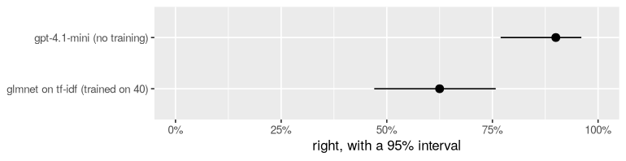

<!-- This file is tidymodels.Rmd.orig. It calls real models (a few cents),
so it is knitted by hand into tidymodels.Rmd, outputs included:
  cd r/vignettes && R_LIBS=../.lib Rscript -e 'knitr::knit("tidymodels.Rmd.orig", "tidymodels.Rmd")'
Edit this file, never tidymodels.Rmd. -->


You know how tidymodels works. You write a model specification, `fit()`
it on training data, `predict()` new data, and score the predictions with
yardstick. Swap one model for another and nothing else in your code moves.

This vignette shows that a language model can be one of those models. You
describe the task in a sentence, and it goes through the same four verbs,
into the same workflows, through the same resampling and tuning. Along the
way we'll find out when it is worth it and what it costs, with real
numbers from a real model.


``` r
library(tidymodels)
library(textrecipes)
library(functai)

log_folder <- tempfile("functai-calls-")
ai_config(lm = "gpt-4.1-mini", temperature = 0, log_calls = log_folder)
```

`ai_config()` chooses the model every AI function uses, unless it says
otherwise. `temperature = 0` asks for its most likely answer every time.
`log_calls` writes each call down, so we can count them at the end. To run
this yourself, set `OPENAI_API_KEY` (or name another model: `"claude-haiku-4-5"`,
`"gemini:gemini-2.5-flash"`, a local `"ollama:qwen3.5:0.8b"`).

## The vocabulary, side by side

| tidymodels | with a language model |
|---|---|
| `multinom_reg()` | `ai_model("classification", "the task, in a sentence")` |
| `set_engine("glmnet")` | `set_engine("functai", lm = "claude-haiku-4-5")`: the language model is the engine |
| `fit()` estimates weights | `fit()` reads the outcome's levels and, if you ask, picks worked examples. No weights, no calls. |
| `predict()` computes | `predict()` asks the model, one call per row, 8 at a time |
| `penalty = tune()` | `examples = tune()`: how many training rows it sees as worked examples |
| `type = "prob"` | `type = "prob"` when you ask for several answers per row (`samples`) |
| free to predict | every prediction is a paid call |

The last line is the one to keep in mind. It shapes every choice below.

## The data

`tickets` ships with functai: 80 messages to a small homeware shop, each
sent to one of four teams. The shop has house rules. A parcel damaged on
the way is *shipping*, not *product*. A refund is *billing*. Those rules
are exactly what a model cannot guess.


``` r
tickets <- functai::tickets |> mutate(category = factor(category))
count(tickets, category)
#> # A tibble: 4 × 2
#>   category     n
#>   <fct>    <int>
#> 1 account     18
#> 2 billing     22
#> 3 product     18
#> 4 shipping    22

set.seed(2026)
split <- initial_split(tickets, prop = 0.5, strata = category)
train <- training(split)
test  <- testing(split)
```

Forty messages to learn from and forty to test on. That's small, and on
purpose: small labelled data is where most text problems start.

## A classical baseline

First, the model you'd normally reach for. The recipe turns each message
into word weights (tf-idf), and a penalised multinomial regression learns
which words point to which team.


``` r
tfidf <- recipe(category ~ message, data = train) |>
  step_tokenize(message) |>
  step_tokenfilter(message, max_tokens = 300) |>
  step_tfidf(message)

glmnet_fit <- workflow() |>
  add_recipe(tfidf) |>
  add_model(multinom_reg(penalty = 0.01) |> set_engine("glmnet")) |>
  fit(train)

augment(glmnet_fit, test) |> accuracy(category, .pred_class)
#> # A tibble: 1 × 3
#>   .metric  .estimator .estimate
#>   <chr>    <chr>          <dbl>
#> 1 accuracy multiclass     0.625
```


62% right. That's not bad for forty examples, but a model
that learns words from forty messages has seen very few words.

## The same four verbs, with a language model


``` r
ai_spec <- ai_model("classification", "Which team should answer this customer message?") |>
  set_engine("functai")
ai_spec
#> AI Model Specification (classification)
#> 
#> Main Arguments:
#>   description = Which team should answer this customer message?
#> 
#> Computational engine: functai
```

The description is the whole model: what you would tell a new colleague on
their first day. Now fit it, and time it:


``` r
system.time(ai_fit <- fit(ai_spec, category ~ message, data = train))
#>    user  system elapsed 
#>   0.006   0.000   0.007
ai_fit
#> parsnip model object
#> 
#> <ai function> category ~ message
#>   Which team should answer this customer message?
#>   message   text
#>   category  one of account, billing, product, shipping
#>   model: gpt-4.1-mini
```

That took no time because nothing was called. Fitting read the formula (the
input is `message`), and it read the outcome's four levels (the only
answers the model may give). The answers in `train` were not used at all:
this model starts "zero-shot". Predicting is where the work happens:


``` r
ai_pred <- augment(ai_fit, test)
#> Warning: probabilities are NA: one answer per row measures no probability
#> ℹ for them, answer each row several times: `set_engine("functai", samples = 5)` (costs 5
#>   calls a row)
ai_pred |> select(message, category, .pred_class)
#> # A tibble: 40 × 3
#>    message                                                            category .pred_class
#>    <chr>                                                              <fct>    <fct>      
#>  1 Hi, my order A-1042 still hasn't arrived and it's been three week… shipping shipping   
#>  2 I was charged twice for order B-2210, please fix this.             billing  billing    
#>  3 The kettle lid doesn't close properly anymore after a month of us… product  product    
#>  4 Tracking for C-3319 hasn't moved since Monday.                     shipping shipping   
#>  5 I forgot my password and the reset email never comes.              account  account    
#>  6 Box was crushed and the lamp inside is cracked. Order D-4001.      shipping shipping   
#>  7 My coupon code SPRING10 didn't apply at checkout.                  billing  billing    
#>  8 Can the cast iron pan go in the dishwasher?                        product  product    
#>  9 Please delete my account and all my data.                          account  account    
#> 10 Refund the blender please, it stopped working after two days.      billing  billing    
#> # ℹ 30 more rows
ai_pred |> accuracy(category, .pred_class)
#> # A tibble: 1 × 3
#>   .metric  .estimator .estimate
#>   <chr>    <chr>          <dbl>
#> 1 accuracy multiclass     0.925
ai_pred |> conf_mat(category, .pred_class)
#>           Truth
#> Prediction account billing product shipping
#>   account        7       0       0        0
#>   billing        0      11       0        0
#>   product        2       0       9        1
#>   shipping       0       0       0       10
```


92% right, with no training at all. And `augment()` warned
that the probability columns are `NA`. That's deliberate, and the section
on probabilities below explains it.

Which messages did it get wrong?


``` r
ai_pred |>
  filter(category != .pred_class) |>
  select(message, category, .pred_class)
#> # A tibble: 3 × 3
#>   message                                                  category .pred_class
#>   <chr>                                                    <fct>    <fct>      
#> 1 Package arrived but the bowl inside was in three pieces. shipping product    
#> 2 I can't find where to log out on the app.                account  product    
#> 3 I get 'invalid token' every time I try to sign in.       account  product
```

Read them against the shop's house rules. Anything that arrived broken is
*shipping*, because the carrier pays. Every request for money back is
*billing*. Problems that appear while using a product are *product*.
Signing in and personal data are *account*. A model reading a message cold
can't know where this shop draws those lines, so it makes the reasonable
call rather than the house call.

## What did `fit()` make? A function

Under the parsnip wrapper, the fitted engine is an ordinary R function:


``` r
team <- extract_fit_engine(ai_fit)
team
#> <ai function> category ~ message
#>   Which team should answer this customer message?
#>   message   text
#>   category  one of account, billing, product, shipping
#>   model: gpt-4.1-mini
team("My card was charged twice for order B-2210.")
#> [1] billing
#> Levels: account billing product shipping
```

It is the function `ai(category ~ message, "Which team should answer this
customer message?", .data = train)` writes: the formula you give `fit()`
is the one you give `ai()`. It is vectorised, so it also works outside
tidymodels, as a column in any dplyr verb:


``` r
test |>
  slice(1:4) |>
  mutate(team = team(message)) |>
  select(message, team)
#> # A tibble: 4 × 2
#>   message                                                             team    
#>   <chr>                                                               <fct>   
#> 1 Hi, my order A-1042 still hasn't arrived and it's been three weeks. shipping
#> 2 I was charged twice for order B-2210, please fix this.              billing 
#> 3 The kettle lid doesn't close properly anymore after a month of use. product 
#> 4 Tracking for C-3319 hasn't moved since Monday.                      shipping
```

Here the two worlds meet. The same object is a tidymodels model, fitted
and tuned with the grammar you know, and a function you can call wherever
you have text.

## Comparing fairly

On forty test messages, a difference of a few points could be luck.
`evaluate()` scores any model, whether a workflow, a parsnip fit or an AI
function, and gives each score a 95% interval:


``` r
scores <- bind_rows(
  tidy(evaluate(glmnet_fit, test)) |> mutate(model = "glmnet on tf-idf (trained on 40)"),
  tidy(evaluate(ai_fit, test))     |> mutate(model = "gpt-4.1-mini (no training)")
)
scores |> select(model, estimate, conf.low, conf.high)
#> # A tibble: 2 × 4
#>   model                            estimate conf.low conf.high
#>   <chr>                               <dbl>    <dbl>     <dbl>
#> 1 glmnet on tf-idf (trained on 40)    0.625    0.470     0.758
#> 2 gpt-4.1-mini (no training)          0.9      0.769     0.960
```


``` r
ggplot(scores, aes(estimate, model)) +
  geom_pointrange(aes(xmin = conf.low, xmax = conf.high)) +
  scale_x_continuous(labels = scales::percent, limits = c(0, 1)) +
  labs(x = "right, with a 95% interval", y = NULL)
```

<div class="figure">

<p class="caption">How often each model is right on the 40 test messages, with 95% intervals.</p>
</div>


The intervals don't overlap. With forty test messages that's a big gap, and it means the difference is real, not luck.

## In a workflow, resampled and tuned

A language model can learn from a few worked examples: a message and its
right team, shown before each question. `examples` is the model's tuning
parameter. Here it is in a workflow, tuned by cross-validation like any
other:


``` r
ai_wf <- workflow() |>
  add_formula(category ~ message) |>
  add_model(
    ai_model("classification", "Which team should answer this customer message?",
             examples = tune()) |>
      set_engine("functai")
  )

set.seed(1)
folds <- vfold_cv(train, v = 5, strata = category)

tuned <- tune_grid(ai_wf, folds,
                   grid = tibble(examples = c(0, 2, 4, 8)),
                   metrics = metric_set(accuracy))
collect_metrics(tuned) |> select(examples, mean, std_err)
#> # A tibble: 4 × 3
#>   examples  mean std_err
#>      <dbl> <dbl>   <dbl>
#> 1        0 0.88   0.0561
#> 2        2 0.782  0.0317
#> 3        4 0.847  0.0476
#> 4        8 0.95   0.0306
```

Two things to notice.

**The formula, not a recipe.** A language model reads the message itself.
A recipe that turns it into word weights would take the words away. So the
workflow uses `add_formula()`.

**The metric set.** tune's default metrics include `roc_auc`, which needs
probabilities. One answer per row has none (see below), so we ask for
accuracy only.


Each value was fitted five times and predicted on eight held-out rows each
time, so every mean above rests on forty answers. Read it against the
standard errors, a few points each.

8 examples scored best, 7 points above none. Measured against the uncertainty of both scores, that gap is about 1.1 times its standard error: forty answers can't tell it apart from luck.
And 2 and 4 examples scored *lower* than none. A few examples can mislead as well as teach, because the model copies the pattern of whichever messages it happened to see.

The model already knows the language, so worked examples are only worth
their price when they teach it something it can't guess. Here that's the
shop's house rules, and a handful of random rows rarely covers them.

`last_fit()` gives the honest final number: the chosen setting, fitted on
all of `train`, scored once on `test`.


``` r
best <- select_best(tuned, metric = "accuracy")
best
#> # A tibble: 1 × 2
#>   examples .config        
#>      <dbl> <chr>          
#> 1        8 pre0_mod4_post0
final <- finalize_workflow(ai_wf, best) |>
  last_fit(split, metrics = metric_set(accuracy))
collect_metrics(final)
#> # A tibble: 1 × 4
#>   .metric  .estimator .estimate .config        
#>   <chr>    <chr>          <dbl> <chr>          
#> 1 accuracy multiclass       0.9 pre0_mod0_post0
```


90% on the test set with 8 examples, against
92% with none. The test set did not confirm the gain. That's the winner's curse: picking the best of four noisy scores favours whichever setting got lucky on these folds. Always check a tuned setting on data it never saw, as last_fit() does, before you pay for it: here, more examples per call bought nothing.

## Probabilities, honestly

tidymodels models give `type = "prob"`: a probability per class, which
`roc_auc()`, calibration plots and thresholds need. OpenAI, Anthropic and
Gemini don't say how likely each answer is, and functai never invents that
number. That's why `augment()` above had `NA` probabilities.

What you can do is ask the same question several times. With `samples = 5`,
each message is answered five times at temperature 1. The probability of a
team is its share of those five answers, and the class is the majority
vote:


``` r
voter <- ai_model("classification", "Which team should answer this customer message?") |>
  set_engine("functai", samples = 5) |>
  fit(category ~ message, data = train)

votes <- augment(voter, test)
votes |> select(category, .pred_class, .pred_account:.pred_shipping) |> head()
#> # A tibble: 6 × 6
#>   category .pred_class .pred_account .pred_billing .pred_product .pred_shipping
#>   <fct>    <fct>               <dbl>         <dbl>         <dbl>          <dbl>
#> 1 shipping shipping                0             0             0              1
#> 2 billing  billing                 0             1             0              0
#> 3 product  product                 0             0             1              0
#> 4 shipping shipping                0             0             0              1
#> 5 account  account                 1             0             0              0
#> 6 shipping shipping                0             0             0              1
votes |> roc_auc(category, .pred_account:.pred_shipping)
#> # A tibble: 1 × 3
#>   .metric .estimator .estimate
#>   <chr>   <chr>          <dbl>
#> 1 roc_auc hand_till      0.981
```

Where did the five answers disagree?


``` r
votes |>
  filter(pmax(.pred_account, .pred_billing, .pred_product, .pred_shipping) < 1) |>
  select(message, category, .pred_class, .pred_account:.pred_shipping)
#> # A tibble: 3 × 7
#>   message    category .pred_class .pred_account .pred_billing .pred_product .pred_shipping
#>   <chr>      <fct>    <fct>               <dbl>         <dbl>         <dbl>          <dbl>
#> 1 My coupon… billing  billing               0             0.8           0.2            0  
#> 2 Package a… shipping product               0             0             0.6            0.4
#> 3 I get 'in… account  product               0.2           0             0.8            0
```


Only 3 of 40 messages split the vote. 2 of the vote's 3 mistakes are among them, so the split votes do point at messages a person should check.

This cost five calls per message; the class and the probabilities share
them. The probabilities come in steps of 0.2, and `gpt-4.1-mini` is sure
of itself most of the time. So `roc_auc` here rewards the model for being
right, more than for knowing when it might not be. The fix for consistent
mistakes isn't more votes. It's teaching the rule: write it into the
description, or show it with worked examples that cover it.

## The other way round: a classical model that learns from the language model

Swapping works in both directions. Say you had thousands of unlabelled
messages. The language model can label them once, and a classical model
can learn from those labels, then predict for free, forever, offline.

Here we pretend `train` has no labels: the language model labels it, and
glmnet learns from its answers instead of a person's.


``` r
ai_labelled <- train |>
  select(message) |>
  mutate(category = team(message))

student <- workflow() |>
  add_recipe(recipe(category ~ message, data = ai_labelled) |>
               step_tokenize(message) |>
               step_tokenfilter(message, max_tokens = 300) |>
               step_tfidf(message)) |>
  add_model(multinom_reg(penalty = 0.01) |> set_engine("glmnet")) |>
  fit(ai_labelled)

bind_rows(
  tidy(evaluate(glmnet_fit, test)) |> mutate(labels = "a person's"),
  tidy(evaluate(student, test))    |> mutate(labels = "the language model's")
) |> select(labels, estimate, conf.low, conf.high)
#> # A tibble: 2 × 4
#>   labels               estimate conf.low conf.high
#>   <chr>                   <dbl>    <dbl>     <dbl>
#> 1 a person's              0.625    0.470     0.758
#> 2 the language model's    0.525    0.375     0.671
```


The language model's labels matched a person's on 95% of
the training messages. The student learned from those and reached
52%, against 62% for the model
trained on a person's labels. The intervals overlap: with forty messages to learn from, both students are limited by how few messages they saw, far more than by who labelled them.

Forty messages is far too few for a word-counting model, whoever labels
them. The pattern is what scales. Labelling 40,000 messages is 40,000
cheap calls, done once. The classical model trained on them then predicts
for free, offline, in milliseconds. Before you trust it, measure the
student against a few hundred rows a person labelled.

## What this vignette cost

Every call was logged, so we can count them:


``` r
calls(folder = log_folder) |>
  summarise(calls = n(),
            input_tokens = sum(input_tokens),
            output_tokens = sum(output_tokens))
#> # A tibble: 1 × 3
#>   calls input_tokens output_tokens
#>   <int>        <dbl>         <dbl>
#> 1   525        64061          4725
```

A few cents with `gpt-4.1-mini`. Most calls came from tuning (4 values × 40
rows) and from voting (5 × 40). Resampling and tuning multiply calls like
nothing else does, so choose small grids.

## Rules of thumb

- **Start zero-shot.** A description and `fit()` cost nothing. Measure it
  before you tune it.
- **Measure with intervals.** Small test sets make small differences
  meaningless; `evaluate()` says how small.
- **Use the formula, not a word recipe**, for an AI model in a workflow.
- **Ask for probabilities only when you need them** (`samples`), and for
  tuning without them, use `metric_set(accuracy)`.
- **Keep `temperature = 0` for scoring.** Answers can still vary a little
  from run to run; that's part of why intervals matter.
- **Call the engine directly** when you just want answers:
  `extract_fit_engine(fit)` is a vectorised R function.
- **Let a language model label, and a classical model learn** when you
  need to predict millions of rows.
